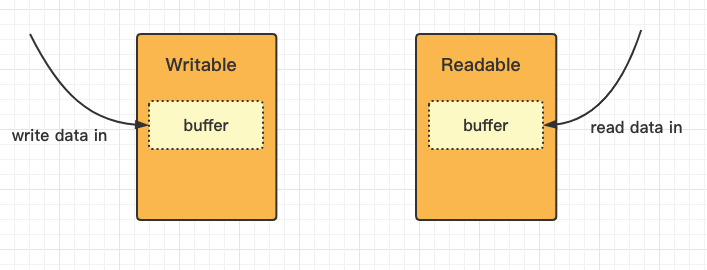

Node.js stream模块翻译

前文

2018年[翻译过](https://www.cnblogs.com/cool-fire/p/8403567.html)一遍，今天再来翻译一遍。

版本: Node.js v17.3.0


# Stream

源码: [lib/stream.js]( https://github.com/nodejs/node/blob/v17.3.0/lib/stream.js)

stream -- 流，是一个抽象接口，用来处理流式数据。

Node.js里有很多流对象，比如: HTTP服务的request对象、process.stdout。

可以从流里读数据、往流里写数据。所有的流都继承了[`EventEmitter`](https://nodejs.org/api/events.html#class-eventemitter)。

```js

const stream = require('stream');

```

大部分情况下，没啥必要用这个模块。


## Stream的种类

Node.js里有4种流:

- [`Writable`](https://nodejs.org/api/stream.html#class-streamwritable): 只写流，只能往这个流里写数据。比如 [`fs.createWriteStream()`](https://nodejs.org/api/fs.html#fscreatewritestreampath-options).
- [`Readable`](https://nodejs.org/api/stream.html#class-streamreadable): 只读流，只能从这个流里读数据。比如[`fs.createReadStream()`](https://nodejs.org/api/fs.html#fscreatereadstreampath-options).
- [`Duplex`](https://nodejs.org/api/stream.html#class-streamduplex): 双工流，可读可写，合并了上面两个。比如[`net.Socket`](https://nodejs.org/api/net.html#class-netsocket).
- [`Transform`](https://nodejs.org/api/stream.html#class-streamtransform): 双工流，有个勾子，在读和写的时候修改数据。比如[`zlib.createDeflate()`](https://nodejs.org/api/zlib.html#zlibcreatedeflateoptions).

此外，stream模块包含了工具函数：[`stream.pipeline()`](https://nodejs.org/api/stream.html#streampipelinesource-transforms-destination-callback)、[`stream.finished()`](https://nodejs.org/api/stream.html#streamfinishedstream-options-callback)、[`stream.Readable.from()`](https://nodejs.org/api/stream.html#streamreadablefromiterable-options)、和[`stream.addAbortSignal()`](https://nodejs.org/api/stream.html#streamaddabortsignalsignal-stream)。

### Promise式的API

v15.0.0新增

处理流可以不用callback了，用它返回的promise。这样引入：

```js
require('stream/promises')
或者
require('stream').promises
```


### 对象模式(Object mode)

Node.js API创建的所有的流只能操作string和Buffer。然而，自定义流的实现时，可能需要处理其他类型的JavaScript对象，这样的流就处于对象模式。

使用`objectMode`选项把流对象转换到对象模式。注意：如果流对象已经存了，再把它转成对象模式，是一个不安全操作。


### Buffering

[`Writable`](https://nodejs.org/api/stream.html#class-streamwritable)和[`Readable`](https://nodejs.org/api/stream.html#class-streamreadable)这两种流在内部都会有一个buffer缓冲，用来存储数据。



对于实现了`Readable`接口的流，调用[`stream.push(chunk)`](https://nodejs.org/api/stream.html#readablepushchunk-encoding)方法时，就会填充内部buffer。如果流没有调用[`stream.read()`](https://nodejs.org/api/stream.html#readablereadsize)方法消费，数据就一直在内部buffer。

一旦内部buffer的数据量达到了高水位（`highWaterMark`），流就会暂停从底层资源读数据，直到数据被消费。（换句话说，流会停止调用内部[`readable._read()`](https://nodejs.org/api/stream.html#readable_readsize)方法，这个方法是用来填充内部buffer的）。

对于`Writable`流，调用[`writable.write(chunk)`](https://nodejs.org/api/stream.html#writablewritechunk-encoding-callback)时，就会填充内部buffer。当内部buffer < 高水位，返回true，否则返回false。

stream的API的一个关键目标是，把内部buffer的数据量限制在一个合理的水平，不至于内存爆炸。比如[`stream.pipe()`](https://nodejs.org/api/stream.html#readablepipedestination-options)方法，就需要协调两个流不同的速度。

高水位标志`highWaterMark`是一个阈值，而不是强制性的限制。自定义实现的流可以强制限制。

对于`Duplex`和`Transform`流，两个都实现了`Readable`和`Writable`，内部有两个buffer，读buffer和写buffer。两个buffer独立分开。比如说，[`net.Socket`](https://nodejs.org/api/net.html#class-netsocket)对象就是Duplex流，读端从socket读数据，写端写数据到socket。

内部buffer机制可能会在后面的版本改变。

哦对了，高水位标志`highWaterMark`可以在实例化流的时候传入构造函数，代表字节数量。而对于对象模式流，代表对象数量。[默认](https://github.com/nodejs/node/blob/cc0342a517279c9c52543e3a37e11da3fc6cdb36/lib/_stream_writable.js?spm=a2c6h.12873639.0.0.12ab6b6ajzlAjY#L40)是16KB和16个对象。


## API

下面的例子用流实现了一个HTTP服务

```js
const http = require('http');

const server = http.createServer((req, res) => {
  // `req` is an http.IncomingMessage, which is a readable stream.
  // `res` is an http.ServerResponse, which is a writable stream.

  let body = '';
  // Get the data as utf8 strings.
  // If an encoding is not set, Buffer objects will be received.
  req.setEncoding('utf8');

  // Readable streams emit 'data' events once a listener is added.
  req.on('data', (chunk) => {
    body += chunk;
  });

  // The 'end' event indicates that the entire body has been received.
  req.on('end', () => {
    try {
      const data = JSON.parse(body);
      // Write back something interesting to the user:
      res.write(typeof data);
      res.end();
    } catch (er) {
      // uh oh! bad json!
      res.statusCode = 400;
      return res.end(`error: ${er.message}`);
    }
  });
});

server.listen(1337);

// $ curl localhost:1337 -d "{}"
// object
// $ curl localhost:1337 -d "\"foo\""
// string
// $ curl localhost:1337 -d "not json"
// error: Unexpected token o in JSON at position 1

```

`Writable`流提供了`write()`、`end()`方法来写数据。

`Readable`流使用`EventEmitter`的API通知应用数据可读。


### Writable streams(写流)

写流是对数据目的地的抽象。

写流有：

- [HTTP requests](https://nodejs.org/api/http.html#class-httpclientrequest)
- [HTTP responses](https://nodejs.org/api/http.html#class-httpserverresponse)
- [fs write streams](https://nodejs.org/api/fs.html#class-fswritestream)
- [zlib streams](https://nodejs.org/api/zlib.html)
- [crypto streams](https://nodejs.org/api/crypto.html)
- [TCP sockets](https://nodejs.org/api/net.html#class-netsocket)
- [child process stdin](https://nodejs.org/api/child_process.html#subprocessstdin)
- [`process.stdout`](https://nodejs.org/api/process.html#processstdout), [`process.stderr`](https://nodejs.org/api/process.html#processstderr)

所有的写流都实现了[stream.Writable](https://github.com/nodejs/node/blob/v17.3.0/lib/internal/streams/writable.js)类的方法。

所有的写流都遵循下面的基本使用方式：

```js
const myStream = getWritableStreamSomehow();
myStream.write('some data');
myStream.write('some more data');
myStream.end('done writing data');
```


#### Class: `stream.Writable`

v0.9.4新增

##### **Event:** `'close'`

当流或者流底层的资源（比如文件描述符）被关闭时，触发。

close事件表明后面不会再有任何其他事件触发，也不会有任何计算。

写流总是会触发close事件。


##### **Event:** `'drain'`

v0.9.4新增

当调用[`stream.write(chunk)`](https://nodejs.org/api/stream.html#writablewritechunk-encoding-callback)返回false时（表示内部buffer到了高水位），此时将停止写入。直到buffer被消费~~且低于高水位时~~，drain事件会触发，此时正好可以恢复继续写入过程。

```js
// Write the data to the supplied writable stream one million times.
// Be attentive to back-pressure.
function writeOneMillionTimes(writer, data, encoding, callback) {
  let i = 1000000;
  write();
  function write() {
    let ok = true;
    do {
      i--;
      if (i === 0) {
        // Last time!
        writer.write(data, encoding, callback);
      } else {
        // See if we should continue, or wait.
        // Don't pass the callback, because we're not done yet.
        ok = writer.write(data, encoding);
      }
    } while (i > 0 && ok);
    if (i > 0) {
      // Had to stop early!
      // Write some more once it drains.
      writer.once('drain', write);
    }
  }
}
```


##### **Event:** `'error'`

v0.9.4新增

- [Error](https://developer.mozilla.org/en-US/docs/Web/JavaScript/Reference/Global_Objects/Error)

写入或管道传输出错时触发，传递`Error`参数。

`error`事件触发后，流会被自动关闭。可以通过设置[`autoDestroy`](https://nodejs.org/api/stream.html#new-streamwritableoptions)参数避免自动关闭行为。

`error`事件触发后，后续的事件只能是`close`。


##### **Event:** `'finish'`

v0.9.4新增

调用[`stream.end()`](https://nodejs.org/api/stream.html#writableendchunk-encoding-callback)方法后触发，所有的数据会冲到底层系统。

```js
const writer = getWritableStreamSomehow();
for (let i = 0; i < 100; i++) {
  writer.write(`hello, #${i}!\n`);
}
writer.on('finish', () => {
  console.log('All writes are now complete.');
});
writer.end('This is the end\n');
```


##### **Event:** `'pipe'`

v0.9.4新增

-  src [<stream.Readable>](https://nodejs.org/api/stream.html#class-streamreadable) 源流

[`stream.pipe()`](https://nodejs.org/api/stream.html#readablepipedestination-options)调用后触发。加入到源流的目的列表。

```js
const writer = getWritableStreamSomehow();
const reader = getReadableStreamSomehow();
writer.on('pipe', (src) => {
  console.log('Something is piping into the writer.');
  assert.equal(src, reader);
});
reader.pipe(writer);
```


##### **Event:** `'unpipe'`

v0.9.4新增

-  src [<stream.Readable>](https://nodejs.org/api/stream.html#class-streamreadable) 源流

[`stream.unpipe()`](https://nodejs.org/api/stream.html#readableunpipedestination)调用后或者写流发生错误时触发。移除源流的目的列表。

```js
const writer = getWritableStreamSomehow();
const reader = getReadableStreamSomehow();
writer.on('unpipe', (src) => {
  console.log('Something has stopped piping into the writer.');
  assert.equal(src, reader);
});
reader.pipe(writer);
reader.unpipe(writer);
```


##### **writable.cork()**

v0.11.2新增

`writable.cork`()方法强制把写入的数据缓存到内部buffer。调用[`stream.uncork()`](https://nodejs.org/api/stream.html#writableuncork)或[`stream.end()`](https://nodejs.org/api/stream.html#writableendchunk-encoding-callback)方法后才刷到目的地。

`cork()`最初的用途是在这样的场景：快速连续的写入小块数据，cork做缓冲，不用马上把小块数据导向底层设备。

`uncork()`方法会调用`writable._writev()`方法，传入缓冲的数据。这可能防止队头阻塞问题。

使用`cork()`方法，但没有实现`writable._write()`，可能对吞吐量有不好的影响。


##### **writable.destroy([error])**

- `error` [<Error>](https://developer.mozilla.org/en-US/docs/Web/JavaScript/Reference/Global_Objects/Error) 触发error事件时传递过去

- Returns: [<this>](https://developer.mozilla.org/en-US/docs/Web/JavaScript/Reference/Operators/this)

销毁流。可选参数error，用来触发error事件。

触发`close`事件（设置`emitClose`为`false`不触发）。

调用`destroy()`后，写流会被终止，之后再调用`write()`、`end()`会报`ERR_STREAM_DESTROYED`错误。

`destroy()`会马上销毁流，并且极其危险，因为之前的`write()`方法写入的数据可能还没被消费，并且可能会触发`ERR_STREAM_DESTROYED`错误。

当需要把缓存的数据刷到目的地，使用end()方法或者等待`drain`事件触发后再`destroy()`。

```js
const { Writable } = require('stream');

const myStream = new Writable();

const fooErr = new Error('foo error');
myStream.destroy(fooErr);
myStream.on('error', (fooErr) => console.error(fooErr.message)); // foo error
```


```js
const { Writable } = require('stream');

const myStream = new Writable();

myStream.destroy();
myStream.on('error', function wontHappen() {});
```


```js
const { Writable } = require('stream');

const myStream = new Writable();
myStream.destroy();

myStream.write('foo', (error) => console.error(error.code));
// ERR_STREAM_DESTROYED
```

一旦调用了`destroy()`，后续的调用都将是无效操作。

自定义实现的流不应该覆盖这个方法，而应该覆盖[`writable._destroy()`](https://nodejs.org/api/stream.html#writable_destroyerr-callback)。


##### **writable.destroyed**

v8.0.0新增

- <boolean>

[`writable.destroy()`](https://nodejs.org/api/stream.html#writabledestroyerror)调用后返回true。

```js
const { Writable } = require('stream');

const myStream = new Writable();

console.log(myStream.destroyed); // false
myStream.destroy();
console.log(myStream.destroyed); // true
```


##### **writable.end([chunk[, encoding]][, callback])**

- `chunk` [string]([](https://developer.mozilla.org/en-US/docs/Web/JavaScript/Data_structures#String_type)) | [Buffer](https://nodejs.org/api/buffer.html#class-buffer) | [Uint8Array](https://developer.mozilla.org/en-US/docs/Web/JavaScript/Reference/Global_Objects/Uint8Array) | [any](https://developer.mozilla.org/en-US/docs/Web/JavaScript/Data_structures#Data_types) 非对象模式只能写入string、Buffer、Uni8Array; 对象模式是除null的任意JavaScript值。
- `encoding` [string](https://developer.mozilla.org/en-US/docs/Web/JavaScript/Data_structures#String_type) 编码，chunk是string时有效。
- `callback` [Function](https://developer.mozilla.org/en-US/docs/Web/JavaScript/Reference/Global_Objects/Function) 流结束时回调此函数。
- Returns: [this](https://developer.mozilla.org/en-US/docs/Web/JavaScript/Reference/Operators/this)

调用`writable.end()`方法意味着后续将不会再有任何数据被写入。传入`chunk`和`encoding`参数来写入最后一块数据，之后流会被销毁。

在调用[`stream.end()`](https://nodejs.org/api/stream.html#writableendchunk-encoding-callback)方法后再调用[`stream.write()`](https://nodejs.org/api/stream.html#writablewritechunk-encoding-callback)会抛错。

```js
// Write 'hello, ' and then end with 'world!'.
const fs = require('fs');
const file = fs.createWriteStream('example.txt');
file.write('hello, ');
file.end('world!');
// Writing more now is not allowed!
```


##### **writable.setDefaultEncoding(encoding)**

- `encoding` [string](https://developer.mozilla.org/en-US/docs/Web/JavaScript/Data_structures#String_type) 默认编码
- Returns: [this](https://developer.mozilla.org/en-US/docs/Web/JavaScript/Reference/Operators/this)

设置写端的默认编码。


##### **writable.uncork()**

v0.11.2新增

 `writable.uncork()` 从 [`stream.cork()`](https://nodejs.org/api/stream.html#writablecork) 调用时缓存的数据，全部刷到目的地。

当使用[`writable.cork()`](https://nodejs.org/api/stream.html#writablecork)和`writable.uncork()`方法管理写流的缓冲数据时，最好是用`process.nextTick()`延时调用`writable.uncork()`，因为在事件循环内，允许批量的`writable.write`()操作。

```js
stream.cork();
stream.write('some ');
stream.write('data ');
process.nextTick(() => stream.uncork());
```

如果[`writable.cork()`](https://nodejs.org/api/stream.html#writablecork)方法调用了多次，那`writable.uncork()`方法也要调用相应的次数。

```js
stream.cork();
stream.write('some ');
stream.cork();
stream.write('data ');
process.nextTick(() => {
  stream.uncork();
  // The data will not be flushed until uncork() is called a second time.
  stream.uncork();
});
```


##### **writable.writable**

v11.4.0新增

- Returns: [boolean](https://developer.mozilla.org/en-US/docs/Web/JavaScript/Data_structures#Boolean_type)

如果可以安全的[`writable.write()`](https://nodejs.org/api/stream.html#writablewritechunk-encoding-callback)方法，返回true。所谓的安全是指流还没被销毁、结束、抛错。


##### **writable.writableEnded**

v12.9.0新增

- Returns: [boolean](https://developer.mozilla.org/en-US/docs/Web/JavaScript/Data_structures#Boolean_type)

调用了[`writable.end()`](https://nodejs.org/api/stream.html#writableendchunk-encoding-callback)后，返回true。返回true并不意味着数据被刷出到目的地，如果要判断数据是否被刷出，要用[`writable.writableFinished`](https://nodejs.org/api/stream.html#writablewritablefinished)。


##### **writable.writableCorked**

v13.2.0, v12.16.0新增

- Returns: [integer](https://developer.mozilla.org/en-US/docs/Web/JavaScript/Data_structures#Number_type)

[`writable.uncork()`](https://nodejs.org/api/stream.html#writableuncork)的调用次数。


##### **writable.writableFinished**

v12.6.0新增

- Returns: [boolean](https://developer.mozilla.org/en-US/docs/Web/JavaScript/Data_structures#Boolean_type)

[`'finish'`](https://nodejs.org/api/stream.html#event-finish)事件被触发前设置为true。


##### **writable.writableHighWaterMark**

v9.3.0新增

- Returns: [number](https://developer.mozilla.org/en-US/docs/Web/JavaScript/Data_structures#Number_type)

返回`highWaterMark`值。


##### **writable.writableLength**

v9.4.0新增

- Returns: [number](https://developer.mozilla.org/en-US/docs/Web/JavaScript/Data_structures#Number_type)

可以被写入的字节数（或者对象数）。


##### **writable.writableNeedDrain**

v15.2.0, v14.17.0新增

- Returns: [boolean](https://developer.mozilla.org/en-US/docs/Web/JavaScript/Data_structures#Boolean_type)

流buffer满的时候设置为true，且将要触发`drain`事件。


##### **writable.writableObjectMode**

v12.3.0新增

- Returns: [boolean](https://developer.mozilla.org/en-US/docs/Web/JavaScript/Data_structures#Boolean_type)

是否对象模式。


##### **writable.write(chunk, [encoding], [callback])**

- `chunk` [string]([](https://developer.mozilla.org/en-US/docs/Web/JavaScript/Data_structures#String_type)) | [Buffer](https://nodejs.org/api/buffer.html#class-buffer) | [Uint8Array](https://developer.mozilla.org/en-US/docs/Web/JavaScript/Reference/Global_Objects/Uint8Array) | [any](https://developer.mozilla.org/en-US/docs/Web/JavaScript/Data_structures#Data_types) 非对象模式只能写入string、Buffer、Uni8Array; 对象模式是除null的任意JavaScript值。
- `encoding` [string](https://developer.mozilla.org/en-US/docs/Web/JavaScript/Data_structures#String_type) 编码，chunk是string时有效，默认是'utf8'。
- `callback` [Function](https://developer.mozilla.org/en-US/docs/Web/JavaScript/Reference/Global_Objects/Function) 这块数据被刷出时回调。
- Returns: [boolean](https://developer.mozilla.org/en-US/docs/Web/JavaScript/Data_structures#Boolean_type)

`writable.write()`方法往流里写数据，如果发生错误，`callback`函数会被回调并传入`error`参数。`callback`是异步调用，并且在`error`事件触发之前调用。

返回true表示内部buffer < `highWaterMark`；返回false时，应该停止write，直到`drain`事件触发。

如果流没有drain，`write()`写入的数据将会一直被放在内部buffer，并且返回false，直到内存爆炸，进程意外终止。高内存使用会导致垃圾收集性能贼低和高RSS。对于TCP socket，如果对端没有读数据，那么这端就永远不会drain，这也算是一个远程可执行漏洞（remotely exploitable vulnerability）。

对于[`Transform`](https://nodejs.org/api/stream.html#class-streamtransform)流，这尤其是个问题。因为`Transform`不drain，会一直缓冲write进的数据，除非被导管了（piped）或者添加了`data`、`readable`任一的事件处理器。

```js
function write(data, cb) {
  if (!stream.write(data)) {
    stream.once('drain', cb);
  } else {
    process.nextTick(cb);
  }
}

// Wait for cb to be called before doing any other write.
write('hello', () => {
  console.log('Write completed, do more writes now.');
});

```

对象模式下总是会忽略`encoding`参数。


### Readable streams(可读流)

数据来源的抽象。

`Readable`的使用例子：

- [HTTP responses, on the client](https://nodejs.org/api/http.html#class-httpincomingmessage)
- [HTTP requests, on the server](https://nodejs.org/api/http.html#class-httpincomingmessage)
- [fs read streams](https://nodejs.org/api/fs.html#class-fsreadstream)
- [zlib streams](https://nodejs.org/api/zlib.html)
- [crypto streams](https://nodejs.org/api/crypto.html)
- [TCP sockets](https://nodejs.org/api/net.html#class-netsocket)
- [child process stdout and stderr](https://nodejs.org/api/child_process.html#subprocessstdout)
- [process.stdin](https://nodejs.org/api/process.html#processstdin)

所有的[`Readable`](https://nodejs.org/api/stream.html#class-streamreadable)都实现了`stream.Readable`类的方法。


#### 两种读数据方式

Readable有两种方式读数据：流式（flowing mode）和中断式（paused mode）。

- 流式。自动从底层源读取数据，并以最快的速度提交到上层应用，使用[`EventEmitter`](https://nodejs.org/api/events.html#class-eventemitter)事件实现。
- 中断式。需要显示调用[`stream.read()`](https://nodejs.org/api/stream.html#readablereadsize)从源读取数据。

Readable也有对象模式，但与读取数据方式不冲突。


所有的Readable流创建后都是中断式，可以用下面其中一个方法转换成流式：

- 添加 [`'data'`](https://nodejs.org/api/stream.html#event-data) 事件处理.
- 调用 [`stream.resume()`](https://nodejs.org/api/stream.html#readableresume) 方法.
- 调用 [`stream.pipe()`](https://nodejs.org/api/stream.html#readablepipedestination-options) 方法将数据导到 [`Writable`](https://nodejs.org/api/stream.html#class-streamwritable).

如果想转回中断式，可以用下面其中之一：

- 如果当前`Readable`没有pipe目的地，调用 [`stream.pause()`](https://nodejs.org/api/stream.html#readablepause) 方法.
- 如果有pipe目的地，删除所有的目的地，调用 [`stream.unpipe()`](https://nodejs.org/api/stream.html#readableunpipedestination) 删除所有的目的地.


有一个很重要的原则：如果没有消费/忽略机制，`Readable`不会去读数据。

移除[`'data'`](https://nodejs.org/api/stream.html#event-data)事件不会自动暂停当前`Readable`读取，同样，如果`Readable`有pipe目的地，调用[`stream.pause()`](https://nodejs.org/api/stream.html#readablepause)不保证流就会暂停读取。

如果[`Readable`](https://nodejs.org/api/stream.html#class-streamreadable)流被转换成流式读取，并且没有消费者，数据会丢失。这种情况可能发生在：调用了`readable.resume()`，但没有`'data'`事件处理器（可能没添加，也可能被移除了）。

添加[`'readable'`](https://nodejs.org/api/stream.html#event-readable)事件会自动使`Readable`停止流动，只能通过[`readable.read()`](https://nodejs.org/api/stream.html#readablereadsize)读取。如果[`'readable'`](https://nodejs.org/api/stream.html#event-readable)事件被移除了，并且有[`'data'`](https://nodejs.org/api/stream.html#event-data)事件处理器，当前Readable会继续开始流动。


#### 三种状态

上面的两种方式只是对Readable流内部实现中的三种状态的简单抽象。

在任何时刻，所有的Readable都是三中状态之一：

- `readable.readableFlowing === null`
- `readable.readableFlowing === false`
- `readable.readableFlowing === true`


`readable.readableFlowing === null`时，表示当前流没有消费机制，所以不会产生数据。在这种状态下时，通过添加`'data'`事件、调用`readable.pipe()`方法、或者调用`readable.resume()`方法，都会把`readable.readableFlowing`设为`true`，并开始产生数据。

调用`readable.pause`()，`readable.unpipe()`会把`readable.readableFlowing`设为false，并暂停当前`Readable`的数据流动，但不会中止数据源。在这种状态下，添加'data'事件不会把`readable.readableFlowing`设回true。

```js
const { PassThrough, Writable } = require('stream');
const pass = new PassThrough();
const writable = new Writable();

pass.pipe(writable);
pass.unpipe(writable);
// readableFlowing is now false.

pass.on('data', (chunk) => { console.log(chunk.toString()); });
pass.write('ok');  // Will not emit 'data'.
pass.resume();     // Must be called to make stream emit 'data'.
```

当`readable.readableFlowing`是`false`时，数据可能积压在`Readable`的内部buffer里。


#### 选一种API方式

随着Node.js的版本更新迭代，`Readable`流也随之演化，提供了多种方式消费数据。

对于同一个`Readable`流，开发者不应该混用多种方式，而是只选择其他一种方式去消费数据，比如，既用`on('data')`，又用`on('redable')`, `pipe()`，这会导致不可预知的结果。

推荐使用`readable.pipe()`方法。如果需要更细粒度的控制数据的产生和传输，使用[`EventEmitter`](https://nodejs.org/api/events.html#class-eventemitter) 和 `readable.on('readable')`/`readable.read()` 或者  `readable.pause()`/`readable.resume()` 。


#### Class: `stream.Readable`

v0.9.4新增

##### **Event:** `'close'`

流以及底层资源（文件描述符）被关闭时，触发`'close'`事件。

`'close'`事件表明不会再有任何事件触发，也不会再有任何计算。

创建流时使用`emitClose`选项，[`Readable`](https://nodejs.org/api/stream.html#class-streamreadable)流总是会触发`'close'`事件。


##### **Event:** `'data'`

v0.9.4新增

- `chunk` [string]([](https://developer.mozilla.org/en-US/docs/Web/JavaScript/Data_structures#String_type)) | [Buffer](https://nodejs.org/api/buffer.html#class-buffer) | [any](https://developer.mozilla.org/en-US/docs/Web/JavaScript/Data_structures#Data_types) 非对象模式只能写入string、Buffer、Uni8Array; 对象模式是除null的任意JavaScript值。

当有数据块需要消费时触发。

当`Readable`处于流式模式下（通过调用`readable.pipe()`，`readable.resume()`，或者添加`'data'`事件处理器）发生。

当Readable处于中断模式下，调用`readable.read()`方法，并有数据可返回时也会触发`'data'`事件。

如果设置了`readable.setEncoding()`，`chunk`是`string`，默认是`Buffer`。

```js
const readable = getReadableStreamSomehow();
readable.on('data', (chunk) => {
  console.log(`Received ${chunk.length} bytes of data.`);
});
```


##### **Event:** `'end'`

v0.9.4新增

'end'事件触发意思着所有的数据（底层源数据）都消费完了。

中断模式下反复调用[`stream.read()`](https://nodejs.org/api/stream.html#readablereadsize)。

```js
const readable = getReadableStreamSomehow();
readable.on('data', (chunk) => {
  console.log(`Received ${chunk.length} bytes of data.`);
});
readable.on('end', () => {
  console.log('There will be no more data.');
});
```


##### **Event:** `'error'`

v0.9.4新增

- [Error](https://developer.mozilla.org/en-US/docs/Web/JavaScript/Reference/Global_Objects/Error)

底层数据源出错时触发，传递`Error`参数。


##### **Event:** `'pause'`

v0.9.4新增

调用[`stream.pause()`](https://nodejs.org/api/stream.html#readablepause)后，并且`readableFlowing`不为false时，触发。


##### **Event:** `'readable'`

有数据可读，或者数据读取到达了末尾时，触发。

`'readable'`事件表明当前`Readable`流有新信息，接下来再用[`stream.read()`](https://nodejs.org/api/stream.html#readablereadsize)返回数据。

```js
const readable = getReadableStreamSomehow();
readable.on('readable', function() {
  // There is some data to read now.
  let data;

  while (data = this.read()) {
    console.log(data);
  }
});
```


如果读取到达了末尾，[`stream.read()`](https://nodejs.org/api/stream.html#readablereadsize)将返回null，并触发'end'事件。即使没有数据可读，也一样会走这个流程。

```js
const fs = require('fs');
const rr = fs.createReadStream('foo.txt'); // foo.txt是个空文件，没有任何数据
rr.on('readable', () => {
  console.log(`readable: ${rr.read()}`);
});
rr.on('end', () => {
  console.log('end');
});
```

输出：

```shell
$ node test.js
readable: null
end
```

在一些场合，添加`'readable'`事件会导致大量的数据读入内部buffer。

通常来说，`readable.pipe()`和`'data'`事件机制更容易理解，而`'readable'`则可能增加吞吐量。


如果同时使用了`'readable'`和[`'data'`](https://nodejs.org/api/stream.html#event-data)，'readable'会优先控制数据的流动。比如，只有[`stream.read()`](https://nodejs.org/api/stream.html#readablereadsize)方法被调用后，`'data'`才会触发。`readableFlowing`会是false。如果`'readable'`被移除，并存在`'data'`处理器，数据还是会流动，并且不用调用`.resume()`方法，`'data'`事件会触发。


##### **Event:** `'resume'`

v0.9.4新增

[`stream.resume()`](https://nodejs.org/api/stream.html#readableresume)调用后，并且`readableFlowing`不为true时，触发。


##### **readable.destroy([error])**

- [Error](https://developer.mozilla.org/en-US/docs/Web/JavaScript/Reference/Global_Objects/Error) 传给`'error'`事件的参数
- Returns: [this](https://developer.mozilla.org/en-US/docs/Web/JavaScript/Reference/Operators/this)

销毁流。可选参数`error`是否触发`'error'`事件。触发`'close'`事件（除非设置了`emitClose`为false）。方法调用后，会释放内部的所有资源，后续的`push()`将会被忽略。

一旦`destroy()`调用了，后续`Readable`的调用都是无效的。

开发者不应该覆盖这个方法，而应该覆盖[`readable._destroy()`](https://nodejs.org/api/stream.html#readable_destroyerr-callback)。


##### **readable.destroyed**

v8.0.0新增

- Returns: [boolean](https://developer.mozilla.org/en-US/docs/Web/JavaScript/Data_structures#Boolean_type)

[`readable.destroy()`](https://nodejs.org/api/stream.html#readabledestroyerror)调用后是true。


##### **readable.isPaused()**

v0.11.14新增

返回当前Readable的操作状态。

```js
const readable = new stream.Readable();

readable.isPaused(); // === false
readable.pause();
readable.isPaused(); // === true
readable.resume();
readable.isPaused(); // === false
```


##### **readable.pause()**

v0.9.4新增

- Returns: [this](https://developer.mozilla.org/en-US/docs/Web/JavaScript/Reference/Operators/this)

使处于流式模式的`Readable`停止触发`'data'`事件，切出流式模式。

```js
const readable = getReadableStreamSomehow();
readable.on('data', (chunk) => {
  console.log(`Received ${chunk.length} bytes of data.`);
  readable.pause();
  console.log('There will be no additional data for 1 second.');
  setTimeout(() => {
    console.log('Now data will start flowing again.');
    readable.resume();
  }, 1000);
});
```

如果当前`Readable`有`'readable'`事件处理器，`readable.pause()`方法没有效果。


##### **readable.pipe(destination[, options])**

v0.9.4新增

- `destination` [<stream.Writable>](https://nodejs.org/api/stream.html#class-streamwritable) 目的地
- `options`  [<Object>](https://developer.mozilla.org/en-US/docs/Web/JavaScript/Reference/Global_Objects/Object)选项
  - `end` [boolean](https://developer.mozilla.org/en-US/docs/Web/JavaScript/Data_structures#Boolean_type) Readabl结束时，目的地是否一起结束。默认: `true`.
- Returns: [<stream.Writable>](https://nodejs.org/api/stream.html#class-streamwritable) 目的地，[`Duplex`](https://nodejs.org/api/stream.html#class-streamduplex)和[`Transform`](https://nodejs.org/api/stream.html#class-streamtransform)允许链式调用。

`Readable`上附加一个[`Writable`](https://nodejs.org/api/stream.html#class-streamwritable)，自动切成流式模式，将所有的读的数据推到`Writable`。

方法自动管理了数据流动速率，免得`Writable`被快速的`Readable`冲垮。

下面的例子把`Readable`读取的数据pipe到`file.txt`文件：

```js
const fs = require('fs');
const readable = getReadableStreamSomehow();
const writable = fs.createWriteStream('file.txt');
// All the data from readable goes into 'file.txt'.
readable.pipe(writable);
```


可以附加多个`Writable`。

```js
const fs = require('fs');
const r = fs.createReadStream('file.txt');
const z = zlib.createGzip();
const w = fs.createWriteStream('file.txt.gz');
r.pipe(z).pipe(w);
```


默认情况下，Readable触发'end'时，Writable会调用[`stream.end()`](https://nodejs.org/api/stream.html#writableendchunk-encoding-callback)方法，Writable将不再可写。通过传递end参数改变禁用这个行为，此时Writable可以继续写入：

```js
reader.pipe(writer, { end: false });
reader.on('end', () => {
  writer.end('Goodbye\n');
});
```

注意：如果`Readable`发生错误，`Writable`不会自动close，需要手动close每一个`Writable`，防止内存泄露。

特例：[`process.stderr`](https://nodejs.org/api/process.html#processstderr)和[`process.stdout`](https://nodejs.org/api/process.html#processstdout)两个`Writable`只会在node进程退出时关闭，忽略任何选项。


##### **readable.read([size])**

v0.9.4新增

Added in: v0.9.4

- `size` [number](https://developer.mozilla.org/en-US/docs/Web/JavaScript/Data_structures#Number_type) 要读多少数据.
- Returns: [<string>](https://developer.mozilla.org/en-US/docs/Web/JavaScript/Data_structures#String_type) | [<Buffer>](https://nodejs.org/api/buffer.html#class-buffer) | [<null>](https://developer.mozilla.org/en-US/docs/Web/JavaScript/Data_structures#Null_type) | [<any>](https://developer.mozilla.org/en-US/docs/Web/JavaScript/Data_structures#Data_types)

从内部buffer读一些数据出来并返回。如果没有数据可读，返回null。

默认情况下返回的数据是Buffer，如果设置了readable.setEncoding()、或者对象模式，则返回其他类型。

size指定读取多少字节出来，如果size > 内部buffer的长度，则返回内部buffer所有数据。如果没有指定size，同样返回内部buffer所有数据。

size要求 <= 1GiB。

readable.read()方法只能在中断模式下调用。在流式模式下，readable.read()方法是自动调用的。

```js
const readable = getReadableStreamSomehow();

// 'readable' may be triggered multiple times as data is buffered in
readable.on('readable', () => {
  let chunk;
  console.log('Stream is readable (new data received in buffer)');
  // Use a loop to make sure we read all currently available data
  while (null !== (chunk = readable.read())) {
    console.log(`Read ${chunk.length} bytes of data...`);
  }
});

// 'end' will be triggered once when there is no more data available
readable.on('end', () => {
  console.log('Reached end of stream.');
});
```


每次调用`readable.read`()方法，要么返回`chunk`，要么返回`null`。`chunk`数据不连续，需要循环获取当前内部buffer的所有数据。当读取一个大文件时，`.read()`可能会返回`null`，那这并不意味着文件读到头了，而只是说明读完了内部buffer数据，当再一次从底层文件数据读取到内部buffer时，会再一次触发`'redable'`事件。

```js
const chunks = [];

readable.on('readable', () => {
  let chunk;
  while (null !== (chunk = readable.read())) {
    chunks.push(chunk);
  }
});

readable.on('end', () => {
  const content = chunks.join('');
});
```

对象模式下，`Readable`总是返回一个单独的对象，而忽略`size`参数。

如果`readable.read()`返回chunk数据，那么`'data'`事件也会触发。

在[`'end'`](https://nodejs.org/api/stream.html#event-end)事件触发后调用[`stream.read([size])`](https://nodejs.org/api/stream.html#readablereadsize)，将返回null，不会抛错误。


##### **readable.readable**

v11.4.0新增

- Returns: [boolean](https://developer.mozilla.org/en-US/docs/Web/JavaScript/Data_structures#Boolean_type)

如果可以安全的调用[`readable.read()`](https://nodejs.org/api/stream.html#readablereadsize)，将返回true。安全指的是`Readable`没被`destroy`、没触发`'error'`，`'end'`。


##### **readable.readableAborted**

v16.8.0新增

- Returns: [boolean](https://developer.mozilla.org/en-US/docs/Web/JavaScript/Data_structures#Boolean_type)

实验阶段。在`'end'`触发前，流是否已经被`destroy` 或者 报错。


##### **readable.readableDidRead**

v16.7.0, v14.18.0新增

- Returns: [boolean](https://developer.mozilla.org/en-US/docs/Web/JavaScript/Data_structures#Boolean_type)

实验阶段。`'data'`是否已经被触发。


##### **readable.readableEncoding**

v12.7.0新增

- [<null>](https://developer.mozilla.org/en-US/docs/Web/JavaScript/Data_structures#Null_type) | [<string>](https://developer.mozilla.org/en-US/docs/Web/JavaScript/Data_structures#String_type)

获取当前`Readable`的 `encoding` 字段， 可以用 [`readable.setEncoding()`](https://nodejs.org/api/stream.html#readablesetencodingencoding) 设定。


##### **readable.readableEnded**

v12.9.0新增

- Returns: [boolean](https://developer.mozilla.org/en-US/docs/Web/JavaScript/Data_structures#Boolean_type)

`'end'`事件触发后是true。


##### **readable.readableFlowing**

v9.4.0新增

- Returns: [boolean](https://developer.mozilla.org/en-US/docs/Web/JavaScript/Data_structures#Boolean_type)

反映当前流的状态。[在三种状态部分讲到](https://nodejs.org/api/stream.html#three-states)。


##### **readable.readableHighWaterMark**

v9.3.0新增

- Returns: [<number>](https://developer.mozilla.org/en-US/docs/Web/JavaScript/Data_structures#Number_type)

返回创建`Readable`时的`highWaterMark`值。


##### **readable.readableLength**

v9.4.0新增

- Returns: [<number>](https://developer.mozilla.org/en-US/docs/Web/JavaScript/Data_structures#Number_type)

返回可读的字节数（或对象数）。


##### **readable.readableObjectMode**

v12.3.0新增

- Returns: [boolean](https://developer.mozilla.org/en-US/docs/Web/JavaScript/Data_structures#Boolean_type)

是否是对象模式。


##### **readable.resume()**

- Returns: [<this>](https://developer.mozilla.org/en-US/docs/Web/JavaScript/Reference/Operators/this)

`readable.resume()`方法使暂停的`Readable`恢复触发[`'data'`](https://nodejs.org/api/stream.html#event-data)事件，将流切换成流式模式。

`resume()`方法可以用来空消费数据，而不实际处理：

```js
getReadableStreamSomehow()
  .resume()
  .on('end', () => {
    console.log('Reached the end, but did not read anything.');
  });
```

在有`'readable'`事件处理器上的`Readable`上调用`.resume()`方法没有效果。


##### **readable.setEncoding(encoding)**

v0.9.4新增

- `encoding` [<string>](https://developer.mozilla.org/en-US/docs/Web/JavaScript/Data_structures#String_type) 编码
- Returns: [<this>](https://developer.mozilla.org/en-US/docs/Web/JavaScript/Reference/Operators/this)

默认情况下，`Readable`没有编码，数据以`Buffer`返回。设置编码会以特定编码返回数据。比如说，`readable.setEncoding('utf8')`将返回utf8字符串；`readable.setEncoding('hex')`将返回16进制的字符串。

`Readable`会自动处理多字节字符。

```js
const readable = getReadableStreamSomehow();
readable.setEncoding('utf8');
readable.on('data', (chunk) => {
  assert.equal(typeof chunk, 'string');
  console.log('Got %d characters of string data:', chunk.length);
});
```


##### **readable.unpipe([destination])**

v0.9.4新增

- `destination` [<stream.Writable>](https://nodejs.org/api/stream.html#class-streamwritable) 要unpipe的目的Writable
- Returns: [<this>](https://developer.mozilla.org/en-US/docs/Web/JavaScript/Reference/Operators/this)

解除Writable。

指定了destination，则只解除该特定的destination。

未指定，则解除所有的。

```js
const fs = require('fs');
const readable = getReadableStreamSomehow();
const writable = fs.createWriteStream('file.txt');
// All the data from readable goes into 'file.txt',
// but only for the first second.
readable.pipe(writable);
setTimeout(() => {
  console.log('Stop writing to file.txt.');
  readable.unpipe(writable);
  console.log('Manually close the file stream.');
  writable.end();
}, 1000);
```


##### **readable.unshift(chunk[, encoding])**

- `chunk` [string]([](https://developer.mozilla.org/en-US/docs/Web/JavaScript/Data_structures#String_type)) | [Buffer](https://nodejs.org/api/buffer.html#class-buffer) | [Uint8Array](https://developer.mozilla.org/en-US/docs/Web/JavaScript/Reference/Global_Objects/Uint8Array) | [null](https://developer.mozilla.org/en-US/docs/Web/JavaScript/Data_structures#Null_type) | [any](https://developer.mozilla.org/en-US/docs/Web/JavaScript/Data_structures#Data_types) 非对象模式只能string、Buffer、Uni8Array; 对象模式是除null的任意JavaScript值。
- `encoding` [string](https://developer.mozilla.org/en-US/docs/Web/JavaScript/Data_structures#String_type) 编码，`'utf8'`或`'ascii'`

`chunk`传入`null`跟`readable.push(null)`的效果一样，将EOF标志放在内部buffer末尾，意味着不能再写入任何数据。

`readable.unshift()`把`chunk`数据推回到内部buffer，这适用于需要重新消费的场景。

`readable.unshift()`不能在[`'end'`](https://nodejs.org/api/stream.html#event-end)事件触发后调用，否则会抛出错误。

```js
// Pull off a header delimited by \n\n.
// Use unshift() if we get too much.
// Call the callback with (error, header, stream).
const { StringDecoder } = require('string_decoder');
function parseHeader(stream, callback) {
  stream.on('error', callback);
  stream.on('readable', onReadable);
  const decoder = new StringDecoder('utf8');
  let header = '';
  function onReadable() {
    let chunk;
    while (null !== (chunk = stream.read())) {
      const str = decoder.write(chunk);
      if (str.match(/\n\n/)) {
        // Found the header boundary.
        const split = str.split(/\n\n/);
        header += split.shift();
        const remaining = split.join('\n\n');
        const buf = Buffer.from(remaining, 'utf8');
        stream.removeListener('error', callback);
        // Remove the 'readable' listener before unshifting.
        stream.removeListener('readable', onReadable);
        if (buf.length)
          stream.unshift(buf);
        // Now the body of the message can be read from the stream.
        callback(null, header, stream);
      } else {
        // Still reading the header.
        header += str;
      }
    }
  }
}
```

不像[`stream.push(chunk)`](https://nodejs.org/api/stream.html#readablepushchunk-encoding)，`stream.unshift(chunk)`不会通过重置当前`readable`的内部读状态，而停止读取过程。如果当前`readable`正在读取过程中调用了`unshift()`方法，这可能会导致不可预期的后果。调用`unshift()`后马上调用将会合理的重置内部读状态，但是，在读取过程中，最好不要调用`unshift()`方法。


##### **readable.wrap(stream)**

v0.9.4新增

- `stream` [<Stream>](https://nodejs.org/api/stream.html#stream) 老式的readable
- Returns: [<this>](https://developer.mozilla.org/en-US/docs/Web/JavaScript/Reference/Operators/this)

Node.js 0.10版本之前，stream并没有完全实现当前`stream`模块的API。

readable.wrap()方法可以用来创建一个新的流，新的流的数据源自旧的流。

```js
const { OldReader } = require('./old-api-module.js');
const { Readable } = require('stream');
const oreader = new OldReader();
const myReader = new Readable().wrap(oreader);

myReader.on('readable', () => {
  myReader.read(); // etc.
});
```


##### **readable\[Symbol.asyncIterator]()**

- Returns: [<AsyncIterator>](https://tc39.github.io/ecma262/#sec-asynciterator-interface) 返回遍历器，用来完全消费readable流。

```js
const fs = require('fs');

async function print(readable) {
  readable.setEncoding('utf8');
  let data = '';
  for await (const chunk of readable) {
    data += chunk;
  }
  console.log(data);
}

print(fs.createReadStream('file')).catch(console.error);
```

如果在循环遍历时有`break`，`return`，或者`throw`，流会被destroyed。否则就是完全消费完。读取的chunk数据大小等于`highWaterMark`选项。


##### **readable.iterator([options])**

v16.3.0新增

实验阶段。

- options: [<Object>](https://developer.mozilla.org/en-US/docs/Web/JavaScript/Reference/Global_Objects/Object)
  - `destroyOnReturn` [<boolean>](https://developer.mozilla.org/en-US/docs/Web/JavaScript/Data_structures#Boolean_type) 设置为`false`时，在遍历时`break`，`return`，或者`throw`，流不会destroyed。默认是`true`。
- Returns: [<AsyncIterator>](https://tc39.github.io/ecma262/#sec-asynciterator-interface) 返回遍历器，用来完全消费readable流。

由用户控制，遍历时如果`break`，`return`，`throw`或者触发的`error`事件，是否销毁流。

```js
const { Readable } = require('stream');

async function printIterator(readable) {
  for await (const chunk of readable.iterator({ destroyOnReturn: false })) {
    console.log(chunk); // 1
    break;
  }

  console.log(readable.destroyed); // false

  for await (const chunk of readable.iterator({ destroyOnReturn: false })) {
    console.log(chunk); // Will print 2 and then 3
  }

  console.log(readable.destroyed); // True, stream was totally consumed
}

async function printSymbolAsyncIterator(readable) {
  for await (const chunk of readable) {
    console.log(chunk); // 1
    break;
  }

  console.log(readable.destroyed); // true
}

async function showBoth() {
  await printIterator(Readable.from([1, 2, 3]));
  await printSymbolAsyncIterator(Readable.from([1, 2, 3]));
}

showBoth();
```


### Duplex and transform streams（双工流和转换流）


#### Class: `stream.Duplex`

Duplex(双工流)实现了[`Readable`](https://nodejs.org/api/stream.html#class-streamreadable)和[`Writable`](https://nodejs.org/api/stream.html#class-streamwritable)接口。

Duplex流包括：

- [TCP sockets](https://nodejs.org/api/net.html#class-netsocket)
- [zlib streams](https://nodejs.org/api/zlib.html)
- [crypto streams](https://nodejs.org/api/crypto.html)


##### **duplex.allowHalfOpen**

v0.9.4新增

- [<boolean>](https://developer.mozilla.org/en-US/docs/Web/JavaScript/Data_structures#Boolean_type)

默认是`false`，readable端end的时候writable自动end。在构造函数指定`allowHalfOpen`选项。

这可以修改在已经存的`Duplex`流，但必须是在`'end'`事件触发前修改。


#### Class: `stream.Transform`

v0.9.4新增

`Transform`(转换流)是一`Duplex`的一种，同样实现了[`Readable`](https://nodejs.org/api/stream.html#class-streamreadable)和[`Writable`](https://nodejs.org/api/stream.html#class-streamwritable)接口，只是`Transform`的输入输出相关联。

Transform有：

- [zlib streams](https://nodejs.org/api/zlib.html)
- [crypto streams](https://nodejs.org/api/crypto.html)


##### **transform.destroy([error])**

- `error` [\<Error>](https://developer.mozilla.org/en-US/docs/Web/JavaScript/Reference/Global_Objects/Error)
- Returns: [\<this>](https://developer.mozilla.org/en-US/docs/Web/JavaScript/Reference/Operators/this)

销毁流，`error`参数用来是否触发`'error'`事件。调用`.destroy`后，`Transform`会释放所有内部资源。

开发者不应该覆盖这个方法，而应用覆盖实现[`readable._destroy()`](https://nodejs.org/api/stream.html#readable_destroyerr-callback)。默认的`_destroy()`实现会触发`'close'`事件，除非指定`emitClose`为`false`。

一旦调用了`destroy()`，后续的任何调用都无效。


### `stream.finished(stream[, options], callback)`

- `stream` [\<Stream>](https://nodejs.org/api/stream.html#stream)  readable或writable流
- `options` [\<Object>](https://developer.mozilla.org/en-US/docs/Web/JavaScript/Reference/Global_Objects/Object)
  - `error` [\<boolean>](https://developer.mozilla.org/en-US/docs/Web/JavaScript/Data_structures#Boolean_type) 如果设置为`false`，调用`emit('error', err)`并不意味着结束(finish)。**默认**true。
  - `readable` [\<boolean>](https://developer.mozilla.org/en-US/docs/Web/JavaScript/Data_structures#Boolean_type)  设置为`false`，流end的时候会调用`callback`，即使流可能还是可读。**默认**true。
  - `writable` [\<boolean>](https://developer.mozilla.org/en-US/docs/Web/JavaScript/Data_structures#Boolean_type) 设置为`false`，流end的时候会调用`callback`，即使流可能还是可写。**默认**true。
  - `signal` [\<AbortSignal>](https://nodejs.org/api/globals.html#class-abortsignal) 允许中止等待流finish。如果信号被中止，底层流不会中止。`callback`会被调用，并传入`AbortError`参数。所有由这个函数注册的监听器都会被移除。（完全不知道这讲的什么~）
- `callback` [\<Function>](https://developer.mozilla.org/en-US/docs/Web/JavaScript/Reference/Global_Objects/Function) 一个回调函数，接收error参数。
- Returns: [\<Function>](https://developer.mozilla.org/en-US/docs/Web/JavaScript/Reference/Global_Objects/Function) 清理函数，移除所有注册的监听器。

当流不再可读，可写，出错，或者过早的触发`close`事件时，能收到通知。

```js
const { finished } = require('stream');

const rs = fs.createReadStream('archive.tar');

finished(rs, (err) => {
  if (err) {
    console.error('Stream failed.', err);
  } else {
    console.log('Stream is done reading.');
  }
});

rs.resume(); // Drain the stream.
```

`finished`在处理这样的场景下特别有用：流被过早的destroyed（被丢弃的HTTP请求），因此这样的流不会触发`'end'`或`'finish'`事件。

`finished`提供了promise版本：

```js
const { finished } = require('stream/promises');

const rs = fs.createReadStream('archive.tar');

async function run() {
  await finished(rs);
  console.log('Stream is done reading.');
}

run().catch(console.error);
rs.resume(); // Drain the stream.
```

在`callback`被调用后，`stream.finished()`会留下空事件处理程序（特别是`'error'`，`'end'`，`'finish'`和`'close'`）。之所有这么做，是为了防止意外的`'error'`事件不会导致意外的crash。如果不想要这样的行为，那么需要在`callback`中调用返回的清理函数。

```js
const cleanup = finished(rs, (err) => {
  cleanup();
  // ...
});
```


### `stream.pipeline(source[, ...transforms], destination, callback)`

### `stream.pipeline(streams, callback)`

- `streams` [\<Stream[]>](https://nodejs.org/api/stream.html#stream) | [\<Iterable[]>](https://developer.mozilla.org/en-US/docs/Web/JavaScript/Reference/Iteration_protocols#The_iterable_protocol) | [\<AsyncIterable[]>](https://tc39.github.io/ecma262/#sec-asynciterable-interface) | [\<Function[]>](https://developer.mozilla.org/en-US/docs/Web/JavaScript/Reference/Global_Objects/Function)
- `source` [\<Stream> ](https://nodejs.org/api/stream.html#stream)| [\<Iterable>](https://developer.mozilla.org/en-US/docs/Web/JavaScript/Reference/Iteration_protocols#The_iterable_protocol) | [\<AsyncIterable>](https://tc39.github.io/ecma262/#sec-asynciterable-interface) | [\<Function>](https://developer.mozilla.org/en-US/docs/Web/JavaScript/Reference/Global_Objects/Function)
  - Returns: [\<Iterable>](https://developer.mozilla.org/en-US/docs/Web/JavaScript/Reference/Iteration_protocols#The_iterable_protocol) | [\<AsyncIterable>](https://tc39.github.io/ecma262/#sec-asynciterable-interface)
- `...transforms` [\<Stream> ](https://nodejs.org/api/stream.html#stream)| [\<Function>](https://developer.mozilla.org/en-US/docs/Web/JavaScript/Reference/Global_Objects/Function)
  - `source` [\<AsyncIterable>](https://tc39.github.io/ecma262/#sec-asynciterable-interface)
  - Returns: [\<AsyncIterable>](https://tc39.github.io/ecma262/#sec-asynciterable-interface)
- `destination` [\<Stream> ](https://nodejs.org/api/stream.html#stream)| [\<Function>](https://developer.mozilla.org/en-US/docs/Web/JavaScript/Reference/Global_Objects/Function)
  - `source` [\<AsyncIterable>](https://tc39.github.io/ecma262/#sec-asynciterable-interface)
  - Returns: [\<AsyncIterable>](https://tc39.github.io/ecma262/#sec-asynciterable-interface) | [\<Promise>](https://developer.mozilla.org/en-US/docs/Web/JavaScript/Reference/Global_Objects/Promise)
- `callback` [\<Function>](https://developer.mozilla.org/en-US/docs/Web/JavaScript/Reference/Global_Objects/Function) 当前pipeline完全结束时回调。
  - `err` [\<Error>](https://developer.mozilla.org/en-US/docs/Web/JavaScript/Reference/Global_Objects/Error)
  - `val`  `destination`返回的promise resolve后的值。
- Returns: [\<Stream>](https://nodejs.org/api/stream.html#stream)

模块方法。用来在流之间创建管道，重定向数据和错误，并在管道完全后，自动清理流。

```js
const { pipeline } = require('stream');
const fs = require('fs');
const zlib = require('zlib');

// Use the pipeline API to easily pipe a series of streams
// together and get notified when the pipeline is fully done.

// A pipeline to gzip a potentially huge tar file efficiently:

pipeline(
  fs.createReadStream('archive.tar'),
  zlib.createGzip(),
  fs.createWriteStream('archive.tar.gz'),
  (err) => {
    if (err) {
      console.error('Pipeline failed.', err);
    } else {
      console.log('Pipeline succeeded.');
    }
  }
);
```

pipeline提供了promise版本：

```js
const { pipeline } = require('stream/promises');

async function run() {
  await pipeline(
    fs.createReadStream('archive.tar'),
    zlib.createGzip(),
    fs.createWriteStream('archive.tar.gz')
  );
  console.log('Pipeline succeeded.');
}

run().catch(console.error);
```


promise版本同时可以接收一个`signal`参数，当`signal`被中止，`destroy`会被调用，并传入`AbortError`：

```js
const { pipeline } = require('stream/promises');

async function run() {
  const ac = new AbortController();
  const signal = ac.signal;

  setTimeout(() => ac.abort(), 1);
  await pipeline(
    fs.createReadStream('archive.tar'),
    zlib.createGzip(),
    fs.createWriteStream('archive.tar.gz'),
    { signal },
  );
}

run().catch(console.error); // AbortError
```


pipeline支持async生成器：

```js
const { pipeline } = require('stream/promises');
const fs = require('fs');

async function run() {
  await pipeline(
    fs.createReadStream('lowercase.txt'),
    async function* (source, signal) {
      source.setEncoding('utf8');  // Work with strings rather than `Buffer`s.
      for await (const chunk of source) {
        yield await processChunk(chunk, { signal });
      }
    },
    fs.createWriteStream('uppercase.txt')
  );
  console.log('Pipeline succeeded.');
}

run().catch(console.error);
```

`stream.pipeline()`会在每个`stream`上调用`stream.destroy(err)`，以下的除外：

- 已经触发了`'end'`或`'close'`的`Readable`。

- 已经触发了`'finish'`或`'close'`的`Writable`。

`callback`调用后，`stream.pipeline()`留下空白事件处理，以防流的失败重用，因为这可能导致监听泄露和吞没错误。（不懂~)


### `stream.compose(...streams)`

v16.9.0新增

实验阶段。

- `streams` [\<Stream[]>](https://nodejs.org/api/stream.html#stream) | [\<Iterable[]>](https://developer.mozilla.org/en-US/docs/Web/JavaScript/Reference/Iteration_protocols#The_iterable_protocol) | [\<AsyncIterable[]>](https://tc39.github.io/ecma262/#sec-asynciterable-interface) | [\<Function[]>](https://developer.mozilla.org/en-US/docs/Web/JavaScript/Reference/Global_Objects/Function)
- Returns: [\<stream.Duplex>](https://nodejs.org/api/stream.html#class-streamduplex)

把两个或多个流组合成一个`Duplex`，从最后一个流read，write到第一个流。使用`stream.pipeline`，每个流都被导到下一个流。如果其中任何一个流出错，则所有的流都被destroyed，包括最外面的`Duplex`。

因为`stream.compose`轮流返回一个新的流，相比之下，`stream.pipeline`则是第一个是read流，最后一个是write流，形成闭环。

如果传入`Function`参数，必须是工厂方法，接收`source Iterable`参数。

```js
import { compose, Transform } from 'stream';

const removeSpaces = new Transform({
  transform(chunk, encoding, callback) {
    callback(null, String(chunk).replace(' ', ''));
  }
});

async function* toUpper(source) {
  for await (const chunk of source) {
    yield String(chunk).toUpperCase();
  }
}

let res = '';
for await (const buf of compose(removeSpaces, toUpper).end('hello world')) {
  res += buf;
}

console.log(res); // prints 'HELLOWORLD'
```

