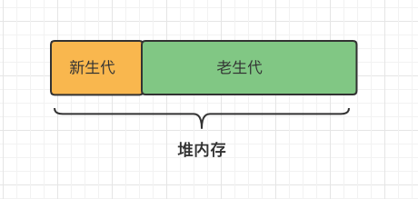
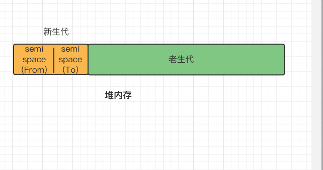

- [V8内存限制](#v8内存限制)
- [Scavenge算法](#scavenge算法)
- [Mark-Sweep & Mark-Compact](#mark-sweep--mark-compact)
- [增量标记（incremental marking）](#增量标记incremental-marking)
- [查看垃圾回收日志](#查看垃圾回收日志)
- [process.memoryUsage()](#processmemoryusage)


### V8内存限制

64位上约1.4G，32位上约0.7G。

具体来讲，V8用**分代**算法分堆，新生代（new space）、老生代（old space）。





64位上新生代为`32MB`，老生代`1400MB`，所以说约`1.4G`；

32位上新生代`16MB`，老生代`700MB`，所以说约`0.7G`。

可以在启动进程时指定两代大小：

```js
node xx --max-new--space-size
node xx --max-old--space-size
```


### Scavenge算法

美 [ˈskævəndʒ]

英 [ˈskævɪndʒ]

- **v.**（从废弃物中）觅食；捡破烂；拾荒；吃（动物尸体）
- **网络**清道夫；清除；扫气

在分代算法基础上，新生代空间一分为二，分为From、To空间，这一对半的空间叫semispace。

新建的对象分配到From空间。垃圾回收时把From空间中活对象复制到To空间，之后From、To角色对调。

优点：因为新生代中对象的存活时间都很短，因此只有少量的活对象需要复制，是最有效率的回收算法。

缺点：空间换时间，只用了一半堆内存。




From的对象在两种条件之一会直接复制到老生代：

1、该对象经历过了Scavenge；

2、To空间已经使用了25%；


### Mark-Sweep & Mark-Compact

标记清除&标记紧缩

Mark-sweep：老生代的回收算法。标记活的对象，清理未被标记的对象。

Mark-compact：清理内存碎片，把存活的对象统移动对齐。


### 增量标记（incremental marking）

为了防止垃圾回收stop the world，采用增量标记。每完成一小步就让应用逻辑执行一会。


### 查看垃圾回收日志

```js
var a = [];
for(var i = 0; i < 1000000; i++) {
  a.push(new Array(100));
}
```


带上--trace_gc启动：

```shell
demon@xx gctest $ node --trace_gc test.js 
[9188:0x1045d8000]       36 ms: Scavenge 2.3 (3.0) -> 1.9 (4.0) MB, 0.9 / 0.0 ms  (average mu = 1.000, current mu = 1.000) allocation failure 
[9188:0x1045d8000]       44 ms: Scavenge 2.4 (4.0) -> 2.4 (4.7) MB, 1.3 / 0.0 ms  (average mu = 1.000, current mu = 1.000) allocation failure 
                        ...
[9188:0x1045d8000]      219 ms: Mark-sweep 57.2 (85.2) -> 56.1 (84.6) MB, 54.6 / 0.0 ms  (+ 0.6 ms in 7 steps since start of marking, biggest step 0.2 ms, walltime since start of marking 57 ms) (average mu = 1.000, current mu = 1.000) finalize incremental marking via stack guard GC in old space requested
[9188:0x1045d8000]      703 ms: Mark-sweep 234.4 (263.2) -> 229.5 (263.2) MB, 238.5 / 0.0 ms  (+ 0.4 ms in 6 steps since start of marking, biggest step 0.1 ms, walltime since start of marking 241 ms) (average mu = 0.506, current mu = 0.506) finalize incremental marking via stack guard GC in old space requested
[9188:0x1045d8000]     1486 ms: Scavenge 718.7 (754.0) -> 714.3 (749.6) MB, 9.5 / 0.0 ms  (average mu = 0.506, current mu = 0.506) allocation failure 
```

Scavenge  新生代当前使用（堆总使用） -->  gc后新生代当前使用（堆总使用），gc耗时。


--prof参数得到V8执行时的性能分析数据，其中包含垃圾回收执行时占用的时间。

```js
for(var i = 0; i < 1000000; i++) {
  var a = {};
}
```


$ node --prof  test01.js

会在当前目录下生成isolate-xxxxxx-v8.log。

在Node源码deps/v8/tools目录下，调用：

$ linux-tick-processor  isolate-xxxxxx-v8.log

但是我的电脑报错。


### process.memoryUsage()

让Node进程内存爆炸

```js
var showMem = function() {
  var mem = process.memoryUsage();

  var format = function(bytes) {
    return (bytes / 1024 / 1024).toFixed(2) + ' MB';
  }

  console.log('Process: heapTotal ' + format(mem.heapTotal) +
  ' heapUsed ' + format(mem.heapUsed) + ' rss ' + format(mem.rss));

  console.log('----------------------------')
}

var useMem = function() {
  var size = 20 * 1024 * 1024;
  var arr = new Array(size);
  for(var i = 0; i < size; i++) {
    arr[i] = 0;
  }
  return arr;
}

var total = [];
for(var j = 0; j < 15; j++) {
  showMem();
  total.push(useMem());
}

showMem();
```


process.memoryUsage()返回的 heapUsed、heapTotal、rss[字段含义](https://stackoverflow.com/questions/12023359/what-do-the-return-values-of-node-js-process-memoryusage-stand-for/38049633#38049633)：


