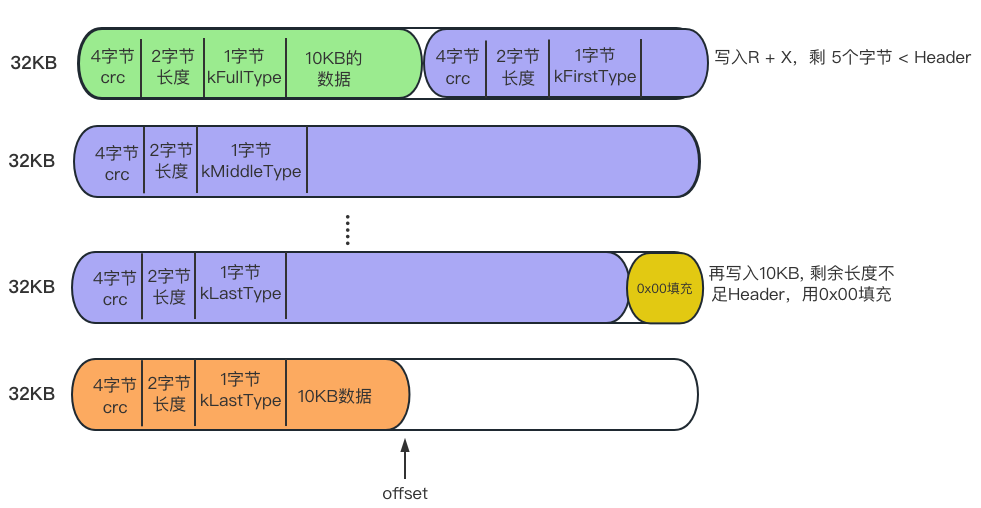

# 编译&使用

git地址：https://github.com/google/leveldb

```shell
git clone --recurse-submodules https://github.com/google/leveldb.git
```

<br />

## 编译出库

```shell
mkdir -p build && cd build
cmake -DCMAKE_BUILD_TYPE=Release .. && cmake --build .
```

在build目录出现libleveldb.a静态库文件。

<br />

## 写个test.cpp

```c++
#include <iostream>
#include <leveldb/db.h>
#include <string>

using namespace std;

int main() {
  leveldb::DB* db;
  leveldb::Options opt;
  leveldb::Status status;
  // 写业务
  // ...
  return 0;
}
```

<br />

## 编译运行

```shell
g++ test.cpp -o testcpp -I/Users/luke/Desktop/test/leveldb/include -L/Users/luke/Desktop/test/leveldb/build -lleveldb -std=c++11

-I:头文件目录
-L:静态库目录
-l:静态库名字
```


# 源码记录

## LEVELDB_EXPORT

在class、struct前面都有一个`LEVELDB_EXPORT`，如：

```c++
struct LEVELDB_EXPORT Options { ... }

class LEVELDB_EXPORT Snapshot { ... }
```

[作用说明](https://stackoverflow.com/questions/70814746/what-does-it-mean-class-leveldb-export-status-in-leveldb): 一些链接器不导出所有的标识符，所以需要这样导出。（没看懂）


## sizeof和alignof区别

sizeof：对象、类占用的内存大小 字节

alignof：对齐的大小 字节

```c++
#include <iostream>
using namespace std;

struct A {
	int avg;
	int avg2;
	double c;
	A(int a, int b) {}
};

struct B {
	int avg;
	int avg2;
	char c;
};

int main() {
	cout<<"sizeof(A):"<<sizeof(A)<<endl;		// 16
	cout<<"alignof(A):"<<alignof(A)<<endl;	// 8

	cout<<"sizeof(B):"<<sizeof(B)<<endl; 		// 12
	cout<<"alignof(B):"<<alignof(B)<<endl;	// 4
}
```


std::aligned_storage

定义在头文件<type_traits> https://en.cppreference.com/w/cpp/types/aligned_storage

```c++
template< std::size_t Len, std::size_t Align = /*default-alignment*/ >
```


# struct ::flock

```c++
int LockOrUnlock(int fd, bool lock) {
  errno = 0;
  struct ::flock file_lock_info;
  std::memset(&file_lock_info, 0, sizeof(file_lock_info));
  file_lock_info.l_type = (lock ? F_WRLCK : F_UNLCK);
  file_lock_info.l_whence = SEEK_SET;
  file_lock_info.l_start = 0;
  file_lock_info.l_len = 0;  // Lock/unlock entire file.
  return ::fcntl(fd, F_SETLK, &file_lock_info);
}
```

锁定fd的部分，https://www.cnblogs.com/kex1n/p/13055518.html


# ::access

https://www.jianshu.com/p/d7c190abde82

F_OK: 文件是否存在

```c++
bool FileExists(const std::string& filename) override {
  return ::access(filename.c_str(), F_OK) == 0;
}
```


# std::string

clear(): 清空字符串。

resize(kHeader): 设置为长度为n个字符，多了截断，少了加空字符。

data(): 返回char* 指针。

size(): 返回字节长度。

push_back(): 往后追加一个字符, 且增加长度。

append(): 追加一个字符串。

remove_prefix()


# std::va_list

```c++
#include <cstdarg>

void Log(Logger* info_log, const char* format, ...) {

  if (info_log != nullptr) {
    // 定义了一个指针 ap, 用于指示可选的参数.
    std::va_list ap;
    
    // 固定格式, ap 指向函数参数列表中的第一个可选参数，argN 是位于第一个可选参数之前的固定参数
    va_start(ap, format);
    info_log->Logv(format, ap);
    
    // 清空参数列表, 并置参数指针 ap 无效
    va_end(ap);
  }
  
}
```


# O_CLOEXEC

  int fd = ::open(filename.c_str(), O_RDWR | O_CREAT | O_CLOEXEC, 0644);

fork出的子进程，保留父进程的fd，但一旦子进程执行了exec，就自动关闭继承来的fd。


# manifest文件格式


# db/log_writer.cc # Writer的写入流程

```c++
class Writer {
  WritableFile* dest_;
  int block_offset_;  // 当前块的偏移
  uint32_t type_crc_[kMaxRecordType + 1]; // kMaxRecordType: 4
  
  Status AddRecord(const Slice& slice); // 调用此方法写入数据
};

// block大小: 32KB
static const int kBlockSize = 32768;
  
// Header is checksum (4 bytes), length (2 bytes), type (1 byte).
// 单次写入数据的头部长度 4字节crc + 2字节长度 + 1字节类型
static const int kHeaderSize = 4 + 2 + 1;
```

Writer抽象出了block的概念，但并不拥有一个实际的block，一个block最大是32KB。

实例化一个新的Writer，调用AddRecord写入数据，梳理下写入流程：

1. 写入10KB，此时offset右移;

   

2. 写入R + x，最后剩下5个字节 < Header；

   

3. 再写入10KB，此时offset到末尾不足一个Header的长度，用0x00来填充，另起一个Block。

   


# 看level如何读文件

有如下文件：testdb/CURRENT，内容是:

```c++
MANIFEST-000002

```


调用代码读:

```c++
std::string current;
Status s = ReadFileToString(env_, "testdb/CURRENT", &current);
...

  
Status ReadFileToString(Env* env, const std::string& fname, std::string* data) {
  data->clear();
  SequentialFile* file;
  
  // 打开文件, 保存fd到file对象
  env->NewSequentialFile(fname, &file);
  
  static const int kBufferSize = 8192;
  char* space = new char[kBufferSize];
  while (true) {
    Slice fragment;
    s = file->Read(kBufferSize, &fragment, space);
    if (!s.ok()) {
      break;
    }
    data->append(fragment.data(), fragment.size());
    if (fragment.empty()) {
      break;
    }
  }
  ...
}

```


其中NewSequentialFile()里今file指向的实际对象是PosixSequentialFile: 

```c++
class PosixSequentialFile final : public SequentialFile {
  int fd_; // 指向打开的文件
  std::string filename_; // 文件名
  
  Read(size_t n, Slice* result, char* scratch);
  Skip(uint64_t n);
};
```


所以过程简单，就是读文件内容到一块内存，一直读到空为止。


# 报错集锦

does not refer to a value

alignof(struct A) 语句报错，编译时加上std11即可：g++ -o sizeof sizeof.cpp --std=c++11

<br />

