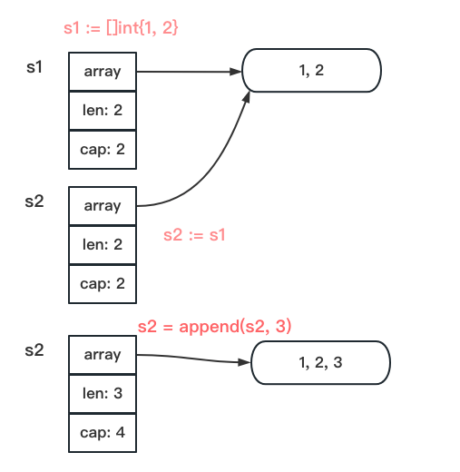

Go专家编程笔记


# 第一章 常见数据结构的实现原理

## 管道

一、读写nil管道均会阻塞。关闭的管道仍然可以读取数据，向关闭的管道写数据会触发panic。总结一下，触发panic的操作有：

- 关闭值为nil的管道；
- 关闭已经关闭的管道；
- 向已经关闭的管道写入数据；


二、for-range可以持续从管理中读出数据，当管理中没有数据时会阻塞当前协程。


## slice

一、slice是引用类型，赋值时底层指向同一个array。

```go
package main

import (
	"fmt"
)

func SliceRise(s []int) {
	s = append(s, 0)
	for i := range s {
		s[i]++
	}
}
func SlicePrint() {
	s1 := []int{1, 2}
	s2 := s1
	s2 = append(s2, 3)
	SliceRise(s1)
	SliceRise(s2)
  
  // 输出[1,2] [2,3,4]
	fmt.Println(s1, s2)
}

func main() {
	SlicePrint()
}
```



注意len和cap即可。


二、append一个nil时的效果

```go
func SliceExtend() {
	var slice []int
	s1 := append(slice, 1, 2, 3)

	// 3, 3
	fmt.Println(len(s1), cap(s1))

	s2 := append(s1, 4)
	// 4, 6
	fmt.Println(len(s2), cap(s2))

	// false
	fmt.Println(&s1[0] == &s2[0])
}
```


三、扩容规则：

cap(原slice) < 1024，则cap(新slice) = 2 * cap(原)，即两倍大小；

cap(原slice) >= 1024，cap(新slice) = 1.25 * cap(原)，1.25倍。


# 第二章 控制结构

## select

一、空的select语句会永远阻塞。

```go
func Select() {
	select {}
}
```


二、case语句中操作了nil的管道，那么该case语句会被忽略。

```go
func Select() {
	var c chan string
	select {
		case c <- "hello":
			fmt.Println("sent")
		default:
			fmt.Println("default")
	}
```


三、select只能用于管道


## for-range

一、for range遍历时，key， value。

```go
// 遍历每次执行一次赋值value, string会拷贝。
// 更好的办法是用key, 不用vaule。
func FindMonkey(s []string) bool {                func Find(s []string) bool {
  for _, v := range s {                             for k := range s {
    if v == "monkey" {                                if s[k] == "monkey" {
			return true                                       return true
    }                                                 }
	}
	return false
}
```


二、for-range作用于值为nil的管道时会永久阻塞。

三、for-range在遍历开始时就已经决定了循环次数，所以迭代过程中向切片追加元素不会有问题。另外，key从0开始取的。

```go
func Range() {
	s := []int{1,2,3}
	for i := range s {
		s = append(s, i)
	}
	// [1,2,3,0,1,2]
	fmt.Println(s)
}
```


