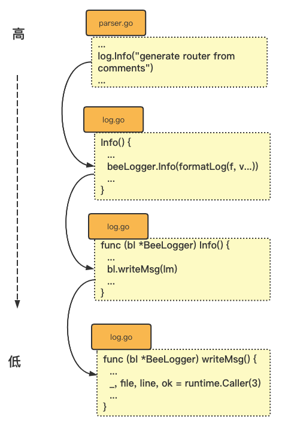

为什么要尝试去看beego源码？

因为，在移植我从egg改过来的tcp框架时发现，无从下手。首先遇到的是参数传递，怎么优雅的传参？

以及插件在go要怎么做？beego可能会有我想要的答案。


# 吐槽

## 路由部分

https://beego.vip/docs/mvc/controller/router.md

```go
可以在 Controller 中通过如下方式获取上面的变量：

this.Ctx.Input.Param(":id")
this.Ctx.Input.Param(":username")
this.Ctx.Input.Param(":splat")
this.Ctx.Input.Param(":path")
this.Ctx.Input.Param(":ext")
```

这种方式也太挫了，去掉冒号不行么？


## 自定义方法及 RESTful 规则

```go
以下是一个 RESTful 的设计示例：

web.Router("/api/food",&RestController{},"get:ListFood")
web.Router("/api/food",&RestController{},"post:CreateFood")
web.Router("/api/food",&RestController{},"put:UpdateFood")
web.Router("/api/food",&RestController{},"delete:DeleteFood")
```

增加路由配置这种方式，不如直接写配置在RestController里，内聚更好


## 注解路由

```go
注解路由
从2.0开始，我们使用配置CommentRouterPath来配置注解路由的扫描路径。在dev环境下，我们将自动扫描该配置指向的目录及其子目录，生成路由文件。

生成之后，用户需要显示 Include 相应地 controller。注意， controller 的 method 方法上面须有 router 注释（// @router），详细的使用请看下面的例子：

// CMS API
type CMSController struct {
    web.Controller
}

func (c *CMSController) URLMapping() {
    c.Mapping("StaticBlock", c.StaticBlock)
    c.Mapping("AllBlock", c.AllBlock)
}

// @router /staticblock/:key [get]
func (this *CMSController) StaticBlock() {
}

// @router /all/:key [get]
func (this *CMSController) AllBlock() {
}
可以在 router.go 中通过如下方式注册路由：

web.Include(&CMSController{})
web 自动会进行源码分析，注意只会在 dev 模式下进行生成，生成的路由放在 “/routers/commentsRouter.go” 文件中。
```

真的挫，还需要记住这种语法。


## 方法表达式路由

这种方式还是好的


# 包级变量、init执行顺序

import web时

```go
package routers

import (
	"quickstart/controllers"
	beego "github.com/beego/beego/v2/server/web"
)

func init() {
    beego.Router("/", &controllers.MainController{})
    beego.Router("/hello", &controllers.MyController{})
}
```

Router方法在 $GOPATH/pkg/mod/github.com/beego/beego/v2@v2.0.1/server/web/server.go

server.go里有init函数：

```go
func init() {
	// create beego application
	BeeApp = NewHttpSever()
}

func NewHttpSever() *HttpServer {
	return NewHttpServerWithCfg(BConfig)
}
```

依赖BConfig变量，定义在/pkg/mod/github.com/beego/beego/v2@v2.0.1/server/web/config.go，属同一个package：

```go
var (
	// BConfig is the default config for Application
	BConfig *Config
  ...
)

func init() {
	BConfig = newBConfig()
  ...
}
```


根据文档，go的init没有明确顺序，如果server.go的init跑在前，不是GG了。然而，go会按照文件名字典序来解析，config.go > server.go，所以顺序是: config.go & server.go 包级变量 --> config.init函数 --> server.init函数

如果把config.go改成zconfig.go，那就gg了。

[一张图说明](https://beego.vip/docs/quickstart/router.md)


# 用到的库

#### path/filepath 内置库

https://pkg.go.dev/path/filepath

```go
import (
	"path/filepath"
)

// 获取目录路径
filepath.Dir(os.Args[0])

// 获取绝对路径，返回 string, err 两个参数
abs, err = filepath.Abs(os.Args[0])

// join路径
appConfigPath = filepath.Join(WorkPath, "conf", filename)

```


#### os 内置库

```go
import (
	"path/filepath"
)

/**
* 可执行文件路径, 比如 go run main.go 生在临时目录生成一个exec文件：
* os.Args[0]: /var/folders/xk/l618n8g0gn/T/go-build378565721/b001/exe/main
*/
os.Args[0]

// 工作目录
wd, err = os.Getwd()

// 获取环境变量值
if os.Getenv("BEEGO_RUNMODE") != "" {}

// 获取文件/文件夹信息，不存在时 err不为空，需要进一步判断
if _, err := os.Stat(name); err != nil 

// 进一步判断, err表示不存在错误
if os.IsNotExist(err) {
```


#### io/ioutil 内置库

```go
import (
	"io/ioutil"
)

// 读取文件内容，返回 []byte, error
data, err := ioutil.ReadFile(name)

```


#### sync.Once

```go
import (
	"fmt"
	"sync"
)

// sync.Once 只执行一次
func main() {
	var once sync.Once
	onceBody := func() {
		fmt.Println("Only once")
	}
	done := make(chan bool)
	for i := 0; i < 10; i++ {
		go func() {
			once.Do(onceBody)
			done <- true
		}()
	}
	for i := 0; i < 10; i++ {
		<-done
	}
}
// 输出 Only once
```


#### sync.Pool

```go
// 池 	
	res := &ControllerRegister{
		routers:  make(map[string]*Tree),
		policies: make(map[string]*Tree),
		pool: sync.Pool{
			New: func() interface{} {
				return beecontext.NewContext()
			},
		},
		cfg: cfg,
	}
```


#### string内置库 strings.NewReplacer

```go
package main

import (
	"fmt"
	"strings"
)

func main() {
	r := strings.NewReplacer("<", "&lt;", ">", "&gt;")
  // 输出 This is &lt;b&gt;HTML&lt;/b&gt;!
	fmt.Println(r.Replace("This is <b>HTML</b>!"))
}


```


#### time内置库

```go
import (
	"time"
)

// 返回当前本地时间 func Now() Time
time.Now()
```


#### 格式化输出结构体

```
// a是接口兜结构体、指针，都可以打印出指向
fmt.Printf("%+v\n", a)
```


#### 结构体内嵌接口的意思

```go
type Logger interface {
	Init(config string) error
	WriteMsg(lm *LogMsg) error
	Destroy()
	Flush()
	SetFormatter(f LogFormatter)
}

type nameLogger struct {
	Logger
	name string
}

// 这样的意思是 Logger可以接收nameLogger实例，如果没有实现接口方法，就不能调用接口方法，否则会编译报错
var ss nameLogger = nameLogger{}
var ii Logger = &nameLogger
```

[参考文章](https://www.jianshu.com/p/a5bc8add7c6e)


#### 可以直接引用对象上的方法

```go
package main
import "fmt"

type ControllerRegister struct {
	routers      map[string]string
	enablePolicy bool
	policies     map[string]string
	enableFilter bool
	filters      []*int
}

func (p *ControllerRegister) serveHttp(ctx *int) {}
type FilterFunc func(ctx *int)

func newFilterRouter(pattern string, filter FilterFunc) {}

func main() {
	res := &ControllerRegister{}
	newFilterRouter("/*", res.serveHttp)
}
```


#### append可以操作nil

```go
	var wildcards []string = nil
	wildcards = append(wildcards, "werw")

	// [ "werw" ]
	fmt.Println(wildcards)
```


#### mime 内置库

[媒体类型](https://developer.mozilla.org/zh-CN/docs/Web/HTTP/Basics_of_HTTP/MIME_types)，通常称为 Multipurpose Internet Mail Extensions 或 MIME 类型 ）是一种标准

```go
import (
	"mime"
)

// 还没看明白是怎么个用法？？
// register MIME type with content type
func registerMime() error {
  // mimemaps: { ".css": "text/css" }
	for k, v := range mimemaps {
		mime.AddExtensionType(k, v)
	}
	return nil
}
```


## Log模块

### [runtime.Caller](https://pkg.go.dev/runtime#Caller)

向上返回调用者信息，跳过3个栈帧

```go
// loggerFuncCallDepth: 3
_, file, line, ok = runtime.Caller(bl.loggerFuncCallDepth)

// 这里返回就是 parser.go、行数
```




## 垃圾代码

log模块# log.go

logM的作用是0啊

```go
func (bl *BeeLogger) writeMsg(lm *LogMsg) error {
  ...
	if bl.asynchronous {

		logM := logMsgPool.Get().(*LogMsg)
		logM.Level = lm.Level
		logM.Msg = lm.Msg
		logM.When = lm.When
		logM.Args = lm.Args
		logM.FilePath = lm.FilePath
		logM.LineNumber = lm.LineNumber
		logM.Prefix = lm.Prefix

		if bl.outputs != nil {
			bl.msgChan <- lm
		} else {
			logMsgPool.Put(lm)
		}
	} else {
		bl.writeToLoggers(lm)
	}
	return nil
}
```

