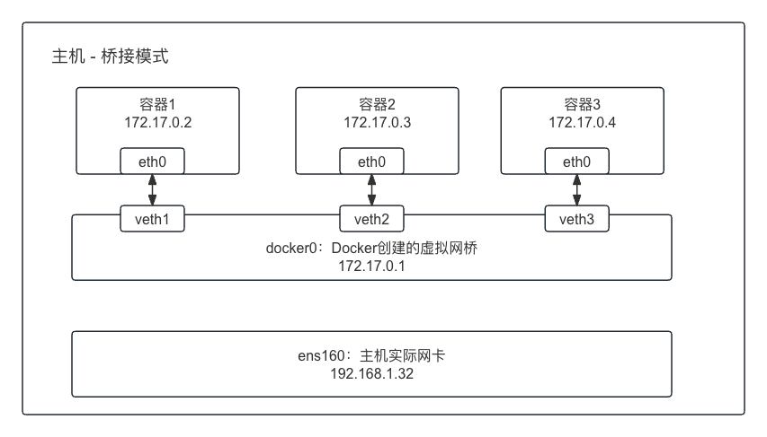

# 基础操作

## 镜像

搜索镜像：`docker search jdk`

拉取镜像到本地：`docker pull 镜像名字:版本`

查看本地镜像：`docker images`

删除镜像：`docker rmi 镜像id`

## 容器

查看正在运行中的容器：`docker ps`。所有容器：`docker ps -a`

运行新容器（每次run都会新建一个）：

`docker run nginx(镜像)` （前台模式运行）

`docker run -d -p 80(宿主端口):80(容器端口)`

​	-d：后台运行；

​	-p：端口映射；

删除容器：`docker rm 容器ID/名字` （不能删除运行中的容器），使用`-f`强制删除。

停止容器：`docker stop 容器ID/名字`

启动容器：`docker start 容器ID/名字`

指定容器名字(names)：`docker run -d -p 80:80 --name nginx01 nginx(镜像)`

容器退出时删除容器：`docker run --rm 镜像`（运行完自动删除, docker stop、或者异常）

容器重启策略：容器关闭时：

no（默认）：不重启；

on-failure：失败时重启，:3，最多重启3次；（docker stop不会重启）

always：失败时一直重启；（同样，docker stop不会重启）

`docker run -d --name nginx01 -P --restart on-failure:3 nginx`

​	-P：随机找一个主机端口映射到80；

​	--restart：重启策略；

docker stop属于正常关闭，所以不会重启。

设置环境变量：`docker run -d -P --name nginx_env -e JAVA_ENV=dev -e JAVA_VM=G1 nginx`

​	-e：指定环境变量

通过：`docker inspect nginx_env`可以看到容器的环境变量值。

或者通过：`docker exec -it nginx_env env` 查看。

限制容器的CPU、内存：

`docker run -d --rm -m 8m --cpus 1 nginx`：内存最多8M

​	-m：8m/8g/8b

​	--cpus：1  **容器CPU占用主机的CPU的比例**

可以通过：`docker stats  容器ID` 查看容器的内存、CPU使用/限制。

查看容器日志：

`docker logs nginx01(容器ID)`

`docker logs -f nginx01`像`tail -f`

进入容器内部：docker exec -it nginx01 /bin/bash

# 高级进阶

## 数据卷 Volume

有两种方式：匿名和具名。

**匿名绑定**：`docker run --rm -d -p 80:80 --name nginx_volume -v /usr/share/nginx/html  nginx`

​	-v: 把容器内的/usr/share/nginx/html目录映射到主机，但不指定是主机哪个位置。

​	通过：`docker inspect nginx_volume`查看Mounts。

​	容器stop/删除后会删除主机映射位置。

**具名绑定：**

`docker run --rm -d -p 80:80 --name nginx_volume -v nginx-html:/usr/share/nginx/html nginx`

​	一样通过docker inspect查看Mounts。

​	容器没了，主机还存在映射位置。

**Bind Mount**：把主机目录映射到容器内，直接用主机目录内容，更常用。

`docker run --rm -d -p 80:80 --name nginx_volume -v /www/nginx-html:/usr/share/nginx/html nginx`

**卷管理**：docker volume 

docker volume ls/create之类的。

## 网络Network

**桥接bridge**：在主机上开一个虚拟网桥Docker0，每一个容器会在Docker0上创建一对虚拟网卡。主机通过Docker0的转发与容器通信。

**主机host**：

