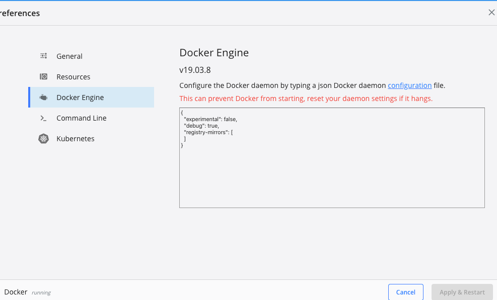

# 环境

macOS Catalina 10.15.7

Docker Desktop 19.03.8


# docker官网

作为一款开源工具，官网没有放github地址，是不好意思放是么？然后找了一圈，没有发现任何编译的文档，热情瞬间全无，我草他妈！

过了几天，冷静下来，重新去查找相关资料。发现docker更名为了moby，至于为什么，某乎上说是docker领导为了把原先积累的docker庞大的粉体群体从搜索引擎上转移到docker官网的产品页上。不得不说，这很高明且恶心！

所以，得看moby。


# moby编译

跟着[moby的文档](https://github.com/moby/moby/blob/master/docs/contributing/set-up-dev-env.md)，第一步`make BIND_DIR=. shell`就报错了

```shell
$ make BIND_DIR=. shell
docker build  --build-arg=GO_VERSION  -f "Dockerfile" --target=dev   -t "docker-dev" .
[+] Building 18.2s (10/10) FINISHED                                                                           
 => [internal] load .dockerignore                                                                        0.1s
 => => transferring context: 34B                                                                         0.0s
 => [internal] load build definition from Dockerfile                                                     0.1s
 => => transferring dockerfile: 38B                                                                      0.0s
 => resolve image config for docker.io/docker/dockerfile:1.3                                            15.5s
 => CACHED docker-image://docker.io/docker/dockerfile:1.3@sha256:42399d4635eddd7a9b8a24be879d2f9a930d0e  0.0s
 => [internal] load .dockerignore                                                                        0.0s
 => [internal] load build definition from Dockerfile                                                     0.2s
 => => transferring dockerfile: 38B                                                                      0.1s
 => ERROR [internal] load metadata for docker.io/djs55/vpnkit:0.5.0                                      1.6s
 => ERROR [internal] load metadata for docker.io/djs55/vpnkit:0.5.0                                      1.5s
 => CANCELED [internal] load metadata for docker.io/library/debian:bullseye                              1.5s
 => CANCELED [internal] load metadata for docker.io/library/golang:1.18.1-bullseye                       1.5s
------
 > [internal] load metadata for docker.io/djs55/vpnkit:0.5.0:
------
------
 > [internal] load metadata for docker.io/djs55/vpnkit:0.5.0:
------
failed to solve with frontend dockerfile.v0: failed to solve with frontend gateway.v0: rpc error: code = Unknown desc = docker.io/djs55/vpnkit:0.5.0 not found
make: *** [build] Error 1

```


解决：

打开docker desktop，把Docker Engine里的registry-mirrors清空，不要配国内的所谓加速地址。




再跑一遍，后面又报错了：

```shell
$ make BIND_DIR=. shell
docker build  --build-arg=GO_VERSION  -f "Dockerfile" --target=dev   -t "docker-dev" .
[+] Building 194.6s (42/76)                                                                                   
 => [internal] load build definition from Dockerfile                                                     0.1s
 => => transferring dockerfile: 38B                                                                      0.0s
 => [internal] load .dockerignore                                                                        0.1s
 => => transferring context: 34B                                                                         0.0s
 => resolve image config for docker.io/docker/dockerfile:1.3                                             3.4s
 => CACHED docker-image://docker.io/docker/dockerfile:1.3@sha256:42399d4635eddd7a9b8a24be879d2f9a930d0e  0.0s
 => [internal] load .dockerignore                                                                        0.0s
 => [internal] load build definition from Dockerfile                                                     0.0s
 => => transferring dockerfile: 38B                                                                      0.0s
 => [internal] load metadata for docker.io/library/debian:bullseye                                       3.1s
 => [internal] load metadata for docker.io/djs55/vpnkit:0.5.0                                            2.8s
 => [internal] load metadata for docker.io/library/golang:1.18.1-bullseye                                1.5s
 => [internal] load metadata for docker.io/djs55/vpnkit:0.5.0                                            2.8s
 => [vpnkit-arm64 1/1] FROM docker.io/djs55/vpnkit:0.5.0@sha256:d9aef9df57edd8d6e2a793ae1786242da5efe1a  3.9s
 => => resolve docker.io/djs55/vpnkit:0.5.0@sha256:d9aef9df57edd8d6e2a793ae1786242da5efe1a1fe09c908bd16  3.9s
 => [internal] load build context                                                                       31.6s
 => => transferring context: 61.08MB                                                                    31.5s
 => [vpnkit-amd64 1/1] FROM docker.io/djs55/vpnkit:0.5.0@sha256:d9aef9df57edd8d6e2a793ae1786242da5efe  113.7s
 => => resolve docker.io/djs55/vpnkit:0.5.0@sha256:d9aef9df57edd8d6e2a793ae1786242da5efe1a1fe09c908bd  187.7s
 => => sha256:d9aef9df57edd8d6e2a793ae1786242da5efe1a1fe09c908bd16e96d2d9cab07 741B / 741B               0.0s
 => => sha256:81b2b42c9be1c14882e762a1ff2c55e210e7786b3a9d4844dc06d38436af79f0 527B / 527B               0.0s
 => => sha256:3a8ef40bfcb9bd910ac224761ec10505456a242fa2c37d8e88fd2916c7fd1205 491B / 491B               0.0s
 => => sha256:c78c38492ad3b2e456a22a162663abfda3a64a6077e6c7721c663f04369b5734 9.86MB / 9.86MB         111.4s
 => => extracting sha256:c78c38492ad3b2e456a22a162663abfda3a64a6077e6c7721c663f04369b5734                1.8s
 => [frozen-images 1/4] FROM docker.io/library/debian:bullseye@sha256:6137c67e2009e881526386c42ba99b3  128.5s
 => => resolve docker.io/library/debian:bullseye@sha256:6137c67e2009e881526386c42ba99b3657e4f92f546814a  0.0s
 => => sha256:6137c67e2009e881526386c42ba99b3657e4f92f546814a33d35b14e60579777 1.85kB / 1.85kB           0.0s
 => => sha256:da1a55850480753941bb8aff55935742562aca344adac8544799e6551b4fe802 529B / 529B               0.0s
 => => sha256:c4905f2a4f97c2c59ee2b37ed16b02a184e0f1f3a378072b6ffa9e94bcb9e431 1.46kB / 1.46kB           0.0s
 => => sha256:67e8aa6c8bbc76b1f2bccb3864b0887671833b8667dc1f6c965fcb0eac7e6402 54.95MB / 54.95MB       115.9s
 => => extracting sha256:67e8aa6c8bbc76b1f2bccb3864b0887671833b8667dc1f6c965fcb0eac7e6402               11.4s
 => [base 1/3] FROM docker.io/library/golang:1.18.1-bullseye@sha256:3b1a72af045ad0fff9fe8e00736baae76  148.3s
 => => resolve docker.io/library/golang:1.18.1-bullseye@sha256:3b1a72af045ad0fff9fe8e00736baae76d70ff51  0.0s
 => => sha256:3b1a72af045ad0fff9fe8e00736baae76d70ff51325ac5bb814fe4754044b972 1.86kB / 1.86kB           0.0s
 => => sha256:967757d5652770cfa81b6cc7577d65e06d336173da116d1fb5b2d349d5d44127 5.16MB / 5.16MB           4.3s
 => => sha256:c357e2c68cb3bf1e98dcb3eb6ceb16837253db71535921d6993c594588bffe04 10.87MB / 10.87MB         9.5s
 => => sha256:5b75b529da0f2196ee8561a90e5b99aceee56e125c6ef09a3da4e32cf3cc6c20 1.80kB / 1.80kB           0.0s
 => => sha256:65375c930b214d93a4c09a1db748e6979ef53ad585ec864dbe837108d48d8d14 7.05kB / 7.05kB           0.0s
 => => sha256:6aefca2dc61dcbcd268b8a9861e552f9cdb69e57242faec64ac120d2355a9c1a 54.94MB / 54.94MB        51.5s
 => => sha256:c766e27afb21eddf9ab3e4349700ebe697c32a4c6ada6af4f08282277a291a28 54.58MB / 54.58MB        74.3s
 => => sha256:d6a8ea6bd5f867dbdf5bad1c42bc569afacf062a0241c1a8b45718fc8ae26fba 85.84MB / 85.84MB       100.0s
 => => sha256:13a9b904f7423b8b1f02a99df065ceb2de067207d626915b84776bb0c918ed0f 141.70MB / 141.70MB     131.5s
 => => extracting sha256:6aefca2dc61dcbcd268b8a9861e552f9cdb69e57242faec64ac120d2355a9c1a               28.2s
 => => sha256:3447e3508f49d81eb14b0cf466950f15126161f20f2d70b8d429017d2b08a74f 156B / 156B              78.0s
 => => extracting sha256:967757d5652770cfa81b6cc7577d65e06d336173da116d1fb5b2d349d5d44127                0.9s
 => => extracting sha256:c357e2c68cb3bf1e98dcb3eb6ceb16837253db71535921d6993c594588bffe04                1.2s
 => => extracting sha256:c766e27afb21eddf9ab3e4349700ebe697c32a4c6ada6af4f08282277a291a28                8.9s
 => => extracting sha256:d6a8ea6bd5f867dbdf5bad1c42bc569afacf062a0241c1a8b45718fc8ae26fba               13.3s
 => => extracting sha256:13a9b904f7423b8b1f02a99df065ceb2de067207d626915b84776bb0c918ed0f               15.6s
 => => extracting sha256:3447e3508f49d81eb14b0cf466950f15126161f20f2d70b8d429017d2b08a74f                0.0s
 => https://download.opensuse.org/repositories/devel:/tools:/criu/Debian_11/Release.key                  0.0s
 => [vpnkit 1/2] COPY --from=vpnkit-amd64 /vpnkit /build/vpnkit.x86_64                                   0.9s
 => [vpnkit 2/2] COPY --from=vpnkit-arm64 /vpnkit /build/vpnkit.aarch64                                  0.8s
 => [frozen-images 2/4] RUN --mount=type=cache,sharing=locked,id=moby-frozen-images-aptlib,target=/var  37.0s
 => [base 2/3] RUN echo 'Binary::apt::APT::Keep-Downloaded-Packages "true";' > /etc/apt/apt.conf.d/keep  1.2s
 => [base 3/3] RUN sed -ri "s/(httpredir|deb).debian.org/${APT_MIRROR:-deb.debian.org}/g" /etc/apt/sour  0.5s
 => [dockercli 1/2] COPY /hack/dockerfile/install/install.sh /hack/dockerfile/install/dockercli.install  0.2s
 => [criu 1/2] ADD --chmod=0644 https://download.opensuse.org/repositories/devel:/tools:/criu/Debian_11  0.1s
 => CANCELED [gotestsum 1/1] RUN --mount=type=cache,target=/root/.cache/go-build     --mount=type=cach  36.9s
 => CANCELED [containerd 1/3] RUN --mount=type=cache,sharing=locked,id=moby-containerd-aptlib,target=/  37.3s
 => CANCELED [runtime-dev-cross-false 1/1] RUN --mount=type=cache,sharing=locked,id=moby-cross-false-a  37.3s
 => [swagger 1/2] WORKDIR /go/src/github.com/go-swagger/go-swagger                                       0.1s
 => [rootlesskit 1/4] COPY /hack/dockerfile/install/install.sh /hack/dockerfile/install/rootlesskit.ins  0.2s
 => CANCELED [golangci_lint 1/1] RUN --mount=type=cache,target=/root/.cache/go-build     --mount=type=  37.0s
 => [registry 1/2] WORKDIR /go/src/github.com/docker/distribution                                        0.3s
 => CANCELED [shfmt 1/1] RUN --mount=type=cache,target=/root/.cache/go-build     --mount=type=cache,ta  37.2s
 => CANCELED [gowinres 1/1] RUN --mount=type=cache,target=/root/.cache/go-build     --mount=type=cache  35.9s
 => CANCELED [tomll 1/1] RUN --mount=type=cache,target=/root/.cache/go-build     --mount=type=cache,ta  35.7s
 => CANCELED [tini 1/3] RUN --mount=type=cache,sharing=locked,id=moby-tini-aptlib,target=/var/lib/apt   36.1s
 => CANCELED [delve 1/1] RUN --mount=type=cache,target=/root/.cache/go-build     --mount=type=cache,ta  35.5s
 => CANCELED [swagger 2/2] RUN --mount=type=cache,target=/root/.cache/go-build     --mount=type=cache,  35.2s
 => CANCELED [criu 2/2] RUN --mount=type=cache,sharing=locked,id=moby-criu-aptlib,target=/var/lib/apt   36.4s
 => CANCELED [dockercli 2/2] RUN --mount=type=cache,target=/root/.cache/go-build     --mount=type=cach  34.9s
 => CANCELED [rootlesskit 2/4] RUN --mount=type=cache,target=/root/.cache/go-build     --mount=type=ca  37.2s
 => CANCELED [registry 2/2] RUN --mount=type=cache,target=/root/.cache/go-build     --mount=type=cache  36.1s
 => [frozen-images 3/4] COPY contrib/download-frozen-image-v2.sh /                                       0.2s
 => ERROR [frozen-images 4/4] RUN /download-frozen-image-v2.sh /build         busybox:latest@sha256:95  19.1s
------
 > [frozen-images 4/4] RUN /download-frozen-image-v2.sh /build         busybox:latest@sha256:95cf004f559831017cdf4628aaf1bb30133677be8702a8c5f2994629f637a209         busybox:glibc@sha256:1f81263701cddf6402afe9f33fca0266d9fff379e59b1748f33d3072da71ee85         debian:bullseye-slim@sha256:dacf278785a4daa9de07596ec739dbc07131e189942772210709c5c0777e8437         hello-world:latest@sha256:d58e752213a51785838f9eed2b7a498ffa1cb3aa7f946dda11af39286c3db9a9         arm32v7/hello-world:latest@sha256:50b8560ad574c779908da71f7ce370c0a2471c098d44d1c8f6b513c5a55eeeb1:
#31 18.60 curl: (35) OpenSSL SSL_connect: SSL_ERROR_SYSCALL in connection to production.cloudflare.docker.com:443 
------
failed to solve with frontend dockerfile.v0: failed to solve with frontend gateway.v0: rpc error: code = Unknown desc = failed to build LLB: executor failed running [/bin/sh -c /download-frozen-image-v2.sh /build         busybox:latest@sha256:95cf004f559831017cdf4628aaf1bb30133677be8702a8c5f2994629f637a209         busybox:glibc@sha256:1f81263701cddf6402afe9f33fca0266d9fff379e59b1748f33d3072da71ee85         debian:bullseye-slim@sha256:dacf278785a4daa9de07596ec739dbc07131e189942772210709c5c0777e8437         hello-world:latest@sha256:d58e752213a51785838f9eed2b7a498ffa1cb3aa7f946dda11af39286c3db9a9         arm32v7/hello-world:latest@sha256:50b8560ad574c779908da71f7ce370c0a2471c098d44d1c8f6b513c5a55eeeb1]: runc did not terminate sucessfully
make: *** [build] Error 1
```

解决：网络问题，再跑一遍，顺利通过。这时是进入了一个容器里面。


开始编译

```shell
hack/make.sh binary
```


安装到`/usr/local/bin/`

```shell
make install
```


启动`dockerd`

```shell
dockerd -D
```

-D表示以debug模式启动


修改代码生效

1. 改之前`dockerd --help`看一下显示信息

```shell
root@74eefcf08f1f:/go/src/github.com/docker/docker# dockerd --help

Usage:	dockerd [OPTIONS]

A self-sufficient runtime for containers.

```

2. 找到cmd/dockerd/docker.go，修改一下提示。直接在宿主机上修改即可。

3. 回到容器，重新编译、安装、启动：

   ```shell
   hack/make.sh binary
   make install
   dockerd --help
   ```

4. [退出容器、重新进入](https://github.com/moby/moby/issues/43135)

   ```shell
   exit
   
   docker run --privileged --rm -ti -v $(pwd):/go/src/github.com/docker/docker docker-dev /bin/bash
   ```


编译CLI

https://github.com/docker/cli

```shell
docker buildx bake
```

报错 docker: 'buildx' is not a docker command。


[在这里有讨论](https://github.com/docker/buildx/issues/132)两者取其一：

1.  ~/.docker/config.json里的experimental改为enabled；

   ```json
   {
     "auths" : {
   
     },
     "stackOrchestrator" : "swarm",
     "experimental" : "disabled",
     "credsStore" : "desktop"
   }
   ```

2. 带上环境变量执行`DOCKER_CLI_EXPERIMENTAL=enabled docker buildx --help`


再次执行docker buildx bake，报错：

```sh
$ DOCKER_CLI_EXPERIMENTAL=enabled docker buildx bake
At 24:22: Unknown token: 24:22 IDENT GO_VERSION

```

