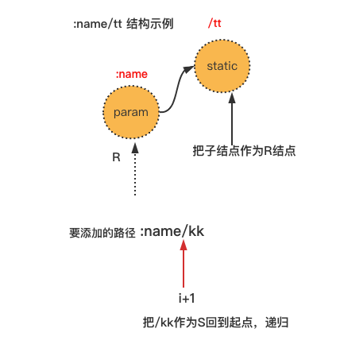

gin笔记

版本：v1.7.7


$ go get -u github.com/gin-gonic/gin

mod源码在：$GOPATH/pkg/mod/github.com/gin-gonic/gin@v1.7.7

```go
package main

import "github.com/gin-gonic/gin"

func main() {
	r := gin.Default()
	r.GET("/ping", func(c *gin.Context) {
		c.JSON(200, gin.H{
			"message": "pong",
		})
	})
	r.Run() // listen and serve on 0.0.0.0:8080 (for windows "localhost:8080")
}
```


三种mode

debug、release、test

 通过环境变量 const EnvGinMode = "GIN_MODE" 决定，默认debug


结构体可以调用指针接收者

```go
	engine := &Engine{
		RouterGroup: RouterGroup{
			Handlers: nil,
			basePath: "/",
			root:     true,
		},
		...
		}

engine.RouterGroup.Use(middleware...)

func (group *RouterGroup) Use(middleware ...HandlerFunc) IRoutes {
	group.Handlers = append(group.Handlers, middleware...)
	return group.returnObj()
}

// engine里的RouterGroup是结构体，非指针
// 但RouterGroup的Use方法接收者是指针
```


处理器数量限制

```go
// math.MaxInt8: 127
const abortIndex int8 = math.MaxInt8 / 2 // 63
```


[path](https://pkg.go.dev/path#Join) 内置模块

path.Join("a/b", "c"))


fmt格式化

```go
debugPrint("%-6s %-25s --> %s (%d handlers)\n", httpMethod, absolutePath, handlerName, nuHandlers)


var DefaultWriter io.Writer = os.Stdout

func debugPrint(format string, values ...interface{}) {
	if IsDebugging() {
		if !strings.HasSuffix(format, "\n") {
			format += "\n"
		}
		fmt.Fprintf(DefaultWriter, "[GIN-debug] "+format, values...)
	}
}

//你也许也想控制字符串输出时的宽度，特别是要确保他们在类表格输出时的对齐。这是基本的右对齐宽度表示。
 fmt.Printf("|%6s|%6s|\n", "foo", "b")

 //要左对齐，和数字一样，使用 - 标志。
 fmt.Printf("|%-6s|%-6s|\n", "foo", "b")
```

 

字符串拼接

```go
fmt.Sprintf("%s%s", s1, s2)
```


Sprintf保留%号

```go
format := fmt.Sprintf("%%-%ds", width) // "%-24s"
```


切片追加，覆盖最后一个

```go
n.children = append(n.children[:len(n.children)-1], child, wildcardChild)
```


关键名称：最左最短前缀树。


假设，最开始的路由route.GET("/R~1~R~2~R~3~R~4~R~5~..........R~n~",  func(c *gin.Context) {} )，这个时候树还是空的，直接调用n.insertChild(path, fullPath, handlers)函数


对于/R~1~R~2~R~3~R~4~R~5~..........R~n~，分几种情况：

一、没有通配符:和*


<br />

二、无*号，但至少有一个冒号":"，第一个冒号所在位置R~i~，有如下推论：

- n >= i + 1  比如/user/: 就是非法，必须带有参数名。

- 设集合A = \{  j | j$\in$ \(i+1, n\] \&& R~j~ = : } ，且A从小大到排序；

  集合B = \{ k | k$\in$ \(i+1, n\] \&& R~k~ = / } ，且B从小大到排序。

  A与B分四种情况

  1. A = $\emptyset$，B  = $\emptyset$   此时生成的路由树如下，W表示wildcard，虚线表示不挂载handlers。

     

  

  2. A = $\emptyset$，B $\neq $ $\emptyset$  取 k = Min(B) 此时生成的路由树如下

     

     

  3.  A  $\neq $ $\emptyset$，B = $\emptyset$  非法，不能在单个路径上（即用/分隔的路径）存在多个通配符，比如 /user:name:id。

  4.  A  $\neq $ $\emptyset$，B $\neq $ $\emptyset$ 这种情况最复杂，需要考查 j、k的关系，取 j = Min(A)，k = Min(B)

     - j < k 非法，比如/user/:name:

     - j > k 以k的分界线，先生成k之前的部分，之后再以k为起点，递归的从1开始生成子结点

       

       以/user:name/uid:uid为例，生成的路由树如下：

       

<br />

三、无:号，至少有一个\*，第一个*号所在位置R~i~，有如下推论

- 有且仅有一个* ，gin规定路径中只能有一个\*，比如 /user/*name/\*id 是非法；
- R~i-1~ = /，gin规定在\*之前，必须使用/开头，比如 /user*name 是非法；
- *只能在路径的最后面，比如/user/\*name/id 是非法；

注意，`r.GET("*name", func(c *gin.Context){})` 在内部gin会加上/，开成 /*name路径。

形成的路由树以及一个例子/user/name/*name，其中左边绿色小方框的是fullPath，右边橙色的是indices 


四、有:号，且有*号，根据三的结论，\*号只能有一个，且\*号只能在路径最后面，此时可以这样处理

- 设集合A = \{  j | j$\in$ \[1, n\] \&& R~j~ = : } ，且A从小大到排序，取 j = Max(A)；

  集合B = \{ k | k$\in$ \(k+1, n\] \&& R~k~ = / } ，且B从小大到排序，取 k = Min(B)；

  k 即为最后一个:号后面的第一个/位置；

  分成两个子串：T = /R~1~R~2~R~3~....R~k-1~ 和 Y = R~k~R~k+1~....R~n~，T只有:号，Y只有*号。

  对于T，按照前面一二递归处理；对于Y，按照三处理，即可。

  下图为例子 /user/name/:name/id/:id/sex/*sex

  

  

  

  到这里，单个路由树的规则已经有了。接下来是在已有路由树的基础上添加路由，导致的结点分裂、移动。

  

  设已有的路由树如下

  

  要添加的路径为 S = S~1~S~2~S~3~...S~m~，R与S的最长公共子串为C = C~1~C~2~C~3~...C~i~，i$\in$\[1, Min(n, m)\]，i、m、n三者关系讨论：

  

  只有 ① ② ③ ④ 有效，其他都是无效的组合。

  

  - 对于①，此时需要将R分裂，C（即 R~1~R~2~R~3~...R~i~）作为父结点，R~i+1~...R~n~子结点

  

  - 对于 ③，相当于无效路由；

  - 对于 ④，按照下面的规则：

    1. 截取 P = S~i+1~...S~m~；

       

    2. 如果当前结点R是个param结点，S~i+1~ = /，且 R有子结点（有的话只会有一个子结点）：

       S = P，R = children[0]；

       回到起点；

       

    3. 如果在当前结点R的indices（param结点不会有indices）中能找到相同的S~i+1~值，说明在R的子结点中，有相同的前缀：

       找到该子结点R~c~；

       增加R~c~的权值，并根据新的权值，重新排列R的子结点们；

       S = P，R = R~c~；

       回到起点；

       

    4. 如果S~i+1~ != :，且S~i+1~ != *：

       为当前结点R添加indices；

       在当前结点R后面添加添加子结点S~i+1~S~i+2~...S~m~，添加方式与前面生成路由树的过程一样，会增加当前结点R的权重，重新排列；

       最后返回；

       

       

    5. 如果当前结点R的W值（R.wildcard) = true：

       W值为true，只能是param和catchAll两种情况，且两种情况的模式是这样：

       

       对于catchAll模式，直接panic退出。因为catchAll是通配后缀所有的字符串，gin规定不能在其后面添加路径；

       对于param模式，取R的子结点R~c~（唯一的子结点），即R~c~ = R.child，接着判断 P是否要比R~c~长，且P是否以R~c~打头，且 R~c~打头后第一个字符是 /，即进行以下判断：

       取 L = len(R~c~)，len(P) >= L  &&  P[:L] == R~c~ && P[L] = /

       如果条件不满足，则直接panic退出，因为gin不允许存在存在相同param模式的路径，比如（/:name 与 /:namekk）。

       如果条件满足，S = P，R = R~c~；

       回到起点；

       


至此完成！


打印出层级路由树

```go
func (engine *Engine) PrintTrees() {
	for _, tree := range engine.trees {
		// debugPrint("%-6s %-25s --> %s (%d handlers)\n", httpMethod, absolutePath, handlerName, nuHandlers)
		fmt.Fprintf(DefaultWriter, "method: %s\n  root: ", tree.method)
		printNode(tree.root, 0)

		fmt.Println()
	}
}

func printNode(n *node, indent int) {
	content := fmt.Sprintf("path(%s) fullPath(%s) prio(%d) indices(%s) wildChild(%t) handlers(%d) nType(%s)\n", n.path, n.fullPath, n.priority, n.indices, n.wildChild, len(n.handlers), getNtype(n.nType))
	format := fmt.Sprintf("%%%ds", len(content) + indent)

	fmt.Fprintf(DefaultWriter, format, content)

	if indent == 0 {
		indent += 10
	} else {
		indent += 2
	}

	for _, c := range n.children {
		printNode(c, indent)
	}

}
```

