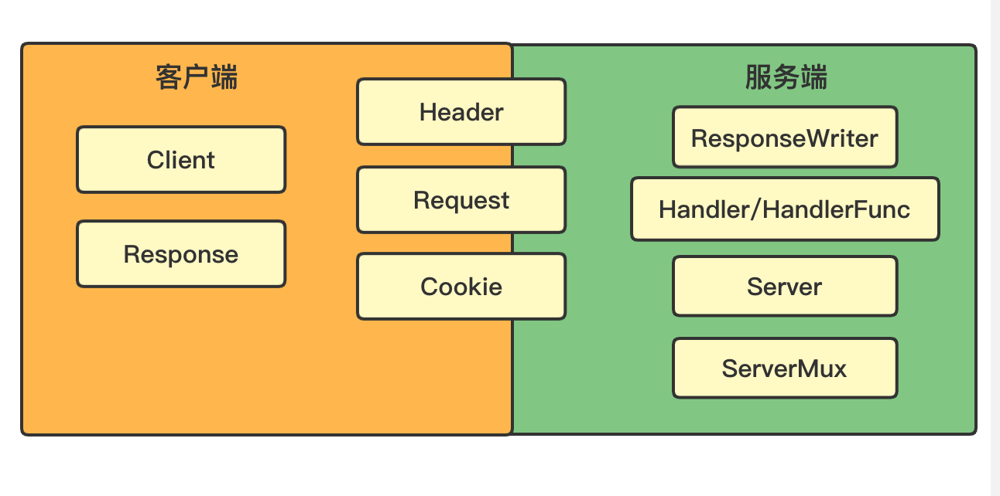

## 第3章 接收请求

### 货物崇拜编程（cargo cult programming）

隐藏在web框架之下的通常是net/http、html/template两个标准库。


### net/http标准库组成部分



### 最简单的web服务器

```go
package main

import (
	"net/http"
)

func main() {
  // 默认监听80端口，使用默认的多路复用器 DefaultServeMux
	http.ListenAndServe("", nil)
}
```


### 附加配置的web

```go
package main

import (
	"net/http"
)

func main() {
	server := http.Server{
		Addr: "127.0.0.1:8080",
		Handler: nil,
	}
	server.ListenAndServe()
}
```


### http.ListenAndServe(address, engine) 实现

```go
func ListenAndServe(addr string, handler Handler) error {
	server := &Server{Addr: addr, Handler: handler}
	return server.ListenAndServe()
}
```


### http.Server结构体配置

```go
type Server struct {
	Addr string
	Handler Handler 
	TLSConfig *tls.Config
	ReadTimeout time.Duration
	ReadHeaderTimeout time.Duration
	WriteTimeout time.Duration
	IdleTimeout time.Duration
	MaxHeaderBytes int
	TLSNextProto map[string]func(*Server, *tls.Conn, Handler)
	ConnState func(net.Conn, ConnState)
	ErrorLog *log.Logger
	BaseContext func(net.Listener) context.Context
	ConnContext func(ctx context.Context, c net.Conn) context.Context
	inShutdown atomicBool // true when when server is in shutdown
	disableKeepAlives int32     // accessed atomically.
	nextProtoOnce     sync.Once // guards setupHTTP2_* init
	nextProtoErr      error     // result of http2.ConfigureServer if used

	mu         sync.Mutex
	listeners  map[*net.Listener]struct{}
	activeConn map[*conn]struct{}
	doneChan   chan struct{}
	onShutdown []func()
}
```


### 处理器

任何接口只要拥有一个ServeHTTP方法且签名相同，那它就是一个处理器。

```go
ServeHTTP(http.ResponseWriter, *http.Request)
```

<br />

自定义一个处理器替换默认的多路复用器

```go
package main

import (
	"fmt"
	"net/http"
)

type MyHandler struct {}
func (h *MyHandler) ServeHTTP(w http.ResponseWriter, r *http.Request) {
	fmt.Fprintf(w, "Hello World!")
}

func main() {
	handler := MyHandler{}
	server := http.Server{
		Addr: "127.0.0.1:8080",
		Handler: &handler,
	}
	server.ListenAndServe()
}
```

<br />

### 使用多个处理器

```go
package main

import (
	"fmt"
	"net/http"
)

type HelloHandler struct {}
func (h *HelloHandler) ServeHTTP(w http.ResponseWriter, r *http.Request) {
	fmt.Fprintf(w, "Hello!")
}

type WorldHandler struct {}
func (h *WorldHandler) ServeHTTP(w http.ResponseWriter, r *http.Request) {
	fmt.Fprintf(w, "World!")
}

func main() {
	hello := HelloHandler{}
	world := WorldHandler{}
	server := http.Server{
		Addr: "127.0.0.1:8080",
	}
	http.Handle("/hello", &hello)
	http.Handle("/world", &world)

	server.ListenAndServe()
}
```


### 处理器函数

与处理器有相同行为的函数，与ServeHTTP方法有相同的签名。

```go
package main

import (
	"fmt"
	"net/http"
)

func hello(w http.ResponseWriter, r *http.Request) {
	fmt.Fprintf(w, "Hello!")
}

func world(w http.ResponseWriter, r *http.Request) {
	fmt.Fprintf(w, "World!")
}

func main() {
	server := http.Server{
		Addr: "127.0.0.1:8080",
	}
	http.HandleFunc("/hello", hello)
	http.HandleFunc("/world", world)

	server.ListenAndServe()
}
```

处理器函数只是创建处理器的便利方法。

<br />

### http的handler

```go
type Handler interface {
	ServeHTTP(ResponseWriter, *Request)
}

/// 实现了 Handler 接口
type HandlerFunc func(ResponseWriter, *Request)
func (f HandlerFunc) ServeHTTP(w ResponseWriter, r *Request) {
	f(w, r)
}

```

<br />

### ServeMux和DefaultServeMux

ServeMux是一个结构，实现了ServeHTTP方法，也是个处理器。

DefaultServeMux是ServeMux的实例。


## 第4章 处理请求

通过调用Request结构提供的方法，可以将URL、Body（主体）提取到结构的Form、PostForm和MultipartForm字段。

一般步骤是：

1、调用ParseForm/ParseMultipartForm方法进行语法分析。

2、根据1调用的方法，访问Form、PostForm或MultipartForm


### Form字段

```html
<body>
  <form action=http://127.0.0.1:8080/process?hello=world&thread=123 method="post" enctype="application/x-www-form-urlencoded">
    <input type="text" name="hello" value="sau sheong" />
  	<input type="text" name="post" value="456" />
    <input type="submit" />
  </form>
</body>
```

对应的controller：

```go
func process(w http.ResponseWriter, r *http.Request) {
  r.ParseForm()
  fmt.Fprintln(w, r.Form)
}
```

输出：map[thread:[123] hello:[sau shenong world] post:[456]]

是个map，key是string，value是string切片。

所以Form里包含了queryString和body，并进行合并。对于body只支持application/x-www-form-urlencoded编码。如果表单改成multipart/form-data，就获取不到body，但能正常获取queryString。


### PostForm字段

只获取body里的字段，只支持application/x-www-form-urlencoded编码，如果表单改成multipart/form-data，就获取不到。


### MultipartForm字段

为获取multipart/form-data表单数据，需要用ParseMultipartForm方法和MultipartForm字段。

```go
r.ParseMultipartForm(1024) // 从表单数据取多少字节的数据
fmt.Fprintln(w, r.MultipartForm) // &{map[hello: [sau shenong] post:[456]] map[] }
```

MultipartForm只包含body，不包含queryString。

MultipartForm是一个包含两个map的结构，一个key是string，value是string切片；另一个是用来保存上传的文件。


### FormValue(xxx)方法

访问Form字段的快捷方法，会自动调用ParseForm方法或ParseMultipartForm方法，取决于enctype。不用自己手动调用了。

```go
// sau sheong 只取Form里的第一个
fmt.Fprintln(w, r.FormValue("hello"))

// map[post:[456] hello:[sau sheong world] thread:[123]]
fmt.Fprintln(w, r.Form)
```

### PostFormValue(xxx)方法

访问PostForm字段的快捷方法，会自动调用ParseForm方法或ParseMultipartForm方法，取决于enctype。不用自己手动调用了。

```go
// sau sheong
fmt.Fprintln(w, r.PostFormValue("hello"))

// map[hello:[sau sheong] post:[456]]
fmt.Fprintln(w, r.PostForm)
```


### 注意

ParseForm方法只支持application/x-www-form-urlencoded编码的表单，不支持application/json编码，所以获取不到。

