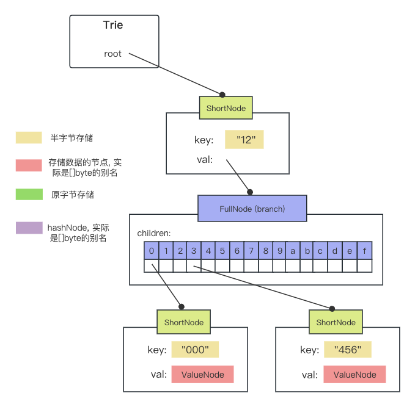
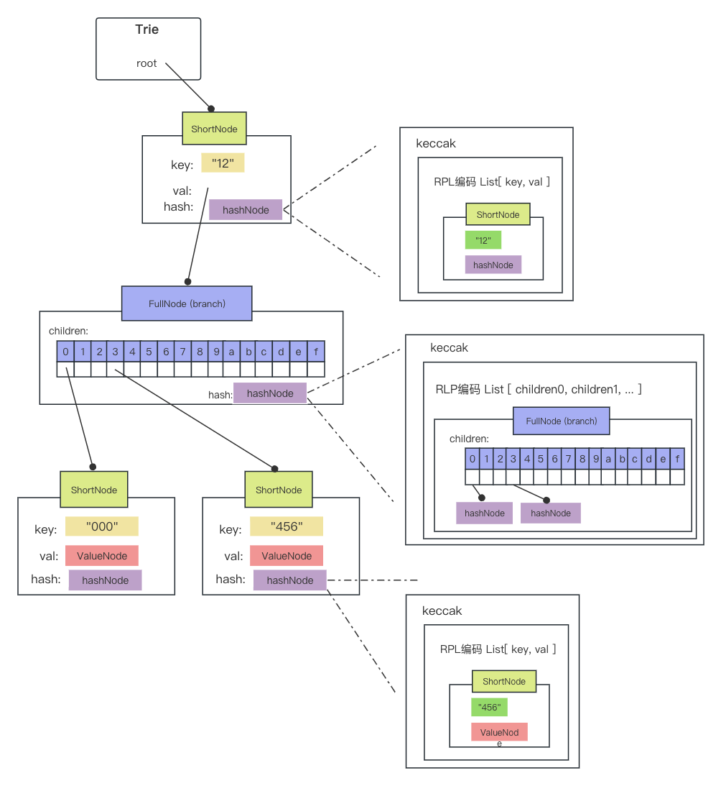

go的数组比较：只能是长度相同，且元素坑位的值相同，才返回true。

```go
type Hash [32]byte

root := Hash{}
root == Hash{} // true
```


go可以调用空指针的方法!

```go
type Trie struct {
	root  node
	owner common.Hash
	db *Database
	tracer *tracer
}

trie := &Trie{
		owner: owner,
		db:    db,
}

// tracer是nil指针, 但可以调用
t.tracer.onInsert(prefix)

// 只不过, 要判断
func (t *tracer) onInsert(key []byte) {
	if t == nil {
		return
	}
```

<br />

可以对nil切片append

```go
package main
import "fmt"

func hold(path []byte) {
	fmt.Println(string(path))
}

func commit(path []byte) {
  // 打印hello, 不影响path
	hold(append(path, []byte("hello")...))
  
  // 打印[]
	fmt.Println(path)
  
  // 打印空串
	fmt.Println(string(path))
}

func main() {
	commit(nil)
}
```

<br />

空串可做map的key


先从trie_test.go看起。


nibble：半字节，把一个字节的高4位，低4位分开

Str: [ 18 ] => nibbles: [ 0x01, 0x02, 16 ]

```go
func keybytesToHex(str []byte) []byte {
	l := len(str)*2 + 1
	var nibbles = make([]byte, l)
	for i, b := range str {
		nibbles[i*2] = b / 16
		nibbles[i*2+1] = b % 16
	}
	nibbles[l-1] = 16
	return nibbles
}
```

<br />

在一个空trie里 update两条数据：

```
updateString(trie, "120000", "qwerqwerqwerqwerqwerqwerqwerqwer")
updateString(trie, "123456", "asdfasdfasdfasdfasdfasdfasdfasdf")
```

会形成这样的结构：



其中的key是以半字节存储。而在FullNode里的children，是一个固定长度的数据，正好指向不同的半字节，同时，children的下标也包含了key的信息。


Trie.Hash()方法：

意思是hash这颗树。需要递归的去hash，先Hash最底层的两个存ValueNode的ShortNode。

以"000" shortNode为例。

先复制两个出来，一个叫collapse，一个叫cached，collapse的key由半字节还原回了原始的key，返回到上层：

```go
func (h *hasher) hashShortNodeChildren(n *shortNode) (collapsed, cached *shortNode) {
	collapsed, cached = n.copy(), n.copy()
	collapsed.Key = hexToCompact(n.Key)
	switch n.Val.(type) {
	case *fullNode, *shortNode:
		collapsed.Val, cached.Val = h.hash(n.Val, false)
	}
	return collapsed, cached
}

```

然后开始对collapsed进行hash，既然是hash，肯定是要对原始数据hash好点，所以把key还原回来：

```go
hashed := h.shortnodeToHash(collapsed, force)
```

看一下是怎么hash的：

```go
func (h *hasher) shortnodeToHash(n *shortNode, force bool) node {
	n.encode(h.encbuf)
	enc := h.encodedBytes()

	if len(enc) < 32 && !force {
		return n // Nodes smaller than 32 bytes are stored inside their parent
	}
	return h.hashData(enc)
}
```

前面两步用rlp编码，把key, value写进一个List，得到的编码字节长度如果 < 32，说明数据据不大，直接存也没问题，直接返回该ShortNode，否则hash一下，返回一个hashNode。简单起见，假设都是>=32，都需要hash。最终得到的trie结构如下：




形式化定义hash(node) =  keccak( RPL( List[ key, value ] ) )。

Trie.hash()最终返回的就是最上层的hash值，是从下到上进行了一遍hash，就是一颗Merkle树。


