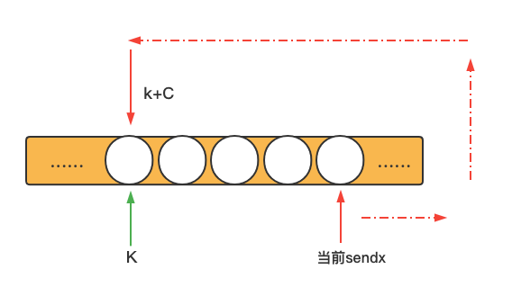

# go内存模型

原文: https://go.dev/ref/mem


## 介绍

Go内存模型制定了一套规则：针对同一个变量，一个goroutine的读操作如何才能保证(guarantee)观察到（observe）另一个goroutine的写操作。

> 翻译翻译，什么叫观察到？
>
> \
>
> 有如下代码
>
> ```go
> package main
> 
> import (
> 	"fmt"
> 	"runtime"
> 	"sync"
> )
> 
> var v string
> var done bool
> var wg sync.WaitGroup
> 
> func write() {
> 	v = "hello world"
> 	done = true
> 
> 	if done {
> 		fmt.Println("wrote,", len(v))
> 	}
> 	wg.Done()
> }
> 
> func read() {
> 	for !done {
> 		runtime.Gosched()
> 	}
> 	fmt.Println("read,", v)
> 	wg.Done()
> }
> 
> func main() {
> 	wg.Add(2)
> 
> 	go write()
> 	go read()
> 
> 	wg.Wait()
> }
> ```
>
> 如果编译器没有重排，输出结果是：
>
> ```go
> // write 先行于 read执行
> wrote, 11
> read, hello world
> ```
>
> read读取到了write后的值，这就是说read观察到了其他goroutine对变量v的写，符合我们的预期。
>
> 然蛾，假设编译器在后台对write进行重排，如下：
>
> ```go
> func write() {
> 	done = true
> 	v = "hello world"
> 
> 	if done {
> 		fmt.Println("wrote,", len(v))
> 	}
> 	wg.Done()
> }
> ```
>
> done与v的顺序重排了，此时可能的输出结果有：
>
> ```go
> // 预期情况：write 先行于 read执行
> wrote, 11
> read, hello world
> 
> // 非预期情况：write赋值done后放出cpu -> read调度执行完 -> write调度执行剩下的write v
> read,
> wrote, 11
> ```
>
> read没有读取到write后的值，这就是说read没有观察到其他goroutine对变量v的写，不符合我们的预期。
>
> 那要怎么搞？自己写的代码，编译器还来插一手，插一手就算了，还插的不对？有什么好办法，引出建议。


## 建议

如果修改数据的同时，有多个goroutine访问这个数据，那必须要串行化访问。

要实现串行化访问，用channel或者sync、async/atomic包里的同步原语。

如果你必须得读文档剩下的内容才能理解你自己写的代码，那你就太水了。

做人不要这么水。


## Happens Before

在单个gorountine内部，读和写必须以程序定义的顺序来执行，编译器和处理器只能在不影响单个gorountine的执行行为的情况下，才可以进行重排。因为存在重排，一个gorountine观察到的执行顺序可能与另一个gorountine观察到的不一样。比如，goroutine执行`a = 1; b = 2;`，在另一个gotoutine里观察到的可能是`b = 2; a = 1;`

> 这段是对介绍部分里的例子做进一步解释，编译器不能乱重排，不能影响单个goroutine的执行结果。
>
> 举个例子:
>
> ```go
> func write() {
> 	v = "hello world"
> 
>   if done {
>     v = "hello reorder"
>   }
> 	done = true
> 
> 	if done {
> 		fmt.Println("wrote,", len(v))
> 	}
> 	wg.Done()
> }
> ```
>
> 这种情况就不能重排v和done，一旦重排，v的值就变了，就会影响这个goroutine的执行结果。

<br />

为指定读与写的顺序要求，我们定义了`happens before` -- 内存操作上的局部顺序。如果事件`e1`发生在事件`e2`之前(`happens before`)，那们也可以说`e2`发生在`e1`之后(`happens after`)。如果`e1`既不发生在`e2`之前，也不发生在`e2`之后，那我们就说，`e1`、`e2`同时发生。

> e1发生在e2之前，不是很自然地可以说e2发生在e1之后嘛，为什么要特地提一嘴说e2发生在e1之后呢？
>
> 我的理解是，为了扩展定义，并定义清楚。作为官方文档，如果只说happens before，不说别的。作为读者，可能会自行脑补扩展happens after、happens afterwards、happens between等名词， 这将不利于讨论。

<br />

**在单个goroutine内，`happens before`顺序就是代码展现的顺序。**

> 要时刻意识到，happens before是对读、写而言。
>
> 在单个goroutine内，读、写同一个变量，你代码里怎么写的，实际就是怎么执行的。所以才会有这么一句话。

<br />

对变量`v`，只有同时满足以下两个条件，读 操作`r`才被***允许***观察到写操作`w`：

1. `r`不发生在`w`之前.
2. 不存在其他的的`w'`发生在`w`之后、不在`r`之前.

> 关键词：允许(allowed)。
>
> 允许，相当于拿到一张抽奖券，至于能不能中奖，后面再说。反正没有这张券，是必然不能中奖的。
>
> 
>
> 1. r不发生在w之前.
>
> 如果1不满足，即r发生在w之前，那r就必然观察不到w的结果，必然不能中奖。所以最低的规定得是r不发生在w之前，这时就有两种情况：
>
> a. r发生在w之后;
>
> b. r、w同时发生;
>
> 对于a好理解，b的同时发生要怎么理解呢？
>
> 对于单条指令来说，是不能同时操作某个内存变量的([某乎上的讲解](https://www.zhihu.com/question/503287789))，这里的同时是并发的意思，所以这里的r、w不能指代单条指令，而应该把r、w看成一个指令集合，也就是说，r、w是一个宏观的行为，里在包含了多个指令。这样，r、w就可以说是同时发生，还是会出现r的某一个指令会先于w的指令。比如说：
>
> ```go
> r包含的指令集,每一条都是原子指令：{
>   read x1;
>   read x2;
>   read v;
> }
> 
> w包含的指令集,每一条都是原子指令: {
>   write x1;
>   write x2;
>   write v;
> }
> 
> ```
>
> 既然如此，为什么不直接把1定义为『r发生在w之后』呢？我的理解是，如果直接定义，就相当于直接中奖了，不符合允许这一词的特性，所以才定义的比较软。
>
> 1的定义有一个漏洞，r是发生在w之后了，但在在w发生后，以可能会有w1、w2、w3等别的写操作。我要的是r只针对特定的w，不能被其他wx覆盖。所以增加了2。
>
> 
>
> 2. 原文是: There is no other write *w'* to `v` that happens after *w* but before *r*.
>
> 有人翻译为：没有其他写操作发生在w之后和r之前。
>
> 如果这样翻，那原文为什么不是：There is no other write *w'* to `v` that happens after *w* and before *r*.
>
> 为什么要用but？[这里](https://www.cpsenglish.com/question/42696)或许给出了[答案](https://zhidao.baidu.com/question/1372749111457311339.html)。

> 简化一下就是：There is no other write that is not before r.
>
> 不存在别的写操作，什么样的写操作？不在r之前的写操作。
>
> 没有其他的写，不在r之前。
>
> 有其他的写，在r之前。
>
> 所以2的意思是：其他的写操作发生在w之前 or w同时，并且发生在r之前。
>
> 同样的，对于同时发生的情况，指令集的情况，其他的wx可能会覆盖w的write。

<br />

对变量v，只有同时满足以下两个条件，读操作`r`才被***保证***观察到特定的写操作`w`：

1. `w`发生在`r`之前；
2. 其他的`w'`发生在`w`之前，或者`r`之后；

> 关键词：保证(guarantee)
>
> 保证就是直接抽到奖了，好理解。

这对条件要比第一对条件强，因为它要求在`w`和`r`之间没有其他的写操作。

<br />

在单个goroutine内，没有同时、并发的情况，所以两对定义是等效的：结果都是读观察到了最近的一次写。当多个goroutine访问同一个变量`v`时，必须要使用一些同步手段来建立`happens before`条件，才能确保读观察到写。

<br />

在内存模型中，对变量`v`的进行零值初始化被视为一个写。

<br />

读写一个比单机器字大的值，会以非特定的顺序操作多机器字。

> 暂时没想到这个跟文档有什么关系


## 同步手段

### 初始化

初始化操作是在单个goroutine内运行，但这个goroutine可能会创建其他的goroutine，导致并发运行。

如果`p`包 import `q`包，`q`包的`init`函数 `happens before` 包的起始代码。

`main.main`函数 `happens after` 所有的`init`函数完成。

> 这其实规定了导入包时，包变量、包init的执行顺序。借用beego上的一张图
>
> 


### 创建goroutine

`go`语句开启新的goroutine `happens before` 新开的goroutine开始执行。

比如下面代码：

```go
var a string

func f() {
	print(a)
}

func hello() {
	a = "hello, world"
	go f()
}
```

调用`hello`后，在将来某个时间点(也许是在hello退出后)会打印出`"hello, world"`。

> 我的理解是，如果代码里存在创建新gorontine的，且存在写入操作，那就不能重排。


### 销毁goroutine

goroutine的退出不能保证 `happens before` 其他的任何事件。比如下面的代码：

```go
var a string

func hello() {
	go func() { a = "hello" }()
	print(a)
}
```

写入`a`的操作没有任何同步机制，不能保证被其他goroutine观察到。事实上，一个进击的编译器可能会删掉整个`go`语句。

如果goroutine的影响必须能被其他gorountine观察到，使用同步机制建立顺序，比如锁`lock`、`channel`通信。

> 这段有点废话，我想这段的用意是在再一次强调同步机制吧。不用刻意去说明销毁goroutine，当它是正常执行就行。


### channel通信

`channel`通信是goroutine之间最主要的同步方式。在一个`channel`上，每一个发送都有与之对应的接收，发与接通常是在不同的goroutine之间。

**channel的发送 happens before 接收完成。**

```go
var c = make(chan int, 10)
var a string

func f() {
	a = "hello, world"
	c <- 0 // 发送, 不重排
}

func main() {
	go f()
	<-c   // 接收
	print(a)
}
```

上面的代码，保证会输出`"hello, world"`. 对变量`a`的写 `happens before` 发送`channel`，而发送`channel` `happens before` 接收端完成，而接收完成又 `happens before` 打印变量`a`。

> 这意味着，如果goroutine内存在发送channel，那就不会重排。

<br />

**关闭channel happens before 接收完成，并会收到零值。**

在上面那个例子，把`c <- 0`替换成`close`(c)，也能保证打印出`"hello, world"`.

> 作为上面的补充，close(channel)相应于send了个零值。


**从一个无缓冲的channel上接收 happens before 发送完成**。

```go
var c = make(chan int)
var a string

func f() {
	a = "hello, world"
	<-c
}

func main() {
	go f()
	c <- 0
	print(a)
}
```

上面的例子也保证会打印`"hello, world"`。对变量`a`的写 `happens before` 接收`channel`，而接收`channel` `happens before` 发送完成，而发送完成又 `happens before`打印变量`a`。

> 这说明：
>
> 1. 发送端不重排；因为在讲上一个情况时，没有特意说明channel是缓冲还是不缓冲；
> 2. channel无缓冲，接收端的goroutine不重排，且接收happens before 发送；


如果上面的例子中，如果`channel`带缓冲，`c = make(chan int 1)`，那就不能保证打印`"hello, workd"`，可能会打印空字符串、崩溃或者其他。

> ```go
> package main
> 
> import (
> 	"fmt"
> )
> 
> var c = make(chan int, 1)
> var a string
> 
> func f() {
> 	a = "hello, world"
> 	<-c
> }
> 
> func main() {
> 	go f()
> 	c <- 0
> 	fmt.Println(a)
> }
> ```
>
> 改成带缓冲的，首先，channel是带缓冲，不适合上面的12总结。
>
> 要分析的话，得用到下一条规则，总结3：
>
> *channel带缓冲，发送端与接收端不在同一位置，发送 happens before 接收；*
>
> 这就有可能产生非预期情况，打印空字符串。


**容量是C的channel上，第k次的接收 happens before 第 k+C上的发送完成。**

这条规则是上一条缓冲`channel`的一般化表述。带缓冲的`channel`使用计数信号量模型：`channel`里的数据与活跃数量对应，`channel`的容量与最大同步数量对应，发送时需要获取信号量，接收时释放信号量。这是限制并发的常规手段。

下面的例子遍历每个worker创建一个goroutine，但用`channel`保证最多只有三条gorountine并发执行worker。

```go
var limit = make(chan int, 3)

func main() {
	for _, w := range work {
		go func(w func()) {
			limit <- 1
			w()
			<-limit
		}(w)
	}
	select{}
}
```

> 什么是第k次的接收、第k+C上的发送？
>
> 
>
> 接收位置是K，K+C就是发了一圈回到原来K的位置。
>
> 如果此时在位置K上，有goroutine阻塞于接收，那么接收 happens before 发送完成。
>
> 所以，前面对于channel的分情况总结，还需要完善，完整的总结应该是这样：
>
> 1. 发送端不重排；
> 2. channel无缓冲，接收端的goroutine不重排，接收 happens before 发送；(这点没改变)
> 3. channel带缓冲，发送端与接收端在同一位置，接收 happens before 发送；(补充)
> 4. channel带缓冲，发送端与接收端不在同一位置，接收与发送无必然先后；(补充, 由3引申而来)
>
> 对于3，其实可以归到2里去，同一个位置就是无缓冲的情况，接收 happens before 发送。


### 锁

`sync`包实现了两种锁：`sync.Mutex`和`sync.RWMutex`。

变量`l`是`sync.Mutex`或`sync.RWMutex`，且`n < m`，第`n`次的`l.Unlock()` `happens before` 第`m`次的`l.Lock()`返回

```go
var l sync.Mutex
var a string

func f() {
	a = "hello, world"
	l.Unlock()
}

func main() {
	l.Lock()
	go f()
	l.Lock()
	print(a)
}
```

上面保证会打印出`"hello, world"`。第一次调用`l.Unlock()`（`f`函数里） `happens before` 第二次`l.Lock()`（main函数里），`l.Lock()` `happens before` 打印。

> 这说明：
>
> 1. Unlock不重排；
> 2. Lock与Unlock分开计数；
>
> 2. call n of xxx翻译为：第n次xxx；


变量`l`是`sync.RWMutex`，对于`l.RLock`，存在一个`n`，使得`l.RLock` `happens after` `l.Unlock`的`n`次调用，与之对应的`l.RUnlock` `happens before` `l.Lock`的 `n+1`次调用。

> 
>
> 这，不用翻译，应该都能懂。


### Once

`sync`包提供了`Once`类型，用于多goroutine情况下的初始化。多个线程能调用`once.Do(f)`，但只有一个会运行`f()`函数，其他的调用会阻塞，直到f()调用完。


`once.Do(f)`单个调用`f()` `happens before` 任何`once.Do(f)`。

```go
var a string
var once sync.Once

func setup() {
	a = "hello, world"
}

func doprint() {
	once.Do(setup)
	print(a)
}

func twoprint() {
	go doprint()
	go doprint()
}
```

调用`twoprint`，只会执行一个`setup`函数。`setup`函数会比`print`调用。结果是`"hello, world"`会打印两次。


### 不正确的同步

读与写并发执行时，读操作`r`可能会观察到写操作`w`后的值，即使结果是正确的，这并不意味着在`r`之后发生的读会观察到`w`之前发生的写。

```go
var a, b int

func f() {
	a = 1
	b = 2
}

func g() {
	print(b)
	print(a)
}

func main() {
	go f()
	g()
}
```

`g`可能打印出`2、0`。

这个事实让一些常用语句失效了。颠覆了我们对代码的惯用认识。

双重检查锁是避免同步开销的一种尝试。比如，`twoprint`可能会错误的写成这样：

```go
var a string
var done bool

func setup() {
	a = "hello, world"
	done = true
}

func doprint() {
	if !done {
		once.Do(setup)
	}
	print(a)
}

func twoprint() {
	go doprint()
	go doprint()
}
```

在`doprint`中，不能保证观察到的`done`写入，就一定观察到了`a`写入。上面这个代码可能打印空字符串。

另一个不正确的惯例是忙等待一个值，比如：

```go
var a string
var done bool

func setup() {
	a = "hello, world"
	done = true
}

func main() {
	go setup()
	for !done {
	}
	print(a)
}
```

像前面的例子一样，在`main`中，不能保证观察到了`done`写入就一样观察到了`a`的写入，所以程序可能打印空字符串。更糟糕的是，不能保证`main`能观察到`done`写入，因为在两个线程之间没有同步事件，`main`中的循环不能保证可以结束。

> 不太理解为什么说main中的循环不能保证结束，唯一的解释是，setup被进击的编译器删除了。


还有一个变体，如下：

```go
type T struct {
	msg string
}

var g *T

func setup() {
	t := new(T)
	t.msg = "hello, world"
	g = t
}

func main() {
	go setup()
	for g == nil {
	}
	print(g.msg)
}

```

即使`main`观察到了`g != nil`退出了循环，也不能保证它能观察到`g.msg`的写入。

> 这就是发生指令重排了。
>
> ```go
> t := new(T)
> g = t
> t.msg = "hello, world"
> ```


对于所有的例子，解决办法都是一样的：直接用显式同步。

