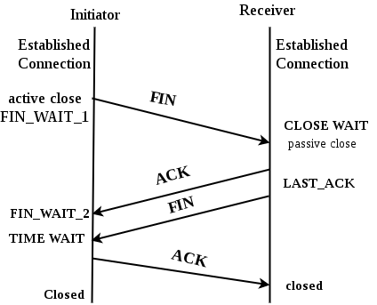

# 问题描述

  "net/http" 包里有个Client用来发送http请求，可以设置超时时间。

如果超时设置为3s，服务端处理需要10s，那3s后会发生什么？

假设请求已经到达服务端处理了。


# 代码重现

```go
package main

import (
	"fmt"
	"log"
	"net"
	"net/http"
	"net/http/httptest"
	"testing"
	"time"
)

func Get(client *http.Client, url string) ([]byte, error) {
	r, err := client.Get(url)
  // 超时, 返回的err不为空
	if err != nil {
		fmt.Println(err)
		return nil, err
	}

	defer r.Body.Close()
	return io.ReadAll(r.Body)
}

func TestGet(t *testing.T) {
	l, err := net.Listen("tcp", "127.0.0.1:7788")
	if err != nil {
    log.Fatal(err)
	}
	handler := http.HandlerFunc(
		func(w http.ResponseWriter, r *http.Request) {
			time.Sleep(10 * time.Second)
			fmt.Fprint(w, "Hello World")
		},
	)
	ts := httptest.NewUnstartedServer(handler)
	ts.Listener.Close()
	ts.Listener = l
	ts.Start()
	defer ts.Close()

	expected := "Hello World"
	log.Print(" ======== to Get ========\n")
  // 发请求, 设置3s超时
	data, err := Get(&http.Client{Timeout: 3 * time.Second}, ts.URL)

	fmt.Println("data:", data)
	fmt.Println("err:", err)

	if expected != string(data) {
		t.Errorf("Expected to be: %s, Got: %s", expected, data)
	}
  
	// time.Sleep(2 * time.Second)
	log.Print(" ======== Now ========\n")
}
```

输出结果：

```shell
httpsource> go test -v
=== RUN   TestGet
2024/04/05 15:32:54  ======== to Get ========
# 阻塞等待3s后, client.Get()超时返回的err
Get "http://127.0.0.1:7788": context deadline exceeded (Client.Timeout exceeded while awaiting headers)
data: []
err: Get "http://127.0.0.1:7788": context deadline exceeded (Client.Timeout exceeded while awaiting headers)
    get_test.go:39: Expected to be: Hello World, Got: 
2024/04/05 15:32:57  ======== Now ========

# defer server.Close()打印出来的东西:
# 第3s后的连接还是活跃的
2024/04/05 15:33:02 httptest.Server blocked in Close after 5 seconds, waiting for connections:
  *net.TCPConn 0xc000112080 127.0.0.1:61986 in state active
  
# 之后阻塞7s后结束, 总共10s
--- FAIL: TestGet (10.00s)
FAIL
exit status 1
FAIL    grcptest/httpsource     10.232s
```


# 现象

请求发出后，server处理。

第3s超时，client关闭连接，同时这个时候，servce.Close()发现客户端还是活跃的，说明client并没完全关闭。

如果这个时候，给多server 2s时间，有没有可能让client完全关闭呢？

在最后加上一句Sleep：

```go
time.Sleep(2 * time.Second)
log.Print(" ======== Now ========\n")
```

结果又不一样了：

```shell
httpsource> go test -v
=== RUN   TestGet
2024/04/05 16:51:25  ======== to Get ========
Get "http://127.0.0.1:7788": context deadline exceeded (Client.Timeout exceeded while awaiting headers)
data: []
err: Get "http://127.0.0.1:7788": context deadline exceeded (Client.Timeout exceeded while awaiting headers)
    get_test.go:39: Expected to be: Hello World, Got: 
2024/04/05 16:51:30  ======== Now ========
--- FAIL: TestGet (10.00s)
FAIL
exit status 1
FAIL    grcptest/httpsource     10.208s
```

可以看到，server.Close()的时候没有发现有活跃的client。


# 结果分析

结合抓包数据来看会好点。


1：tcp三次握手。

2：client发起http请求，server ACK。

3：3s超时，client发起FIN，想结束连接，server ACK。

4/5：server从10s醒来，给client发数据，同时发起FIN。

6：此时client已经关闭了双端，返回RST给server。


看到上面的结果，有个疑问，似乎不太符合tcp四次挥手的后面的过程：

         

按正常来说，在4/5这步，server给client发数据，client应该是可以接收的。但结果不是，只能是一种情况，http.Client直接关闭了双端：

> https://pkg.go.dev/net#Conn
>
> #### func (*TCPConn) [Close](https://cs.opensource.google/go/go/+/go1.22.2:src/net/net.go;l=199) [¶](https://pkg.go.dev/net#TCPConn.Close)
>
> ```
> func (c *TCPConn) Close() error
> ```
>
> Close closes the connection.
>
> #### func (*TCPConn) [CloseRead](https://cs.opensource.google/go/go/+/go1.22.2:src/net/tcpsock.go;l=151) [¶](https://pkg.go.dev/net#TCPConn.CloseRead)
>
> ```
> func (c *TCPConn) CloseRead() error
> ```
>
> CloseRead shuts down the reading side of the TCP connection. Most callers should just use Close.
>
> #### func (*TCPConn) [CloseWrite](https://cs.opensource.google/go/go/+/go1.22.2:src/net/tcpsock.go;l=163) [¶](https://pkg.go.dev/net#TCPConn.CloseWrite)
>
> ```
> func (c *TCPConn) CloseWrite() error
> ```
>
> CloseWrite shuts down the writing side of the TCP connection. Most callers should just use Close.

所以即不能读，也不能写。


# 总结

http.Client超时后，如果请求已经到达server，server会处理这个请求，只是client接收不到响应了。

