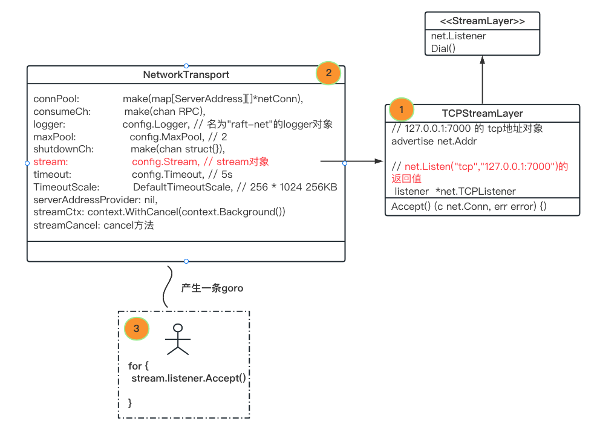
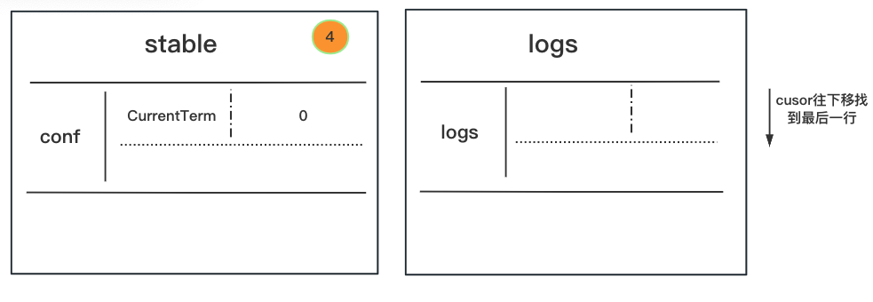
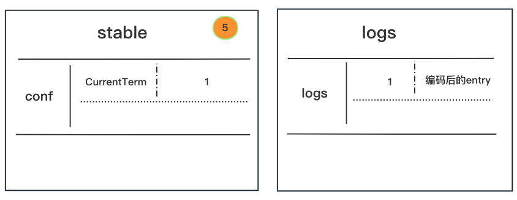
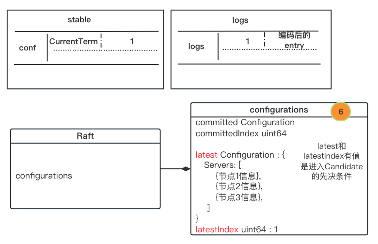
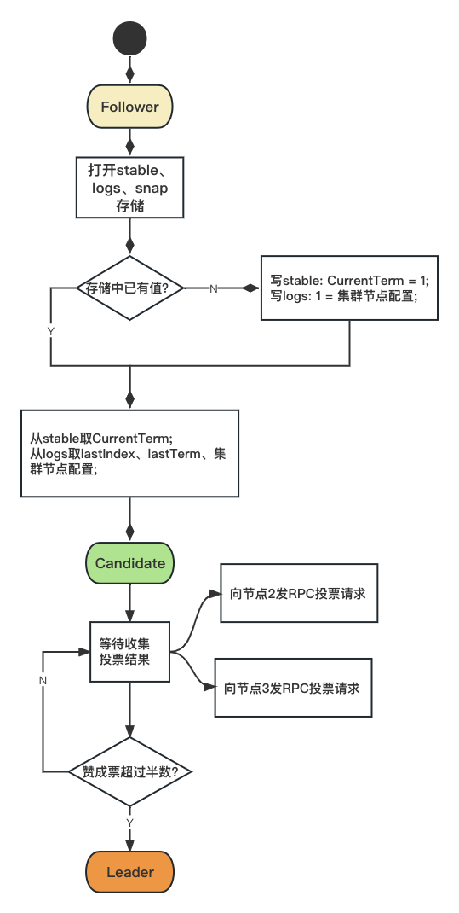
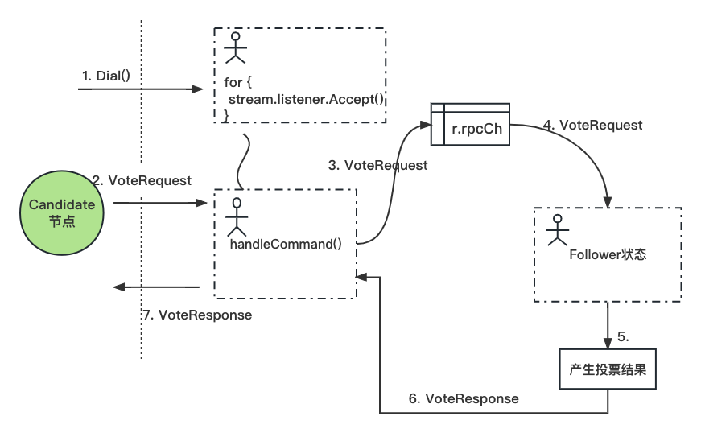

学raft，网上有很多资源，直接找一个小应用例子，男性交友网上有一个[很好的例子](https://github.com/vision9527/raft-demo)，就从它开始吧。

# 一、跑起来

克隆下来，直接go build就行，不用vendor，因为我不管怎么调vscode配置，代码跳转死活不进vendor目录，所以让它用go mod里的默认路径也行。

```shell
# 1. clone
git clone https://github.com/vision9527/raft-demo

# 2. build
cd raft-demo
go build
```

<br />

为了方便分析，先跑一个节点node1，命令参数从原文档copy过来就行：

```shell
# 启动node1: 
./raft-demo --http_addr=127.0.0.1:7001 --raft_addr=127.0.0.1:7000 --raft_id=1 --raft_cluster=1/127.0.0.1:7000,2/127.0.0.1:8000,3/127.0.0.1:9000
```

http_addr：开启的http端口，非raft内容；

raft_addr：raft开启的tcp端口，用来跟其他的节点RPC通信；

raft_id：标识这个节点的唯一id，字符串；

raft_cluster：集群节点；

<br />


# 二、源码分析

## 1 入口main函数

```go
// raft-demo/main.go

func main() {
	flag.Parse()
	if httpAddr == "" || raftAddr == "" || raftId == "" || raftCluster == "" {
    ...
		return
	}
	raftDir := "node/raft_" + raftId
	os.MkdirAll(raftDir, 0700)

	// 初始化raft
	myRaft, fm, err := myraft.NewMyRaft(raftAddr, raftId, raftDir)
  ...
  
}
```

前面简单，解析命令行参数，再调用`myraft.NewMyRaft(raftAddr, raftId, raftDir)`，难度慢慢增加。


## 2 NewMyRaft函数 - NewTCPTransport()

```go
// raft-demo/myraft/my_raft.go

func NewMyRaft(raftAddr, raftId, raftDir string) (*raft.Raft, *fsm.Fsm, error) {
	config := raft.DefaultConfig()
  
  // raftId: "1"
	config.LocalID = raft.ServerID(raftId)

  // raftAddr: "127.0.0.1:7000"
	addr, err := net.ResolveTCPAddr("tcp", raftAddr)

	transport, err := raft.NewTCPTransport(raftAddr, addr, 2, 5*time.Second, os.Stderr)
  ...
  
}
```

首先是调用`raft.DefaultConfig()`产生一个默认的配置，这个配置包括心跳超时时长、选举超时时长、节点ID等信息，具体可以先不看。

然后把"127.0.0.1:7000"转成一个tcp地址，进入`raft.NewTCPTransport()`函数：

```go
// raft@1.1.2/tcp_transport.go

func NewTCPTransport(
  bindAddr string, // 127.0.0.1:7000
  advertise net.Addr, // 127.0.0.1:7000 的 tcp地址对象
	maxPool int, // 2
	timeout time.Duration, // 5s
	logOutput io.Writer,	// os.Stderr
) (*NetworkTransport, error) {
	return newTCPTransport(bindAddr, advertise, func(stream StreamLayer) *NetworkTransport {
		return NewNetworkTransport(stream, maxPool, timeout, logOutput)
	})
}
```

`raft.NewTCPTransport`又调用了`newTCPTransport`，传入三个参数，其中最后一个参数是一个函数（go的惯常套路，传函数回调）。不过话说为什么第二个参数名叫advertise，广告，公告？

<br />

**newTCPTransport()：**

```go
// raft@1.1.2/tcp_transport.go

func newTCPTransport(bindAddr string, advertise net.Addr,
	transportCreator func(stream StreamLayer) *NetworkTransport) (*NetworkTransport, error) {
	// Try to bind
	list, err := net.Listen("tcp", bindAddr)
	if err != nil {
		return nil, err
	}

	// Create stream
	stream := &TCPStreamLayer{
		advertise: advertise,
		listener:  list.(*net.TCPListener),
	}

	// Verify that we have a usable advertise address
	addr, ok := stream.Addr().(*net.TCPAddr)
	if !ok {
		list.Close()
		return nil, errNotTCP
	}
	if addr.IP.IsUnspecified() {
		list.Close()
		return nil, errNotAdvertisable
	}

	// Create the network transport
	trans := transportCreator(stream)
	return trans, nil
}
```

首先调用`net.Listen("tcp", bindAddr)`监听127.0.0.1:7000，返回一个Listener接口，用来后面调用Accept。

然后new一个TCPStreamLayer：

```go
stream := &TCPStreamLayer{
	advertise: advertise, // 127.0.0.1:7000 的 tcp地址对象
  listener:  list.(*net.TCPListener),	// TCPListener是一个具体的接口, 语法:接口静态类型转动态类型
}
```

<br />

然后检查两个事情：

1. 绑定的地址是不是一个tcp地址（比如其他的upd、uds之类的就不行）;
2. 绑定的地址我们没有指定一个具体的ip。没有指定ip就是形如"0.0.0.0" 或 "::"，[说明在这](https://pkg.go.dev/net#IP.IsUnspecified)；

```go
	// stream.Addr()返回127.0.0.1:7000 的 tcp地址对象
	// 1. 如果不是一个tcp地址，就不玩了
	addr, ok := stream.Addr().(*net.TCPAddr)
	if !ok {
		list.Close()
		return nil, errNotTCP
	}

	// 2. 如果没有指定一个具体的ip，就不玩了
	if addr.IP.IsUnspecified() {
		list.Close()
		return nil, errNotAdvertisable
	}
```

<br />

然后再回到回调函数`trans := transportCreator(stream)`，传入stream对象。这个时候应该在小本本上记一下stream对象的结构，有哪些字段。

又来到了梦开始的地方，可是刚到又要到`NewNetworkTransport`里去。

```go
// stream
// maxPool: 2
// timeout: 5s
// logOutput: os.Stderr
return newTCPTransport(bindAddr, advertise, func(stream StreamLayer) *NetworkTransport {
	return NewNetworkTransport(stream, maxPool, timeout, logOutput)
})
```

<br />

**NewNetworkTransport()**：

```go
// raft@1.1.2/net_transport.go

func NewNetworkTransport(
	stream StreamLayer, // stream对象
	maxPool int,	// 2
	timeout time.Duration,	// 5s
	logOutput io.Writer,	// os.Stderr
) *NetworkTransport {

	logger := hclog.New(&hclog.LoggerOptions{
		Name:   "raft-net",
		Output: logOutput,
		Level:  hclog.DefaultLevel,
	})
	config := &NetworkTransportConfig{Stream: stream, MaxPool: maxPool, Timeout: timeout, Logger: logger}
	return NewNetworkTransportWithConfig(config)
}
```

先搞一个logger出来，再搞一个看起来是配置的config出来，包含传进来的所有的参数，再调用`NewNetworkTransportWithConfig(config)`，继续跳吧。

<br />

**NewNetworkTransportWithConfig():**

```go
// raft@1.1.2/net_transport.go

func NewNetworkTransportWithConfig(config *NetworkTransportConfig) *NetworkTransport {
	...
	trans := &NetworkTransport{
		connPool:              make(map[ServerAddress][]*netConn),
		consumeCh:             make(chan RPC),
		logger:                config.Logger,		// 名为"raft-net"的logger对象
		maxPool:               config.MaxPool,	// 2
		shutdownCh:            make(chan struct{}),
		stream:                config.Stream,		// stream对象
		timeout:               config.Timeout,	// 5s
		TimeoutScale:          DefaultTimeoutScale,	// 256 * 1024 256KB 不明白啥意思, 暂时放过
		serverAddressProvider: config.ServerAddressProvider, // 没配置过, 默认值, 接口类型, nil
	}

	// Create the connection context and then start our listener.
	trans.setupStreamContext()
	go trans.listen()

	return trans
}
```

搞一个NetworkTransport对象，这应该就是最终返回的transport对象了。需要注意的是，接收stream是用一个interface接收。这在后面调用listen时会有用。

再调用`trans.setupStreamContext()`，这个比较简单，就是设置一个基类Context，和一个cancel方法。

```go
func (n *NetworkTransport) setupStreamContext() {
	ctx, cancel := context.WithCancel(context.Background())
	n.streamCtx = ctx
	n.streamCancel = cancel
}
```

<br />

然后开条狗，跑`trans.listen()`：

```go
// raft@1.1.2/net_transport.go

func (n *NetworkTransport) listen() {
	const baseDelay = 5 * time.Millisecond
	const maxDelay = 1 * time.Second

	var loopDelay time.Duration
	for {
		// Accept incoming connections
		conn, err := n.stream.Accept() // tcp连接进来
		if err != nil {
      // 发生错误情况下, sleep一段时间
      ...
		}
		// No error, reset loop delay
		loopDelay = 0

		n.logger.Debug("accepted connection", "local-address", n.LocalAddr(), "remote-address", conn.RemoteAddr().String())

		// Handle the connection in dedicated routine
		go n.handleConn(n.getStreamContext(), conn)
	}
}
```

从上面看到，`listen()`方法调用了`stream.Accept()`方法，stream是一个静态类型`StreamLayer`的interface，内嵌了`net.Listener`接口，动态类型是`TCPStreamLayer`的结构体，实现了`StreamLayer`的所有方法，把它们放在一起看就清晰了。

```go
// raft@v1.1.2/net_trasport.go

type StreamLayer interface {
	net.Listener

	// Dial is used to create a new outgoing connection
	Dial(address ServerAddress, timeout time.Duration) (net.Conn, error)
}

```

<br />

```go
// raft@v1.1.2/tcp_transport.go

type TCPStreamLayer struct {
	advertise net.Addr
	listener  *net.TCPListener
}

// Dial implements the StreamLayer interface.
func (t *TCPStreamLayer) Dial(address ServerAddress, timeout time.Duration) (net.Conn, error) { ... }

// Accept implements the net.Listener interface.
func (t *TCPStreamLayer) Accept() (c net.Conn, err error) {
	return t.listener.Accept()
}

// Close implements the net.Listener interface.
func (t *TCPStreamLayer) Close() (err error) { ... }

// Addr implements the net.Listener interface.
func (t *TCPStreamLayer) Addr() net.Addr { ... }
```

所以调用最终就是调用 `t.listener.Accept()`。

<br />

每当有连接进来，就开一条狗处理与这个连接相关的通信消息：

```go
conn, err := n.stream.Accept() // tcp连接进来

// Handle the connection in dedicated routine
go n.handleConn(n.getStreamContext(), conn)
```
<br />

回到最初的调用，这个时候可以画出`transport, err := raft.NewTCPTransport(raftAddr, addr, 2, 5*time.Second, os.Stderr)` transport的画像了：



网络连接部分先到此为止。


## 3 NewMyRaft函数 - NewFileSnapshotStore()

```go
// raft-demo/myraft/my_raft.go

func NewMyRaft(raftAddr, raftId, raftDir string) (*raft.Raft, *fsm.Fsm, error) {
	...
	// "node/raft_1" 
	snapshots, err := raft.NewFileSnapshotStore(raftDir, 2, os.Stderr)
  ...
}
```

看名字就是快照的意思，没怎么看懂，暂时略过。


## 4 NewMyRaft函数 - NewBoltStore()

```go
// raft-demo/myraft/my_raft.go

func NewMyRaft(raftAddr, raftId, raftDir string) (*raft.Raft, *fsm.Fsm, error) {
	...
	// "node/raft_1/raft-log.db"
	logStore, err := raftboltdb.NewBoltStore(filepath.Join(raftDir, "raft-log.db"))
  
  // "node/raft_1/raft-stable.db"
	stableStore, err := raftboltdb.NewBoltStore(filepath.Join(raftDir, "raft-stable.db"))
  ...
}
```

bolt是一个key-value的单机文件数据库，把文件分成一个个与操作系统页大小相同的page，一般是4kb，再把这个文件mmap到内存，采用了B+树索引，且支持事务。raft在它上面进行了封装，成了另一个库raft-boltdb。为了分类数据，bolt分为了bucket（桶），存取key的时候必须指定是在哪个bucket名下存取。

这里创建了（不存在时创建，存在时打开）两个持久化的文件，一个叫log，一个叫stable。

log用来存日志，stable用来存任期term，后面分析选举流程时会分清。

现在只需要知道，这两个用来做持久化存储。


## 5 NewMyRaft函数 - fsm.NewFsm()

```go
// raft-demo/myraft/my_raft.go

func NewMyRaft(raftAddr, raftId, raftDir string) (*raft.Raft, *fsm.Fsm, error) {
	...
  fm := fsm.NewFsm()
  ...
}
```

需要自己实现的有限状态机：*finite-state machine* https://pkg.go.dev/github.com/hashicorp/raft#FSM

目前这个小例子只是实现了Apply()方法，简单的设置值。还不清楚流程是啥样的。


## 6 NewMyRaft函数 - raft.NewRaft()

```go
// raft-demo/myraft/my_raft.go

func NewMyRaft(raftAddr, raftId, raftDir string) (*raft.Raft, *fsm.Fsm, error) {
	...
	rf, err := raft.NewRaft(config, fm, logStore, stableStore, snapshots, transport)
  ...
}
```

传入前面创建的对象，进入raft.NewRaft()。

###  **raft.NewRaft()**

#### 1) logs、stable

```go
// raft@v1.1.2/api.go

func NewRaft(conf *Config, fsm FSM, logs LogStore, stable StableStore, snaps SnapshotStore, trans Transport) (*Raft, error) {
  ...
  
  // keyCurrentTerm: []byte("CurrentTerm")
  currentTerm, err := stable.GetUint64(keyCurrentTerm)
  
  lastIndex, err := logs.LastIndex()

  ...
}
```

首先从stable里取一下CurrentTerm的值，如果没有这个key，则返回0。一开始肯定是没有的，返回0。前面说了，存取bolt的时候必须指定buckt名，这里没有指定，看来是raft帮我们指定了，stable里所有的key操作都是在名为conf这个bucket下。

接着在logs里取，logs不一样，用cursor移到bucket下的最后一行，取最后一行数据。这里一开始是空，当然是取不到，lastIndex = 0。之后，会往stable里写一次CurrentTerm，值为0。



#### 2) 设置当前状态为Follower

```go
r.setState(Follower)
```

这是节点启动时的状态。


#### 3) 开始选举

```go
r.goFunc(r.run)
r.goFunc(r.runFSM)
r.goFunc(r.runSnapshots)
```

开三个goro，节点状态变更在r.run goro，因为当前状态是Follower，执行runFollower函数。

#### 4) runFollower()

```go
// raft@v1.1.2/raft.go

func (r *Raft) runFollower() {
	didWarn := false

	for r.getState() == Follower {
		select {
      ...
		case b := <-r.bootstrapCh:
			b.respond(r.liveBootstrap(b.configuration))
      
		case <-heartbeatTimer:
      // 1. 当前有无其他节点配置, 没有, continue
      // 2. 状态变为Candidate, return
      ...
		}
	}
}
```

监听了很多的通道，与启动相关的目前就两个：

1. bootstrapCh，这是main goro调用r.BootstrapCluster(configuration)放进来的，包含其他节点的配置信息，这里是参数raft_cluster的配置：1/127.0.0.1:7000,2/127.0.0.1:8000,3/127.0.0.1:9000，三个server。

2. heartbeatTimer，Follower状态超时后（与Leader心跳超时、或者启动时初始状态超时），状态转换为Candidate状态。

这里有个注意的点，1跟2是存在竞态的，假设1、2同时满足，随机选择了2，那2会因为当前无其他节点配置而再次进入倒计时，直到1有机会执行完填充其他节点配置。

<br />

##### **4.1) b.respond(r.liveBootstrap(b.configuration))**

这个也比较关键，值得好好看，传入的b.configuratoin是这样一个结构：

```go
Configuration{
  Servers: [
    {
      Suffrage: Voter,
      ID: "1",
      Address: "127.0.0.1:7000",
    },
    {
      Suffrage: Voter,
      ID: "2",
      Address: "127.0.0.1:8000",
    },
    {
      Suffrage: Voter,
      ID: "3",
      Address: "127.0.0.1:9000",
    },
    
  ]
}

// raft@v1.1.2/future.go
// b
type bootstrapFuture struct {
	deferError
	configuration Configuration
}


// raft@v1.1.2/configuration.go
type Configuration struct {
	Servers []Server
}
```

<br />

之后再调用BoostrapCluster()：

```go
// raft@v1.1.2/raft.go

func (r *Raft) liveBootstrap(configuration Configuration) error {
	// Use the pre-init API to make the static updates.
	err := BootstrapCluster(&r.conf, r.logs, r.stable, r.snapshots,
		r.trans, configuration)
	if err != nil {
		return err
	}
  
  ...
```

BootstrapCluster()函数做了以下事情：

1. stable里取一下当前任期CurrentTerm的值，如果 >0，返回ErrCantBootstrap错误。前面分析过，stable存的CurrentTerm值为0，所以继续往下走；

2. logs里取一下最后一条记录，如果有，返回ErrCantBootstrap错误。现在是没有，继续往下走；

3. snaps里取一下，如果有，返回ErrCantBootstrap错误。现在是没有，继续往下走；

4. stable写入当前任期CurrentTerm，值为1；

5. logs写入日志：

   ```go
   entry := &Log{
   	Index: 1,
   	Term:  1,
     Type: LogConfiguration
     Data: 编码了的，其他节点配置信息
   }
   ```

   总结一下，1-3步是看当前stable、logs、snap里有没有值，如果有，就直接返回，不写入初始值，保证了幂等。

   现在， stable、logs里有初始值了，从这里也知道，初始term值是1，与文档对得上。

   logs里的内容格式也知道了，Index作为key，一整个entry编码后作为value存入。

   


回到liveBootstrap，继续往下：

```go
// raft@v1.1.2/raft.go

func (r *Raft) liveBootstrap(configuration Configuration) error {
	// Use the pre-init API to make the static updates.
	err := BootstrapCluster(&r.conf, r.logs, r.stable, r.snapshots,
		r.trans, configuration)
	if err != nil {
		return err
	}
  
	// Make the configuration live.
  // 1. 从logs取第一条日志, 也就是刚刚写入的
	var entry Log
	if err := r.logs.GetLog(1, &entry); err != nil {
		panic(err)
	}
  // 2. 再写一下任期1
	r.setCurrentTerm(1) // 内存与持久化
	r.setLastLog(entry.Index, entry.Term)
  
  // 3.
	r.processConfigurationLogEntry(&entry)
	return nil
}
```

processConfigurationLogEntry()做的事有：

1. 存一下最近的节点配置，主要是设置一下：

   r.configurations.latest = 其他节点信息配置

   r.configurations.latestIndex = 1 // 在logs的Index


至此，配置有了，可以进入Candidate状态了。




#### 5) runCandidate()

```go
// raft@v1.1.2/raft.go

func (r *Raft) runCandidate() {
	r.logger.Info("entering candidate state", "node", r, "term", r.getCurrentTerm()+1)
  
  // 1. 异步广播其他节点, 让他们投票给我
	voteCh := r.electSelf()
  
  // 2. 启动计时器
  electionTimer := randomTimeout(r.conf.ElectionTimeout) // 1s
  ...
}
```

<br />

首先看看r.electSelft()的实现

```go
// raft@v1.1.2/raft.go

func (r *Raft) electSelf() <-chan *voteResult {
  // 1. 搞个chan
	respCh := make(chan *voteResult, len(r.configurations.latest.Servers))
  
  // 2. 任期+1, 且持久化写入stable, 当前任期 = 2
	r.setCurrentTerm(r.getCurrentTerm() + 1)

	// 3. 从内存取最新log的Index、Term, 现在的Index = 1, Term = 1
	lastIdx, lastTerm := r.getLastEntry()
  
  // 4. 构造请求数据 
	req := &RequestVoteRequest{
		RPCHeader:          r.getRPCHeader(),
		Term:               r.getCurrentTerm(), // 当前term
		Candidate:          r.trans.EncodePeer(r.localID, r.localAddr),
		LastLogIndex:       lastIdx, // 最新的log index
		LastLogTerm:        lastTerm, // 最新的log term
		LeadershipTransfer: r.candidateFromLeadershipTransfer,
	}

  // 5. 遍历节点, 发送rpc投票消息
	// For each peer, request a vote
	for _, server := range r.configurations.latest.Servers {
		if server.Suffrage == Voter {
      // 给自己投赞成票
			if server.ID == r.localID {
				// Persist a vote for ourselves
        r.persistVote(req.Term, req.Candidate)
  
				// Include our own vote
				respCh <- &voteResult{
					RequestVoteResponse: RequestVoteResponse{
						RPCHeader: r.getRPCHeader(),
						Term:      req.Term,
						Granted:   true,
					},
					voterID: r.localID,
				}
			} else {
				askPeer(server)
			}
		}
	}
  
	return respCh
}
```

需要注意的点：

1. 每次请求他人投票前，增加自己的当前任期CurrentTerm，并持久化到stable。如果一直在选举阶段，任期值就会一直加。
2. 发送RPC消息是通过transport，transport里有个map，映射地址 ---> 连接对象Conn，用来缓存。
3. 因为每个节点只能投一票，要记录下投出的票，包括自己投给自己的票也要记录下来。通过持久化到stable的LastVoteTerm、LastVoteCand两个key实现。

<br />


再看收到其他节点的投票结果如何处理：

```go
// raft@v1.1.2/raft.go

func (r *Raft) runCandidate() {
	...
	// Tally the votes, need a simple majority
	grantedVotes := 0
	votesNeeded := r.quorumSize() // 法定人数
	r.logger.Debug("votes", "needed", votesNeeded)

	for r.getState() == Candidate {
		select {
      
    // rpc消息
		case rpc := <-r.rpcCh:
			r.processRPC(rpc)

    // 收到其他节点投票结果
		case vote := <-voteCh:
			// Check if the term is greater than ours, bail
			if vote.Term > r.getCurrentTerm() {
				r.logger.Debug("newer term discovered, fallback to follower")
				r.setState(Follower)
				r.setCurrentTerm(vote.Term)
				return
			}

			// Check if the vote is granted
			if vote.Granted {
				grantedVotes++
				r.logger.Debug("vote granted", "from", vote.voterID, "term", vote.Term, "tally", grantedVotes)
			}

			// Check if we've become the leader
			if grantedVotes >= votesNeeded {
				r.logger.Info("election won", "tally", grantedVotes)
				r.setState(Leader)
				r.setLeader(r.localAddr)
				return
			}
      
		}
	}
}
```

判断是否赢得大多数人的选票，是就成为Leader。

这里有个问题，什么情况下投票结果的Term会 > 当前节点的Term？

目前已知的是，发送投票请求后，等待返回超时，重新进入electSelf()会增加当前Term，假如节点间的网络不通，那每个节点都会不断增加自己的Term，这种情况下就可能其他节点Term>当前节点Term。其他情况后面补充。




到此为止，从Candidate视角来看，Candidate节点成为了Leader。但还有个小疑问，投票返回的Term是请求时的Term，还是投票节点自己的Term？还有怎么判断有没有投票过？如果投过票后，又来了一个比较大的Term投票请求怎么办？


## 从Follower给Candidate投票视角来看

### 1) 如何收到RPC投票请求

前面走transport流程时，有一条goro专门来Accept连接：

```go
// raft@v1.1.2/net_transport.go

func (n *NetworkTransport) listen() {

	for {
		// Accept incoming connections
		conn, err := n.stream.Accept() // tcp连接进来, 返回原生的Conn

		n.logger.Debug("accepted connection", "local-address", n.LocalAddr(), "remote-address", conn.RemoteAddr().String())

		// Handle the connection in dedicated routine
		go n.handleConn(n.getStreamContext(), conn)
	}
}
```

每来一个连接，又生成一个goro处理，进handleConn()，再到handleCommand()：

```go
// raft@v1.1.2/net_transport.go

func (n *NetworkTransport) handleCommand(r *bufio.Reader, dec *codec.Decoder, enc *codec.Encoder) error {
	// 1. 先读一个字节, 消息类型
	rpcType, err := r.ReadByte()
	if err != nil {
		return err
	}

	// Create the RPC object
	respCh := make(chan RPCResponse, 1)
	rpc := RPC{
		RespChan: respCh,
	}

	isHeartbeat := false
	switch rpcType {

	case rpcRequestVote:
		var req RequestVoteRequest
    
    // 2. 解码剩下的字节流数据
		if err := dec.Decode(&req); err != nil {
			return err
		}
		rpc.Command = &req
		...
	}

	// Dispatch the RPC
	select {
    // 放进无缓冲通道
	case n.consumeCh <- rpc:
	}

	// Wait for response
RESP:
	select {
	case resp := <-respCh:
		// Send the error first
		respErr := ""
		if resp.Error != nil {
			respErr = resp.Error.Error()
		}
		if err := enc.Encode(respErr); err != nil {
			return err
		}

		// Send the response
		if err := enc.Encode(resp.Response); err != nil {
			return err
		}
	case <-n.shutdownCh:
		return ErrTransportShutdown
	}
	return nil
}
```

从上面代码可以看到：handleCommand做的事有：

1. 先从流读一个字节，标识RPC消息类型，这里是投票请求消息rpcRequestVote；
2. 解码数据；
3. 放进通道，阻塞等待取走。


通道正好在Follower状态时读取：

```go
// raft@v1.1.2/raft.go

func (r *Raft) runFollower() {
	...
	for r.getState() == Follower {
		select {
		case rpc := <-r.rpcCh:
			r.processRPC(rpc)
```

最终是调用requestVote()函数：

```go
// requestVote is invoked when we get an request vote RPC call.
func (r *Raft) requestVote(rpc RPC, req *RequestVoteRequest) {

	// Setup a response
	resp := &RequestVoteResponse{
		RPCHeader: r.getRPCHeader(),
		Term:      r.getCurrentTerm(), // 回应的是节点的当前Term
		Granted:   false,
	}
	var rpcErr error
	defer func() {
		rpc.Respond(resp, rpcErr)
	}()

	// Check if we have an existing leader [who's not the candidate] and also
	// check the LeadershipTransfer flag is set. Usually votes are rejected if
	// there is a known leader. But if the leader initiated a leadership transfer,
	// vote!
	candidate := r.trans.DecodePeer(req.Candidate)
  // 1. 检测当前是否已经有了Leader
  // 如果有, 且我们没有明确指定当前新节点是用来替换已有的Leader, 那应该维持现有的Leader, 投反对票
	if leader := r.Leader(); leader != "" && leader != candidate && !req.LeadershipTransfer {
		r.logger.Warn("rejecting vote request since we have a leader",
			"from", candidate,
			"leader", leader)
		return
	}

	// 2. 我的Term比你大, 投反对票
	if req.Term < r.getCurrentTerm() {
		return
	}

  // 3. 我的Term没你大, 那我把自己的Term改成跟你一样大
	if req.Term > r.getCurrentTerm() {
		// Ensure transition to follower
		r.logger.Debug("lost leadership because received a requestVote with a newer term")
		r.setState(Follower)
		r.setCurrentTerm(req.Term)
		resp.Term = req.Term
	}

	// Check if we have voted yet
	lastVoteTerm, err := r.stable.GetUint64(keyLastVoteTerm)
	if err != nil && err.Error() != "not found" {
		r.logger.Error("failed to get last vote term", "error", err)
		return
	}
	lastVoteCandBytes, err := r.stable.Get(keyLastVoteCand)
	if err != nil && err.Error() != "not found" {
		r.logger.Error("failed to get last vote candidate", "error", err)
		return
	}

	// Check if we've voted in this election before
  // 4. 我上次也是投针对这个Term投的票
	if lastVoteTerm == req.Term && lastVoteCandBytes != nil {
		r.logger.Info("duplicate requestVote for same term", "term", req.Term)
    
    // 投给的是同一个人, 再投你赞成票, 反正是幂等的
		if bytes.Compare(lastVoteCandBytes, req.Candidate) == 0 {
			r.logger.Warn("duplicate requestVote from", "candidate", req.Candidate)
			resp.Granted = true
		}
    
    // 我投的不是同一个人, 我投过了, 不能再投, 默认投反对
		return
	}

	// Reject if their term is older
	lastIdx, lastTerm := r.getLastEntry()
  
  // 5. 我的日志上记录的我上次的Term 比你的大, 反对
	if lastTerm > req.LastLogTerm {
		r.logger.Warn("rejecting vote request since our last term is greater",
			"candidate", candidate,
			"last-term", lastTerm,
			"last-candidate-term", req.LastLogTerm)
		return
	}

  // 6. 我的日志上记录我们的Term一样, 但我的内容比你多, 反对
	if lastTerm == req.LastLogTerm && lastIdx > req.LastLogIndex {
		r.logger.Warn("rejecting vote request since our last index is greater",
			"candidate", candidate,
			"last-index", lastIdx,
			"last-candidate-index", req.LastLogIndex)
		return
	}

	// Persist a vote for safety
  // 7. 记录下我是对哪个Term投票, 投给的谁
	if err := r.persistVote(req.Term, req.Candidate); err != nil {
		r.logger.Error("failed to persist vote", "error", err)
		return
	}

	resp.Granted = true
	r.setLastContact()
	return
}
```

判断是否投票的逻辑得结合数据业务、日志复制来看，这里暂时不深究。

组装投票结果后，返回给Candiate节点。




# 从数据一致性看日志复制

小例子收到写入数据请求时的处理：

```go
// raft-demo/main.go

func (h HttpServer) Set(w http.ResponseWriter, r *http.Request) {

	data := "set" + "," + key + "," + value
	future := h.ctx.Apply([]byte(data), 5 * time.Second)
	if err := future.Error(); err != nil {
		fmt.Fprintf(w, "error:" + err.Error())
		return
	}
	fmt.Fprintf(w, "ok")
	return
}
```

调用的是


默认Config

```go
&Config{
  	// 调用raft.DefaultConfig()设置的值
		ProtocolVersion:    ProtocolVersionMax,	// 协议版本3
  
  	// 心跳超时 1s
		HeartbeatTimeout:   1000 * time.Millisecond,
  
  	// 选举超时 1s
		ElectionTimeout:    1000 * time.Millisecond,
  
  	// 提交超时 50ms
		CommitTimeout:      50 * time.Millisecond,
		MaxAppendEntries:   64,
		ShutdownOnRemove:   true,
		TrailingLogs:       10240,
		SnapshotInterval:   120 * time.Second,
		SnapshotThreshold:  8192,
		LeaderLeaseTimeout: 500 * time.Millisecond,
		LogLevel:           "DEBUG",
  
  
  	// 默认值到此为止, 以下需要自己设置
  	LocalID ServerID, // ServerID也就是string
  
  	
	}
```


raft.NewTCPTransport

```go
addr, err := net.ResolveTCPAddr("tcp", "127.0.0.1:7000")

transport, err := raft.NewTCPTransport("127.0.0.1:7000", addr, 2, 5*time.Second, os.Stderr)

/**
	stream := &TCPStreamLayer{
		advertise: addr, tcp包裹的地址对象
		listener:  list.(*net.TCPListener), net.Listen("127.0.0.1:7000")的返回对象
	}

*/
```

transport接收处理tcp连接


raft.NewFileSnapshotStore

```go
snapshots, err := raft.NewFileSnapshotStore("node/raft_1", 2, os.Stderr)

/**
	store := &FileSnapshotStore{
		path:   "node/raft_1/snapshot/,
		retain: 2,
		logger: "snapshot"的logger,
	}

*/
```


raftboltdb.NewBoltStore

```go
logStore, err := raftboltdb.NewBoltStore("node/raft_1/raft-log.db")

/**

	store := &BoltStore{
		conn: &DB{
			NoSync: false,
			opened: true,
			NoGrowSync: false,
			MmapFlags: 0,
			MaxBatchSize: 1000,
			MaxBatchDelay: 10 * time.Millisecond,
			AllocSize: 16 * 1024 * 1024,
			path: "node/raft_1/raft-log.db",
			file: os.OpenFile(path),
			opts: {
				writeAt: db.file.WriteAt,
			},
			pageSize: 4096,
			
			pagePool = sync.Pool{
				New: func() interface{} {
								return make([]byte, db.pageSize)
				},
			},
			
			freelist: &freelist{
									ids     []pgid,
									pending: make(map[txid][]pgid),
									cache:   make(map[pgid]bool),
			},
			
			rwtx: nil,
			
			// mmap的相关
			dataref: nil
			data: nil,
			datesz: 0,
			
			meta0: mmap后第0页的ptr,
			meta1: 一样
			
		},
		path: "node/raft_1/raft-log.db",
	}

*/

```


  fsm.NewFsm()

```go
fm := fsm.NewFsm()

/**
	// 实现Apply、Snapshot、Restore方法
	fsm := &Fsm{
		DataBase: database{
						Data map[string]string
						mu   sync.Mutex
		},
	}

*/
```

 

 raft.NewRaft

```go
rf, err := raft.NewRaft(config, fsm, logStore, stableStore, snapshots, transport)

/**

	r := &Raft{
		protocolVersion:       3,
		applyCh:               make(chan *logFuture),
		conf:                  *conf,
		fsm:                   fsm,
		fsmMutateCh:           make(chan interface{}, 128),
		fsmSnapshotCh:         make(chan *reqSnapshotFuture),
		leaderCh:              make(chan bool),
		localID:               "1",
		localAddr:             "127.0.0.1:7000",
		logger:                logger,
		logs:                  logStore,
		configurationChangeCh: make(chan *configurationChangeFuture),
		configurations:        configurations{},
		rpcCh:                 trans.Consumer(),
		snapshots:             snapshots,
		userSnapshotCh:        make(chan *userSnapshotFuture),
		userRestoreCh:         make(chan *userRestoreFuture),
		shutdownCh:            make(chan struct{}),
		stable:                stableStore,
		trans:                 transport,
		verifyCh:              make(chan *verifyFuture, 64),
		configurationsCh:      make(chan *configurationsFuture, 8),
		bootstrapCh:           make(chan *bootstrapFuture),
		observers:             make(map[uint64]*Observer),
		leadershipTransferCh:  make(chan *leadershipTransferFuture, 1),
		
		//
		leader: "",
		raftState: raftState {
			currentTerm uint64 : 从store里取
			lastLogIndex: 从logStore里取, 下同
			lastLogTerm: 
			state RaftState : Follower // uin32别名
		},
		
		configurations: configurations {
			latestIndex: 0,
			latest: Configuration {
			
				// 一开始是空
				Servers []Server: [{
        	Suffrage: Voter,
        	ID: 1,
        	Address: 127.0.0.1:7000,
        	
        	...其他两个
        }]
			},
		},
		
		routinesGroup sync.WaitGroup,
		
		// 成为Leader时
		leaderState: {
			commitCh: make(chan struct{}, 1)
			commitment: &commitment{
					commitCh: commitCh,
					matchIndexes: { serverID => int },
					commitIndex:  0,
					startIndex:   r.getLastIndex()+1,
			},
			inflight: list.New(),
			
			replState: make(map[ServerID]*followerReplication): {
				"2" => {},
				"3" => {},
			},
			
			notify : make(map[*verifyFuture]struct{})
			tepDown : make(chan struct{}, 1)
		}
		
	}
*/
```


bootstrapFuture

```go
bootstrapFuture {
  configuration: Server []Server: [{...}],
  deferError{
    errch: make(chan error, 1),
  }
}
```


raft-boltdb

github.com/hashicorp/raft-boltdb


os.Getpagesize() int 操作系统内存页大小 单位byte


寻找一种易于理解的共识算法

(扩展版本)

Diego Ongaro 和 John Ousterhout 

斯坦福大学


概要


