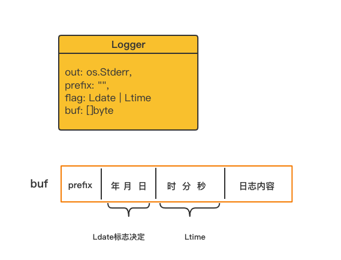
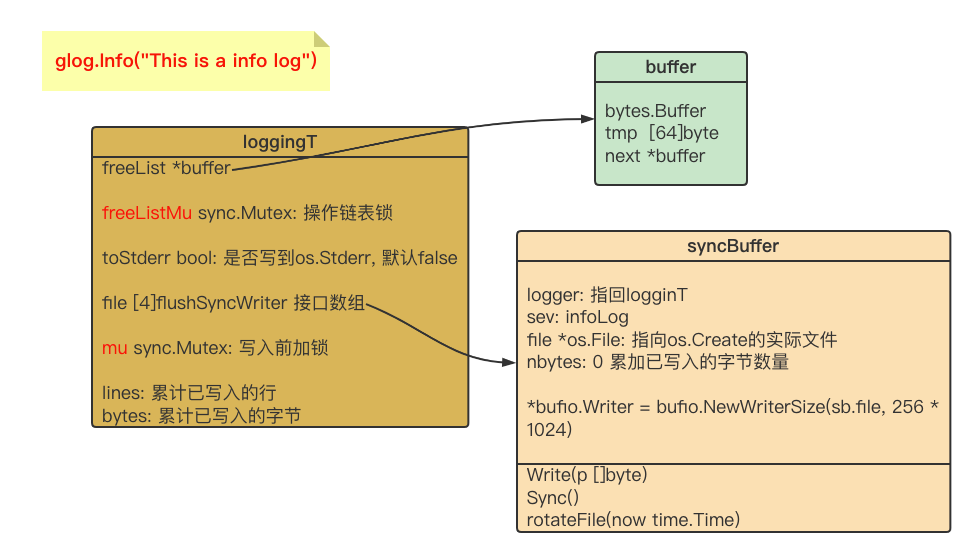
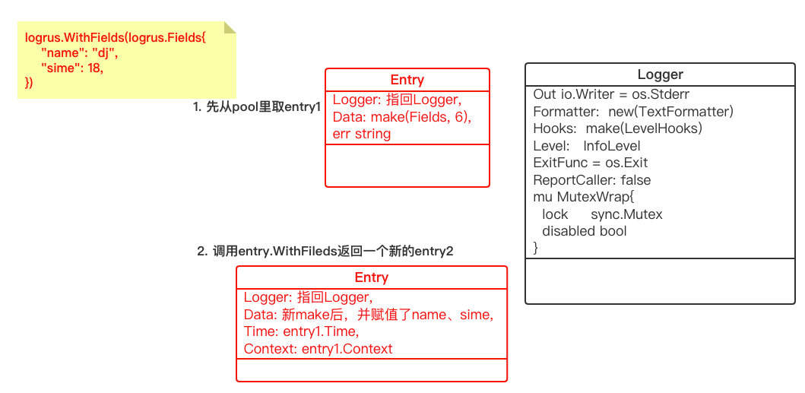
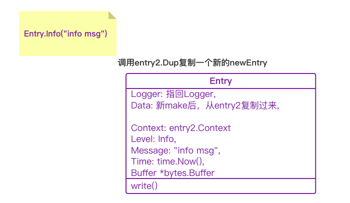
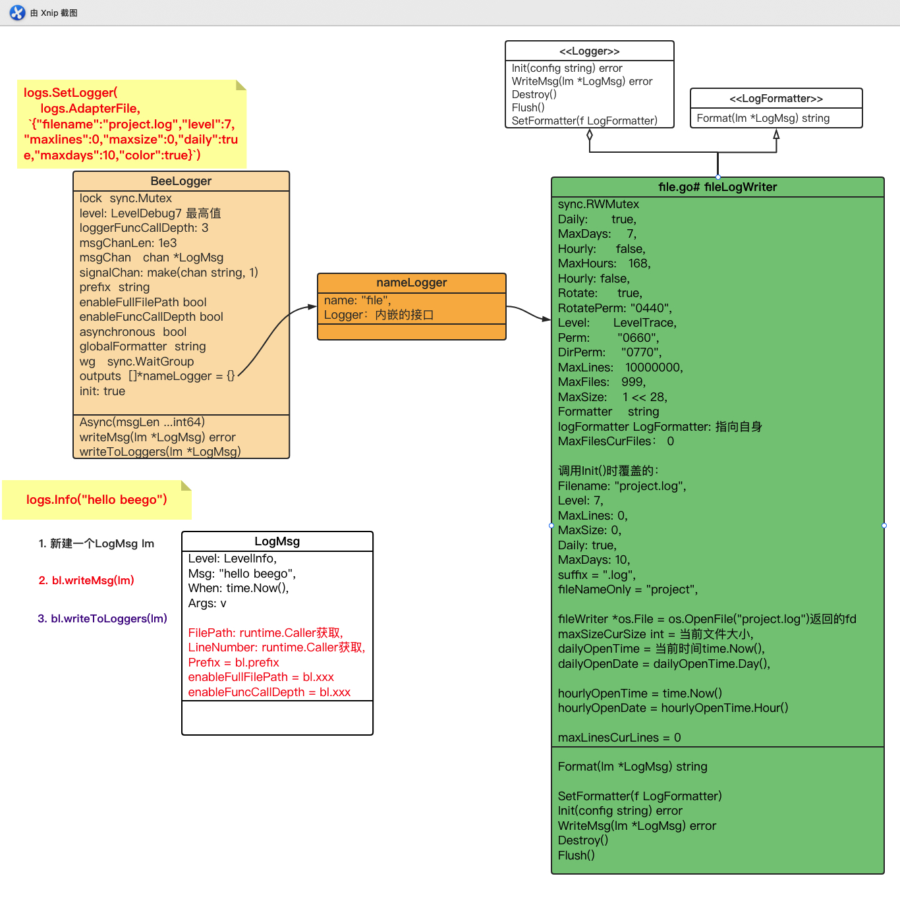

- [关于log](#关于log)
  - [标准库中自带的log包](#标准库中自带的log包)
    - [默认打印到标准错误输出（os.Stderr）](#默认打印到标准错误输出osstderr)
    - [打印到文件](#打印到文件)
    - [缺点](#缺点)
  - [官方出的第三方包glog](#官方出的第三方包glog)
    - [安装&demo](#安装demo)
    - [跑](#跑)
    - [Glog.Info("This is a info log")流程](#gloginfothis-is-a-info-log流程)
    - [分割文件流程](#分割文件流程)
    - [定时刷日志缓冲流程](#定时刷日志缓冲流程)
    - [总结](#总结)
  - [logrus](#logrus)
    - [demo](#demo)
    - [执行流程](#执行流程)
      - [logrus.WithFields(...)](#logruswithfields)
      - [Entry2.Info("info msg")执行流程](#entry2infoinfo-msg执行流程)
    - [特点](#特点)
    - [配合file-rotatelogs日志按天分割](#配合file-rotatelogs日志按天分割)
  - [beego的日志组件](#beego的日志组件)
    - [logs.Info("hello beego")执行流程](#logsinfohello-beego执行流程)
    - [普通模式](#普通模式)
    - [普通模式下的按小时分割](#普通模式下的按小时分割)
    - [异步模式](#异步模式)
    - [异步&普通总结](#异步普通总结)
    - [特点](#特点-1)


# 关于log


## 标准库中自带的log包

### 默认打印到标准错误输出（os.Stderr）

```go
package main
import "log"

func main() {
	log.Println("Content from log package!")
}
```



打印流程：

1、加锁；

2、buf从0开始（l.buf = l.buf[:0]），依次append prefix、Ldate、Ltime、日志内容到Logger实例buf中；

3、调用l.out.Write(l.buf)，最后解锁；


### 打印到文件

```go
package main

import (
    "log"
    "os"
)

func main() {
    // 如果文件logs.txt不存在，会自动创建
    file, err := os.OpenFile("logs.txt", os.O_APPEND|os.O_CREATE|os.O_WRONLY, 0666)
    if err != nil {
        log.Fatal(err)
    }
    log.SetOutput(file)
    log.Println("Content from log package!")
}
```


### 缺点

没有日志级别；

直接写文件，没有缓冲；

没有rotate；


字符可以直接与int相加

```go
byte('0' + i - q*10)
```


## 官方出的第三方包glog

### 安装&demo

```bash
go get github.com/golang/glog
```


```go
package main

import (
  "flag"
  "github.com/golang/glog"
)

func main() {
  // 解析传入的参数
  flag.Parse()
  // 退出前执行，清空缓存区，将日志写入文件
  defer glog.Flush()
	
  // 输出各个等级的日志
  glog.Info("This is a info log")
  // glog.Warning("This is a warning log")
  // glog.Error("This is a error log")
  // glog.Fatal("This is a fatal log")
}
```


### 跑

默认输出到临时目录文件：

```bash
go run glogtest.go
```

<br />

输出到当前目录：

```bash
go run glogtest.go -log_dir="./"
```

生成软连接 glogtest.go -> glogtest.demondeMBP.demon.log.INFO.20220415-101633.8576。

每次跑会拿到当前时间戳生成新的文件，同时软连接指向最新生成的文件。

<br />

只打印到控制台错误流：

```bash
go run glogtest.go -logtostderr
```

<br />

### Glog.Info("This is a info log")流程



1. `freeListMu`加锁，从`freeList`获取一块`buffer`实例，拿到后解锁；
2. 先往`buffer`里的`tmp`数组写入元数据：`Lmmdd hh:mm:ss.uuuuuu threadid file:line]` ；
3. 调用内嵌`bytes.Buffer`的`Write()`方法：`buffer.Write(buffer.tmp[:30])`写入；
4. 调用`fmt.Fprintln(buffer, args...)`写入`This is a info log`到内嵌的`bytes.Buffer`；
5. `mu`加锁；
6. 调用内嵌`bytes.Buffer`的`Bytes()`方法，拿到`buffer`的字节数据：`data := buffer.Bytes()`；
7. 调用`syncBuffer.Write(data) ==> syncBuffer.Writer.Write(data)`，最终调用的是内嵌的`bufio.Writer`的`Write()`方法先写入缓冲，至于何时写入文件，就由标准库`bufio`来控制了。
8. `freeListMu`加锁，放回`freeList`链表，再解锁；
9. `mu`解锁；


### 分割文件流程

按文件大小分割，阈值约1.8G；

1. 每次`syncBuffer.Write(data)`时判断是否需要分割。注意此时已经是加了`mu`锁的；
2. 调用`syncBuffer`内嵌的`bufio.Writer`的`Flush`()方法；
3. 调用`syncBuffer.file.Close()`方法；
4. 创建新文件`file`，包括软链接，更新syncBuffer file指向：`sb.file = file`；
5. 重置`syncBuffer.nbytes`计数；
6. 创建新`bufio.Writer`，更新`syncBuffer`指向：`sb.Writer = bufio.NewWriterSize(file, 256*1024)`


### 定时刷日志缓冲流程

间隔30s

1. `mu`加锁；
2. 调用`syncBuffer`内嵌的`bufio.Writer`的`Flush`()方法；
3. 调用`syncBuffer.file.Sync()`方法；
4. `mu`解锁；


### 总结

1. 二级缓冲：块缓冲、bufio缓冲，适合写入频繁；
2. info（0）、warning（1）、error（2）、fatal（3）四个级别，相应的级别写进相应的文件；
3. 按文件大小分割，写入超过1024 * 1024 * 1800 $\approx$1.8G 会重新创建文件；


## logrus

### demo

版本v1.8.1

```go
go get github.com/sirupsen/logrus
```


```go
package main

import (
  "github.com/sirupsen/logrus"
)

func main() {
	logrus.WithFields(logrus.Fields{
    "name": "dj",
    "sime": 18,
  }).Info("info msg")
}
```


### 执行流程

#### logrus.WithFields(...)

1. 从`pool`里取一个空壳`entry1`；
2. 调用`entry1.WithFields()`返回一个新的`entry2`，此时`entry2`里保存了`name`、`sime`;
3. 返回`entry2`，放回`entry1`到`pool`；




#### Entry2.Info("info msg")执行流程

1. 调用`entry2.Dup()`复制一个新的`newEntry`，值从`entry2`复制过来，保存`info msg`；
2. `newEntry.Logger.mu`加锁，获取`newEntry.Logger.ReportCaller`值，获取后解锁；
3. `newEntry.Logger.mu`加锁，存一份临时`entry.Logger.Hooks`，解锁；
4. 调用各个`hook`的`Fire`方法；
5. 从`pool`里取一份`bytes.Buffer`，并赋值`newEntry.Buffer = buffer`；
6. 调用`newEntry.Logger.Formatter.Format(entry`)方法，写入`buffer`；
7. `newEntry.Logger.mu`加锁；
8. `newEntry.Logger.Out.Write(buffer.Bytes())` 写入`Out`；
9. 解锁;
10. 置空`newEntry.Buffer = nil`，`buffer`放回；




### 特点

1. 完全兼容标准log包；
2. debug、info、warn、error、fatal 、 panic 值依次减小；
3. 没有分割功能；
4. 一级缓冲：块缓冲用来写入格式化format后的数据，Out的写入得看具体实现；


### 配合file-rotatelogs日志按天分割

```go
package main

import(
	"time"
  log "github.com/sirupsen/logrus"
  "github.com/lestrrat-go/file-rotatelogs"
)

func main() {
  rl, _ := rotatelogs.New(
		"./access_log.%Y-%m-%d %H:%M",
		rotatelogs.WithRotationTime(24 * time.Hour), // 每天分割
		rotatelogs.WithMaxAge(15 * 24 * time.Hour), // 保留最近15天
	)

  log.SetOutput(rl)
  log.Printf("Hello, World!2")

	for {
		log.Println("now:", time.Now())
		 <- time.NewTicker(1 * time.Second).C
	}
}
```

注意：file-rotatelogs内部也会加锁，配合logrus其实没必要再加一次锁。


## beego的日志组件

```go
package main

import (
	"github.com/beego/beego/v2/core/logs"
)


func main() {
	err := logs.SetLogger(logs.AdapterFile, `{"filename":"project.log","level":7,"maxlines":0,"maxsize":0,"daily":true,"maxdays":10,"color":true}`)
	if err != nil {
		panic(err)
	}
	logs.Info("hello beego")
}
```


### logs.Info("hello beego")执行流程

两种模式，异步输出和普通，默认是普通。



### 普通模式

1. 新建一个`LogMsg lm`，初始一些值；

2. 调用`bl.writeMsg(lm)`，再赋值一些值；

3. 遍历`bl.outputs`，调用`output.WriteMsg(lm)`，这里只有一个`fileLogWriter`，记为`w`。

4. `w.WriteMsg(lm)`执行流程

   1. 调用`w.Format(lm)`格式化，拿到结果string，记为msg；

   2. 加读锁`w.Rlock()`；

   3. 判断是否需要按小时分割，判断条件为：

      ```go
      func (w *fileLogWriter) needRotateHourly(hour int) bool {
      	return (w.MaxLines > 0 && w.maxLinesCurLines >= w.MaxLines) ||
      		(w.MaxSize > 0 && w.maxSizeCurSize >= w.MaxSize) ||
      		(w.Hourly && hour != w.hourlyOpenDate)
      }
      ```

      可以看到，小时与行数、字节大小分割判断交织在一起。

      

   4. 如果不需要按小时分割，再判断是否需要按天分割，判断条件为：

      ```go
      func (w *fileLogWriter) needRotateDaily(day int) bool {
      	return (w.MaxLines > 0 && w.maxLinesCurLines >= w.MaxLines) ||
      		(w.MaxSize > 0 && w.maxSizeCurSize >= w.MaxSize) ||
      		(w.Daily && day != w.dailyOpenDate)
      }
      ```

      可以看到，天数也与行数、字节大小分割判断交织在一起。

      

   5. 如果都不需要分割，解读锁`w.RUnlock()`；

   6. 加锁`w.Lock()`；

   7. 直接写文件`w.fileWriter.Write([]byte(msg))`；

   8. 增加行数、字节数统计 `w.maxLinesCurLines++`、`w.maxSizeCurSize += len(msg)`；

   9. 解锁`w.Unlock()`;

<br />

### 普通模式下的按小时分割

1. 加读锁`w.RLock()`；

2. 判断需要按小时分割：`if w.needRotateHourly(h)`；

3. 解读锁  `w.RUnlock()`；

4. 加锁`w.Lock()`；

5. 再判断一下需要按小时分割：`if w.needRotateHourly(h)`；

6. 调用`w.doRotate(lm.When)`开始分割；

7. 新文件名`fName = w.fileNameOnly + fmt.Sprintf(".%s.%03d%s", openTime.Format("2006010215"), num, w.suffix)`；

   `w.fileNameOnly = "project"`；

   `openTime = w.hourlyOpenTime`  创建fileWriter里的时间；

   `num := w.MaxFilesCurFiles + 1`  计数，每次分割都会加1；

8. 关闭原先的文件： `w.fileWriter.Close()`；

9. 重合名原先的文件名新文件名：`err = os.Rename(w.Filename, fName)`；

10. 重新创建新的文件：`fd, err := os.OpenFile(w.Filename, os.O_WRONLY|os.O_APPEND|os.O_CREATE, os.FileMode(perm))`；

11. 赋值`w.fileWriter = fd`；

12. 重置fileWriter的一些属性：

    `w.maxSizeCurSize = fd文件的Size()`

    `w.dailyOpenTime = time.Now()`、`w.dailyOpenDate = w.dailyOpenTime.Day()`

    `w.hourlyOpenTime = time.Now()`、`w.hourlyOpenDate = w.hourlyOpenTime.Hour()`

    `w.maxLinesCurLines = 0`

第5步加锁之后要再判断一遍，跟多线程单例的实现一样。

<br />

### 异步模式

要启用异步模式，要先调用`Async()方法`

```go
// 启用异步
logs.Async()

// 可以设置缓冲 chan 的大小
logs.Async(1e3)
```

`Async`方法会设置`BeeLogger`属性的值：

```go
bl.asynchronous = true // 标志
bl.msgChan = make(chan *LogMsg, bl.msgChanLen) // 初始化通道
bl.wg.Add(1) // 同步组
go bl.startLogger() // 启动接收通道的goroutine
```

<br />

写日志流程：

1. 新建一个`LogMsg lm`，初始一些值；
2. 调用`bl.writeMsg(lm)`，再赋值一些值；
3. 从pool里取一个LogMsg：`logM := logMsgPool.Get().(*LogMsg)`，把`lm`里的属性值赋值给`logM`；
4. 放进通道：`bl.msgChan <- lm`；

前面12步跟普通模式一样。这里logM没用到，不太理解为什么要这么写？

到此，写进带缓冲的通道，就结束了。

<br />

接收通道的goroutine流程：

```go
func (bl *BeeLogger) startLogger() {
	gameOver := false
	for {
		select {
      
		case bm := <-bl.msgChan:
			bl.writeToLoggers(bm)
			logMsgPool.Put(bm)
      
		case sg := <-bl.signalChan:
			bl.flush()
			if sg == "close" {
				for _, l := range bl.outputs {
					l.Destroy()
				}
				bl.outputs = nil
				gameOver = true
			}
			bl.wg.Done()
		}
		if gameOver {
			break
		}
	}
}
```

其中`bl.writeToLoggers(bm)`就是普通模式下从第3步开始以及后面的流程，所以后面的写入文件、分割，也是同普通模式一致。


### 异步&普通总结

1. 存在两个锁：BeeLogger和fileLogWriter。

   BeeLogger属于上层应用锁，用来控制不能幂等调用的方法，比如初始化结构体等；

   fileLogWriter属于下层锁，写入底层文件内容时、分割文件时等操作底层文件时加的锁；

2. 两种模式在写入底层文件的时候都要加锁；

3. 异步模式相比来说，处理性能更好，主goroutine不必等待写文件IO完成


### 特点

1. 支持按行数分割、按字节大小分割、按小时分割、按天分割；
2. 提供Emergency、Alert、Critical、Error、Warning、Notice、Infor、Debug 8个级别，值从0依次增加；
3. 提供异步模式写；
4. 申请内存块没用缓冲；


