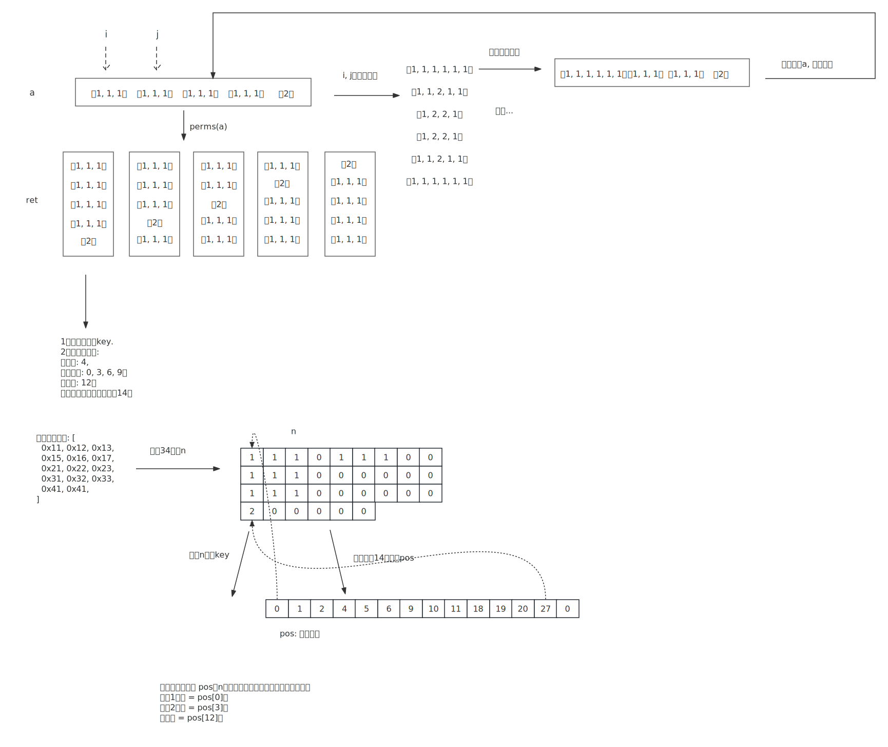

1、以最长的为例

```javascript
const a = [[ 1, 1, 1 ], [ 1, 1, 1 ], [ 1, 1, 1 ], [ 1, 1, 1 ], [ 2 ]];
```


2、调用perms(a)，生成排列组合：

```javascript
const ret = this.perms(a);
```


3、a两两合并，递归调用ptn，

i, j 两两合并，再与剩下的组合，递归调用，产生所有的可能。


4、打包成key，分析拆解出顺、刻、将元信息。




