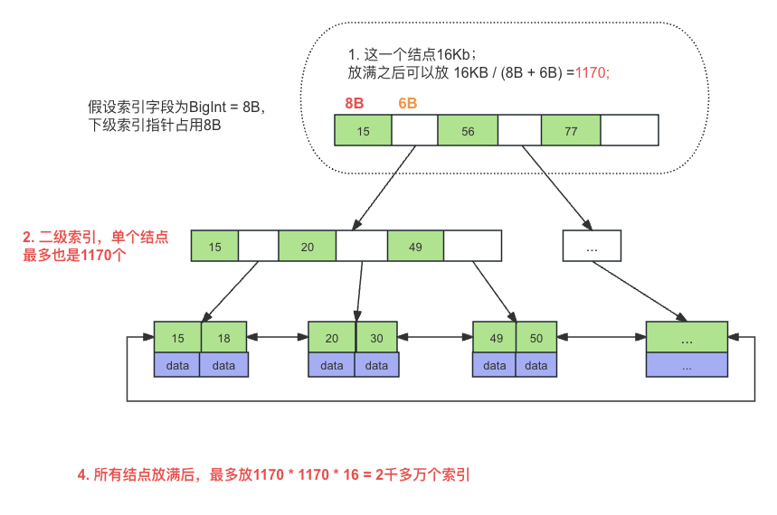

# 数据并发问题

| sno | name | class |
| --- | ---- | ----- |
| 1   | 小谷   | 1班    |

<br />

## 1.脏写(Dirty Write)

事务A修改了另一个未提交事务B修改的数据。

| 时间编号 | Session A                         | Session B                         |
| ---- | --------------------------------- | --------------------------------- |
| 1    | begin;                            |                                   |
|      |                                   | begin;                            |
|      |                                   | Update set name='李四' where sno=1; |
|      | Update set name='张三' where sno=1; |                                   |
|      | commit;                           |                                   |
|      |                                   | Rollback;                         |

是没有任何隔离级别下，session A看到的效果是无效，明明提交了，却没有效果。

（按mysql默认隔离级别，session A的update语句会阻塞）

<br />

## 2.脏读(Dirty Read)

事务A读取到了事务B未提交的数据。

| 时间编号 | Session A                                 | Session B                         |
| ---- | ----------------------------------------- | --------------------------------- |
| 1    | begin;                                    |                                   |
|      |                                           | begin;                            |
|      |                                           | Update set name='李四' where sno=1; |
|      | select * from where sno=1;<br />(李四，脏读发生) |                                   |
|      | commit;                                   |                                   |
|      |                                           | Rollback;                         |

是没有任何隔离级别下，session A读到了session B未提交的数据。

<br />

## 3.不可重复读(Non-Repeatable Read)

事务A读取了一个字段，然后事务B更新了该字段，之后事务A再次读同一个字段，值不同了，就发生了不可重复读。

| 时间编号 | Session A                              | Session B                         |
| ---- | -------------------------------------- | --------------------------------- |
| 1    | begin;                                 |                                   |
|      | Select * from where sno=1;<br />（读出小谷) |                                   |
|      |                                        | Update set name='李四' where sno=1; |
|      | select * from where sno=1;<br />(读出李四) |                                   |
|      | commit;                                |                                   |

<br />

## 4.幻读(Phantom)

事务A读取了一些数据，然后事务B插入了一些新的行，之后事务A再次读取，多出几行，就发生了幻读。

| 时间编号 | Session A                                 | Session B           |
| ---- | ----------------------------------------- | ------------------- |
| 1    | begin;                                    |                     |
|      | Select * from where sno>0;<br />（读出小谷)    |                     |
|      |                                           | Insert (2, 赵六, 2班); |
|      | select * from where sno>0;<br />(读出小谷、赵六) |                     |
|      | commit;                                   |                     |

<br />

更为准备地说是，第一次select得到的结果数据无法支撑后续的业务操作。比如说，select出来某记录不存在，准备插入此记录，但执行insert时却发现此记录存在，此时也算是幻读。

| 时间编号 | Session A                                    | Session B           |
| ---- | -------------------------------------------- | ------------------- |
| 1    | begin;                                       |                     |
|      | Select * from where sno>0;<br />（读出小谷id=1)   |                     |
|      |                                              | Insert (2, 赵六, 2班); |
|      | Insert (2, 赵五, 2班);<br />(报主键错误)             |                     |
|      | Select * from where sno>0;<br />（只能读出小谷id=1) |                     |

mysql的RR是可以避免幻读的，通过select for update加锁来解决。

<br />

# SQL的四种隔离级别

read uncommitted：读到其他未提交事务的数据，不能避免脏读、不可重复读、幻读。

read committed：只能读到其他事务已提交的数据，解决了脏读，但仍有不可重复读、幻读。

repeatable read：解决脏读、不可重复读，但仍有幻读。

Serializable：串行。

四种级别都解决了脏写。

<br />

SQL标准下：

读未提交    ----------    解决

读已提交    ----------    脏读

可重复读    ----------    不可重复读

串行化        ----------    幻读

<br />

Mysql有点不一样：

读未提交    ----------    

读已提交    ----------    脏读

可重复读    ----------    不可重复读、幻读 (采用MVCC、Next-Key Lock)

<br />

# MVCC

怎么理解MVCC？

采用乐观锁思想，用更好的方式处理读写冲突，用快照读做到非阻塞并发读。

<br />

## 隐藏字段、Undo Log版本链

Trx_id：最近更新记录的事务id。

Roll_pointer：每次修改记录时，会把旧的版本写入undo日志。指针就指向这条记录位置。

举例：假设插入记录的事务id为8，则该记录示意图如下：

```php
 id       name      trx_id  roll_pointer
 ---      -----     -----      
| 1 |    | 张三 |   | 8  |       指向 ---------------> insert undo
 ---      -----     -----
```

事务提交后，roll_pointer就没了，insert undo就被回收。

之后两个事务id10、20对这条记录进行update操作：

| 时间编号 | 事务10                         | 事务20                         |
| ---- | ---------------------------- | ---------------------------- |
| 1    | begin;                       |                              |
|      |                              | begin;                       |
|      | Update name='李四' where id=1; |                              |
|      | Update name='王五' where id=1; |                              |
|      | Commit;                      |                              |
|      |                              | Update name='钱七' where id=1; |
|      |                              | Update name='宋八' where id=1; |
|      |                              | commit;                      |

形成的版本链：

```php
 id       name      trx_id  roll_pointer
 ---      -----     -----      
| 1 |    | 宋八 |   | 20  |    指向----
 ---      -----     -----            |
                                     |
 ------------------------------------
 |
 |--> 1    钱七    20 -->
           1 王五    10 -->
           1    李四    10 -->
           1 张三    8        .
```

<br />

## ReadView

每来一个事务，就生成一个ReadView，一对一。

ReadView包含的数据：

1. creator_trx_id：对应的事务id。
2. trx_ids：当前活跃的事务id列表（未提交的事务）。
3. up_limit_id：活跃事务中最小的事务Id。
4. low_limit_id：当前系统应该分配的下一个事务id。

<br />

ReadView取数据规则：

* 记录的trx_id == RV.creator_trx_id，可取。

* 记录的trx_id < RV.up_limit_id，可取。

* 记录的trx_id > RV.low_limit_id，不可取，取版本链下条记录判断。

* 记录的trx_id在up与low之间时：
  
  对于Read Committed，trx_id存在于trx_ids，说明活跃，不可取；不存在则可取。
  
  对于Repeatable Read，不可取。

<br />

### 一、 重新认识这 4 个变量

假设你现在是事务 A，你刚刚开启，MySQL 给你发了一张照片，叫 **ReadView（RV）**。这张照片记录了当前全系统的事务状态：

1. **`creator_trx_id`（我自己的ID）**：就是你（事务A）自己的事务 ID。

2. **`trx_ids`（顽固分子列表）**：拍照片的这一刻，系统里**已经启动但还没提交**的那些“倒霉鬼”事务。

3. **`up_limit_id`（安全低水位线）**：
   
   - *误区提示*：名字叫 `up`（上），但它是活跃事务里**最小**的那个 ID。
   
   - *大白话*：**在这个 ID 之前的事务，全都已经提交了。** 它们做出的修改，你闭着眼睛都能看。

4. **`low_limit_id`（危险高水位线）**：
   
   - *误区提示*：名字叫 `low`（下），但它是系统即将分配的**下一个**新事务 ID（最大）。
   
   - *大白话*：**在这个 ID 之后的事务，都是在你拍完照片之后才出生的。** 它们做的修改，你绝对不能看。

### 二、 拆解：ReadView 的取数据规则

当你要去读数据库里的一条记录时，你会发现这条记录上挂着一个修改者的名字：**`记录的 trx_id`（是谁改了这条数据）**。

你要拿着这个 `记录的 trx_id` 去和手里的照片（ReadView）做比对，决定能不能看。比对规则其实就是个**查成分**的过程：

#### 规则 1：`记录的 trx_id == RV.creator_trx_id` ➔ 允许看

- **逻辑**：数据就是你自己（当前事务）刚刚改的，你当然能看到自己改了什么。

#### 规则 2：`记录的 trx_id < RV.up_limit_id` ➔ 允许看

- **逻辑**：这个修改者比你照片里最老的活跃事务还要老，说明**在操作之前它就已经提交完毕了**。这是历史既定事实，完全可见。

#### 规则 3：`记录的 trx_id >= RV.low_limit_id` ➔ 进去看版本链下一条

- **逻辑**：这个修改者是在你拍完照片（生成 ReadView）**之后才创建的事务**。未来发生的事，你现在不能提前看（防止脏读/幻读），所以不能看当前版本，得顺着 `undo log` 版本链去找更老的内容。

#### 规则 4：`记录的 trx_id` 夹在 `up_limit_id` 和 `low_limit_id` 之间

这是最绕的地方。这个修改者和你是“同龄人”（在你活跃期间它也活跃）。那能不能看它改的数据，取决于**它有没有提交**，这里就分出了 RC 和 RR 两种隔离级别：

- **如果你是 RC（读已提交）**：
  
  - **在 `trx_ids` 列表里**：说明拍照片那一刻它还没提交。因为你是 RC（要求读已提交），现在它没提交，你就**不能看**，得去找老版本。
  
  - **不在 `trx_ids` 列表里**：不在说明它**已经提交了**。既然提交了，你又是 RC，那就可以大方地**允许看**。

- **如果你是 RR（可重复读）**：
  
  - 你的笔记里写着“不可取”，意思是不管它在不在列表里，你**一律不看**，都去找老版本。
  
  - **为什么？** 因为 RR 要求你从头到尾读到的东西都一模一样。只要这个事务跟你属于“同时代”，哪怕在你要读的这一刻它提交了，为了保证你之前读过的数据不发生变化，你也**绝对不能看它新改的数据**。

<br />

# B+树

查看页大小

```mysql
show global status like 'Innodb_page_size';

Variable_name            Value
Innodb_page_size    16384   (16KB)
```

一页大小是16KB，也就是说一个B+树结点，一次分配是16KB，一页。这样可以算出，只用一页的情况下，高度为3的B+树，能存多少数据。



# 索引名词

聚集索引：像B+树主键索引那样，叶子结点即放索引，又放整行数据。

非聚集索引：索引跟数据分开放，像MyIsam的B+树主键索引。


