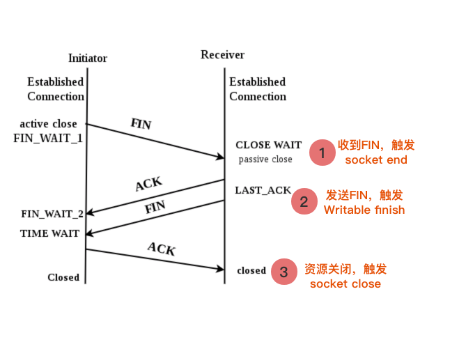
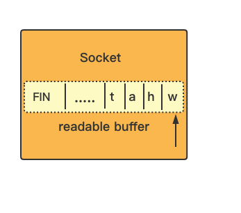

## net socket与stream事件  


### 测试程序

tcp_server.js

```js
const net = require('net');

net.createServer(function(c) {
  console.log('conneceted');

  c.on('finish', function() {
    console.log('finish 111');
  })
  
  c.on('close', function() {
    console.log('close');
  })
  
  c.on('finish', function() {
    console.log('finish 222');
  })

  c.on('end', function() {
    console.log('end');
  });

}).listen(9988);

console.log('listen on 9988', ' pid:', process.pid)  

```

<br />

tcp_client.js

```js
const net = require('net');

const c = net.createConnection({
  port: 9988
})

c.on('finish', function() {
  console.log('finish 111');
})

c.on('close', function() {
  console.log('close');
})

c.on('finish', function() {
  console.log('finish 222');
})
```

 <br />

启动server，再启动cilent，ctrl + c 直接退出client，server端打印出：

```shell
$ node tcp_server.js 
listen on 9988  pid: 27157
conneceted
end
finish 111
finish 222
close

```

<br/>

<br/>

需要查socket的文档和stream的文档，再配合tcp的四次挥手理解。    

<br />

<br />

socket的end事件：

https://nodejs.org/docs/latest-v10.x/api/net.html#net_event_end

> Emitted when the other end of the socket sends a FIN packet, thus ending the readable side of the socket.
>
> By default (`allowHalfOpen` is `false`) the socket will send a FIN packet back and destroy its file descriptor once it has written out its pending write queue. However, if `allowHalfOpen` is set to `true`, the socket will not automatically [`end()`](https://nodejs.org/docs/latest-v10.x/api/net.html#net_socket_end_data_encoding_callback) its writable side, allowing the user to write arbitrary amounts of data. The user must call [`end()`](https://nodejs.org/docs/latest-v10.x/api/net.html#net_socket_end_data_encoding_callback) explicitly to close the connection (i.e. sending a FIN packet back).

意思是收到了对端发来的FIN包就触发'end'事件，表示不再可读。

为了更好的理解，看一下stream的end事件：

https://nodejs.org/docs/latest-v10.x/api/stream.html#stream_event_end

> The `'end'` event is emitted when there is no more data to be consumed from the stream.

注意，只有Readable stream才有end事件。

socket是Duplex stream，可以看到socket的end与Readable stream的end意义上是对应的，表示不再有数据可读。



所以，在1触发，最先打印出了end。

<br/>  <br/>

socket没有finish事件，那么只能是stream里的：

https://nodejs.org/docs/latest-v10.x/api/stream.html#stream_event_finish

> The `'finish'` event is emitted after the [`stream.end()`](https://nodejs.org/docs/latest-v10.x/api/stream.html#stream_writable_end_chunk_encoding_callback) method has been called, and all data has been flushed to the underlying system.

意思是所有的内部buffer数据都被刷到底层系统。同时注意，只有Writable stream才有finish事件。可以猜测，只有当前socket端不再可写时，才会触发，而这正是当前socket向对端发送FIN后。


对应2，打印出finish。

  <br/>
  <br/>

之后，socket的close事件:

https://nodejs.org/docs/latest-v10.x/api/net.html#net_event_close_1

> Added in: v0.1.90
>
> - `hadError` [](https://developer.mozilla.org/en-US/docs/Web/JavaScript/Data_structures#Boolean_type) `true` if the socket had a transmission error.
>
> Emitted once the socket is fully closed. The argument `hadError` is a boolean which says if the socket was closed due to a transmission error.

socket完全被关闭时触发。

同时Readable stream和Writable stream都有close事件，看一下：

Readable:

https://nodejs.org/docs/latest-v10.x/api/stream.html#stream_event_close_1

> The `'close'` event is emitted when the stream and any of its underlying resources (a file descriptor, for example) have been closed. The event indicates that no more events will be emitted, and no further computation will occur.
>
> A [`Readable`](https://nodejs.org/docs/latest-v10.x/api/stream.html#stream_class_stream_readable) stream will always emit the `'close'` event if it is created with the `emitClose` option.

  <br/>

Writable:

https://nodejs.org/docs/latest-v10.x/api/stream.html#stream_event_close

> The `'close'` event is emitted when the stream and any of its underlying resources (a file descriptor, for example) have been closed. The event indicates that no more events will be emitted, and no further computation will occur.
>
> A [`Writable`](https://nodejs.org/docs/latest-v10.x/api/stream.html#stream_class_stream_writable) stream will always emit the `'close'` event if it is created with the `emitClose` option.

Readable和Writable两种流对close事件的描述高度一致，都是说流的底层资源（文件描述符）被关闭了，这也与socket的close事件相对应。


对应3，打印close。

  <br/>


### socket.end与消费

如果我们改一下tcp_client.js的代码，把ctrl + c换成socket.end()方法，服务端保持不变呢？

```js
// tcp_client.js
const net = require('net');

const c = net.createConnection({
  port: 9988
})

c.on('end', function() {
  console.log('end');
})
c.on('finish', function() {
  console.log('finish 111');
})
c.on('close', function() {
  console.log('close');
})
c.on('finish', function() {
  console.log('finish 222');
})
setTimeout(function() {
  c.end('what the hell');
}, 3000)

```

3s后，调用end()方法，关闭当前连接。

先看一下socket.end()方法描述

https://nodejs.org/docs/latest-v10.x/api/net.html#net_socket_end_data_encoding_callback

> ### socket.end([data][, encoding][, callback])[[src\]](https://github.com/nodejs/node/blob/5182a7ece0b71feeb9157f7aa348a15d53e32058/lib/net.js#L544)[#](https://nodejs.org/docs/latest-v10.x/api/net.html#net_socket_end_data_encoding_callback)
>
> Added in: v0.1.90
>
> - `data` [<string>](https://developer.mozilla.org/en-US/docs/Web/JavaScript/Data_structures#String_type) | [<Buffer>](https://nodejs.org/docs/latest-v10.x/api/buffer.html#buffer_class_buffer) | [<Unit8Array>](https://developer.mozilla.org/en-US/docs/Web/JavaScript/Reference/Global_Objects/Uint8Array)
> - `encoding` [<string>](https://developer.mozilla.org/en-US/docs/Web/JavaScript/Data_structures#String_type) Only used when data is `string`. **Default:** `'utf8'`.
> - `callback` [<Function>](https://developer.mozilla.org/en-US/docs/Web/JavaScript/Reference/Global_Objects/Function) Optional callback for when the socket is finished.
> - Returns: [<net.Socket>](https://nodejs.org/docs/latest-v10.x/api/net.html#net_class_net_socket) The socket itself.
>
> Half-closes the socket. i.e., it sends a FIN packet. It is possible the server will still send some data.
>
> If `data` is specified, it is equivalent to calling `socket.write(data, encoding)` followed by [`socket.end()`](https://nodejs.org/docs/latest-v10.x/api/net.html#net_socket_end_data_encoding_callback).

半关闭socket，向对端发送FIN包。

那么，按照新改的代码，服务端是不是就会走四次挥手流程，依次打印出'end'、'finish'、'close'呢？先看客户端的输出：

```shell
$ node tcp_cilent.js 
finish 111
finish 222
```

再看服务端的输出：

```shell
$ node tcp_server.js 
listen on 9988  pid: 32405
conneceted
```


调用了end()方法，连接竟然没有断开？而且服务端也没有触发'end'事件？这。。。


线索在stream的end事件描述里：

https://nodejs.org/docs/latest-v10.x/api/stream.html#stream_event_end

> ##### Event: 'end'[#](https://nodejs.org/docs/latest-v10.x/api/stream.html#stream_event_end)
>
> Added in: v0.9.4
>
> The `'end'` event is emitted when there is no more data to be consumed from the stream.
>
> The `'end'` event **will not be emitted** unless the data is completely consumed. This can be accomplished by switching the stream into flowing mode, or by calling [`stream.read()`](https://nodejs.org/docs/latest-v10.x/api/stream.html#stream_readable_read_size) repeatedly until all data has been consumed.

除非data被完全消费，否则'end'不会触发。

还有在文档的最后面，也有讲，并给出了例子。

https://nodejs.org/docs/latest-v10.x/api/stream.html#stream_compatibility_with_older_node_js_versions

<br />

再去看服务端的代码，没有为新来的socket绑定'data'事件、也没有'readable' + read()方法消费内部data，socket处于pause mode。或者可以理解为，FIN包被排到了内部buffer的尾部，只有消费完了前面的data，才能轮到FIN包。



所以，要让他正常走完四次挥手，需要消费一下服务端的socket，像这样：

```js
const net = require('net');


net.createServer(function(c) {
  console.log('conneceted');

  c.on('finish', function() {
    console.log('finish 111');
  })
  c.on('close', function() {
    console.log('close');
  })
  c.on('finish', function() {
    console.log('finish 222');
  })
  c.on('end', function() {
    console.log('end');
  });

  setTimeout(async () => {
    /**
      几种方法选一种
    */
    
    // 方法1: 用flow mode
    c.on('data', (chunk) => {
      console.log(`Received ${chunk.length} bytes of data. chunkStr:${chunk.toString()}`);
    });
  }, 5000);
  
  	// 方法2: pause mode readable + read方法
    c.on('readable', () => {
      let chunk;
      while (null !== (chunk = c.read())) {
        console.log(`Received ${chunk.length} bytes of data. chunkStr:${chunk.toString()}`);
      }
    });
  
  	// 方法3: pause mode 直接read
    for(let i = 0; i < 16;i++) {
      const internelBuf = c.read(1);
      console.log(`${i} Received ${internelBuf ? internelBuf.length + ' bytes of data. chunkStr:' +  internelBuf.toString() : null }`);
  
      await new Promise((r,j) => {
        setTimeout(() => {
          r(true);
        }, 2000)
      })
    }
  
  	// 方法4: flow mode resume方法
    c.resume();
  

}).listen(9988);

console.log('listen on 9988', ' pid:', process.pid)
```

<br />

如此一来，客户端、服务端都正常打印。

```shell
$ node tcp_cilent.js 
finish 111
finish 222
end
close
```

<br />

```shell
$ node tcp_server.js 
listen on 9988  pid: 32627
conneceted
end
finish 111
finish 222
close

```


 所以，socket 'end'事件的触发，需要加上一个条件：就是当前socket需要被消费完并且收到FIN包，才会触发。

<br />


### socket.destroy与finish

如果，把end改为destroy呢？

```js
// tcp_client.js
const net = require('net');

const c = net.createConnection({
  port: 9988
})

c.on('end', function() {
  console.log('end');
})
c.on('finish', function() {
  console.log('finish 111');
})
c.on('close', function() {
  console.log('close');
})
c.on('finish', function() {
  console.log('finish 222');
})

setTimeout(function() {
  // c.end('what the hell');
  c.destroy();

}, 3000)
```

在官方文档里，关于destroy的描述是这样：

socket部分: https://nodejs.org/docs/latest-v10.x/api/net.html#net_socket_destroy_exception

> ### socket.destroy([exception])
>
> Added in: v0.1.90
>
> Ensures that no more I/O activity happens on this socket. Only necessary in case of errors (parse error or so).
>
> If `exception` is specified, an [`'error'`](https://nodejs.org/docs/latest-v10.x/api/net.html#net_event_error_1) event will be emitted and any listeners for that event will receive `exception` as an argument.

<br />

stream部分: https://nodejs.org/docs/latest-v10.x/api/stream.html#stream_writable_destroy_error

> ##### writable.destroy([error])[#](https://nodejs.org/docs/latest-v10.x/api/stream.html#stream_writable_destroy_error)
>
> Added in: v8.0.0
>
> Destroy the stream, and emit the passed `'error'` and a `'close'` event. After this call, the writable stream has ended and subsequent calls to `write()` or `end()` will result in an `ERR_STREAM_DESTROYED` error. Implementors should not override this method, but instead implement [`writable._destroy()`](https://nodejs.org/docs/latest-v10.x/api/stream.html#stream_writable_destroy_err_callback).

stream部分说，销毁流，并触发'close'事件，客户端确实是这样：

```shell
$ node tcp_cilent.js 
close
```

<br />

而服务端，不管有没有消费socket，都正常打印：

```shell
$ node tcp_server.js 
listen on 9988  pid: 32712
conneceted
end
finish 111
finish 222
close
```

<br />

之前说过，发送FIN包后会触发'finish'，但这里destroy并没有触发'finish'，按照来说，不管是end还是destroy，都会向对端发送FIN，只是destroy发完后就直接销毁fd， 不等对端的ACK。

> ##### Event: 'finish'[#](https://nodejs.org/docs/latest-v10.x/api/stream.html#stream_event_finish)
>
> Added in: v0.9.4
>
> The `'finish'` event is emitted after the [`stream.end()`](https://nodejs.org/docs/latest-v10.x/api/stream.html#stream_writable_end_chunk_encoding_callback) method has been called, and all data has been flushed to the underlying system.

所以，发送FIN包后就不会马上触发'finish'，而是发送FIN包，并且内部buffer被刷到底层fd后才会触发。

