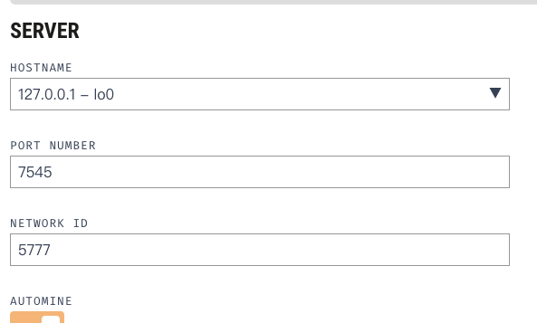

truffle笔记


版本：

```powershell
➜  truffle version
Truffle v5.8.2 (core: 5.8.2)
Ganache v7.7.7
Solidity v0.5.16 (solc-js)
Node v14.6.0
Web3.js v1.8.2
➜   
```


初始化一个项目

两种方式

```powershell
# 一. 空的项目
truffle init

# 二. 包含sample文件, 一般用这个
truffle unbox metacoin 
```


编译项目

两种方式

```shell
# 第一种方式: 生成build/contracts/xx.json文件
truffle compile

# 第二种方式
truffle develop # develop会创建一个本地区块链, 之后进入这个环境
>compile        # 再执行compile命令

```


部署项目

truffle管部署叫migrate。

也有两种方式，第一种是部署到truffle内置的develop本地区块：

```shell
truffle develop
>migrate # migrate会先compile, 再部署到内置的本地区块

```


第二种是部署到其他区块，以ganache为例：

ganache网络配置如下：



```json
# 1. 在truffle-config.js里networks部分指向ganache:
module.exports = {
  networks: {
    development: {
      host: "127.0.0.1",
      port: 7545,
      network_id: "*"
    }
  }
};

# 2. 执行 truffle migrate部署到ganache
truffle migrate

# 3. 与合约交互, 这是在ganache网络环境下
truffle console
```


string转bytes32:

```javascript
function create(bytes32 name) public returns () {}

create(web3.utils.asciiToHex("gg"))
```


