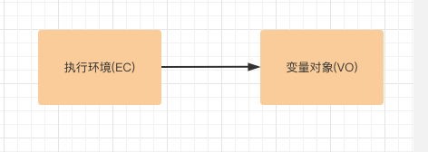
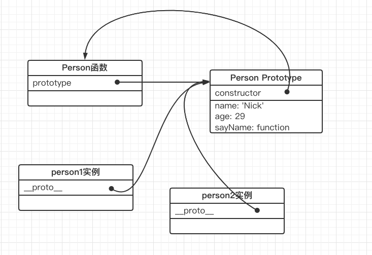
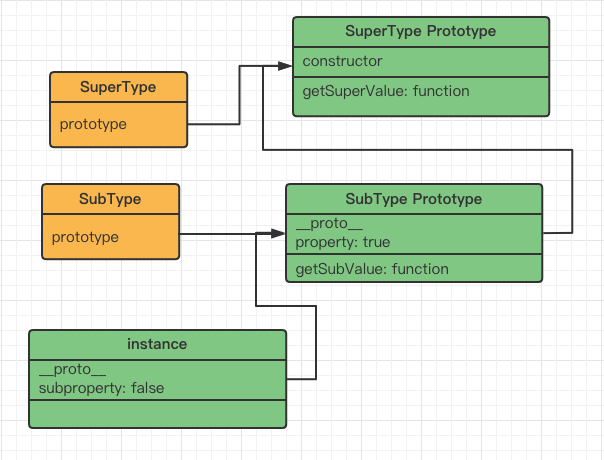
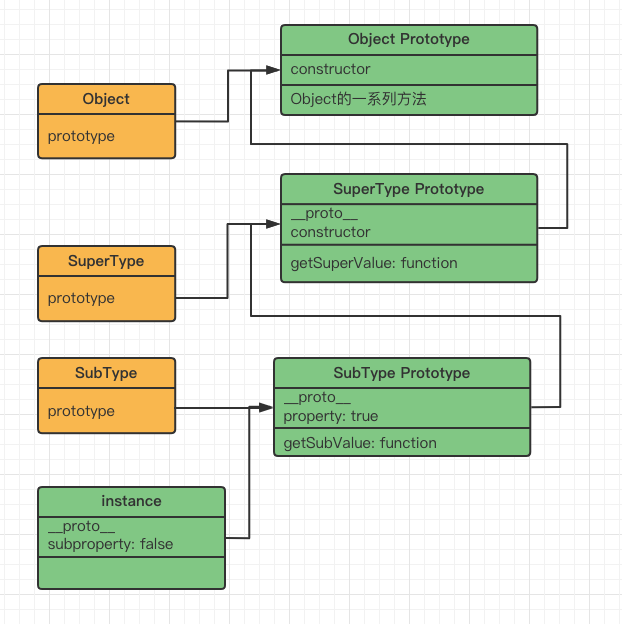
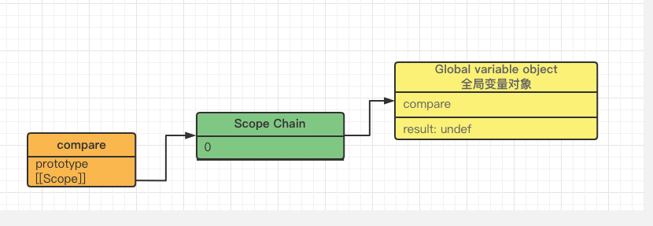
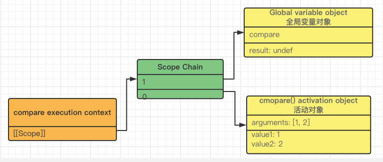
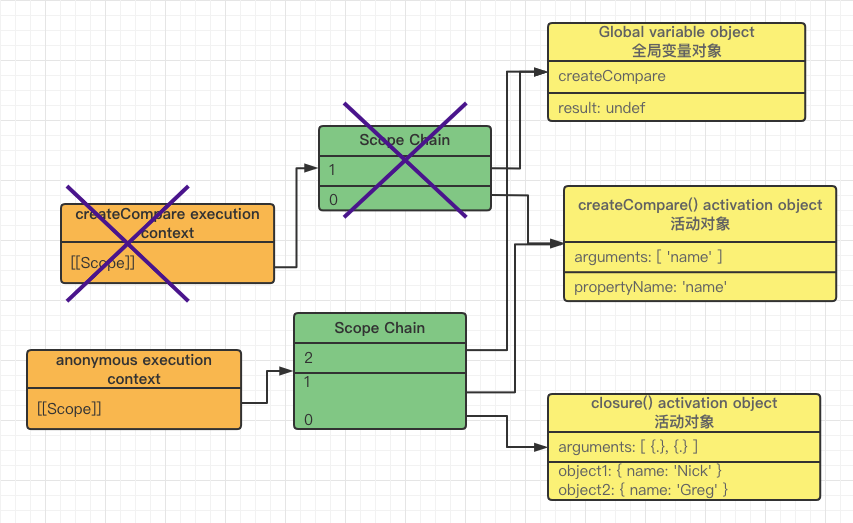

- [第3章 基本概念](#第3章-基本概念)
  - [typeof](#typeof)
  - [Undefined](#undefined)
  - [Null](#null)
  - [Number](#number)
  - [浮点数](#浮点数)
  - [整数](#整数)
  - [NaN](#nan)
  - [Arguments](#arguments)
- [第4章 变量、作用域和内存问题](#第4章-变量作用域和内存问题)
  - [typeof](#typeof-1)
  - [执行环境](#执行环境)
  - [var](#var)
- [第5章 引用类型](#第5章-引用类型)
  - [Array类型](#array类型)
  - [Function](#function)
  - [this](#this)
  - [函数属性](#函数属性)
  - [函数方法](#函数方法)
  - [基本包装类型](#基本包装类型)
- [第6章 面向对象的程序设计](#第6章-面向对象的程序设计)
  - [属性(property)、特性(attribute)](#属性property特性attribute)
  - [创建对象](#创建对象)
    - [工厂模式](#工厂模式)
    - [构造函数模式](#构造函数模式)
    - [原型模式](#原型模式)
    - [稳妥构造函数模式](#稳妥构造函数模式)
  - [继承](#继承)
    - [原型链继承](#原型链继承)
    - [借用构造函数(constructor stealing)](#借用构造函数constructor-stealing)
    - [组合继承(combinartion inheritance)](#组合继承combinartion-inheritance)
    - [原型式继承(Prototypal Inheritance)](#原型式继承prototypal-inheritance)
    - [寄生式继承(parasitic)](#寄生式继承parasitic)
    - [寄生组合式继承](#寄生组合式继承)
- [第7章 函数表达式](#第7章-函数表达式)
  - [函数的作用域过程](#函数的作用域过程)
  - [闭包](#闭包)
  - [this值的意外改变](#this值的意外改变)
  - [闭包的作用](#闭包的作用)
- [附录B 严格模式](#附录b-严格模式)
  - [变量](#变量)
  - [对象](#对象)
  - [函数](#函数)
  - [抑制this](#抑制this)


### 第3章 基本概念

```js
// 非严格模式下，正常打印出"hi"

// 严格模式下报错: ReferenceError: message is not defined
// 'use strict'; 

function test() {
  message = 'hi';
}
test();
console.log(message);

```

#### typeof

```js
操作符，返回一个字符串

未定义或未初始化     "undefined"
布尔       "boolean"
字符串     "string"
数值       "number"
对象或null "object"
函数       "function"
```

#### Undefined

```js
使用var声明但没有初始化
var message
message == undefined; // 返回 true

```

#### Null

```js
null == undefined; // true
null === undefined; // 返回false
```

#### Number

```js
IEEE754来表示整数和浮点数
```

#### 浮点数

```js
浮点的内存空间是整数的2倍，如果浮点数值本身表示就是一个整数，会被转成整数
var floatNum1 = 1.; // 会被转成整数1
var floatNum2 = 10.0; // 10

最高精度是17位小数
0.1 + 0.3 = 0.30000000000000004; // 小数点后面17位小数

这是IEEE754数值浮点计算的通病
```

#### 整数

```js
最小值 Number.MIN_VALUE: 5e-324
最大值 Number.MAX_VALUE: 1.7976931348623157e+308
超过，会转成Infinity、-Infinity，使用isFinite(函数)判断是否超过

var h = Number.MAX_VALUE * 100; // Infinity
isFinite(h); // true
```

#### NaN

```js
NaN不与任何数相等
NaN == NaN; // false

任何NaN的关系比较都是false
NaN < 3; // false
NaN >= 3; // false

NaN !== NaN; // true

isNaN(NaN); // true
isNaN(10); // false
isNaN("10"); // false 可以被转成数值10
isNaN("blue"); // true 不能被转成数值
isNaN(Object); // 依次valueOf、toString返回值能否转成数值
```

#### Arguments

```js
非严格模式, 修改arguments, 会同步修改形参的值; 
function doAdd(num1, num2) {
  arguments[1] = 10;
  console.log(arguments[0] + num2); // 输出15
}
doAdd(5, 5);

非严格模式, 修改形参, 会同步修改arguments的值;
function doAdd(num1, num2) {
  num2 = 10;
  console.log(arguments[0], arguments[1]); // 5 10
}
doAdd(5, 5);

严格模式, 两者互不影响。


arguments.lenght只由传入实参决定：

'use strict'; // 严格模式与非严格模式通用
function doAdd(num1, num2) {
  arguments[3] = 4;
  console.log(arguments.length); // 1
}
doAdd(5);


```


### 第4章 变量、作用域和内存问题

#### typeof

```js
var f = function() {}
typeof f; // 返回'function'
```

#### 执行环境

执行环境（execution context  简称环境）。每个执行环境都有一个关联的变量对象（variable object），环境中定义的变量和函数都保存在变量对象中。




每个函数都有自己的执行环境，当执行流进入一个函数时，函数的环境就会被推入到一个环境栈中。

当代码在一个环境中执行时，会创建变量对象的一个作用域链。如果这个环境是函数，则将其活动对象（activation object）作为变量对象。作用域链链的是变量对象。

#### var

使用var声明的变量会自动被添加到最近的环境中。在函数内部，最近的是函数的局环境。

```js
function add(num1, num2) {
  var sum = num1 + num2;
  return sum;
}
add(10, 20);
console.log(sum); // 报错, ReferenceError: sum is not defined

```


### 第5章 引用类型

#### Array类型

```js
var colors = new Array(20); // 创建length为20的数组

length属性不是只读，设置length可以移除最后几项:
const colors = [ 'red', 'blue', 'green', 'black' ];
colors.length = 1;
console.log(colors); // 输出 [ 'read' ]


判断是否是数组的推荐方式：
if (Array.isArray(value) ) {
   // 是数组 
}

方法：
push/pop实现栈
push/shift实现队列 

var colors = ['red', 'blue'];
var item = colors.shift(); // 'red' 删除第一项

unshift：
colors.unshift('black'); // 从前推入 [ 'black', 'blue' ]

排序 
sort默认会调用每个数组项的toString()方法，按字符串从小到大
var v = [ 0, 1, 5, 10, 15 ];
v.sort(); // [ 0, 1, 10, 15, 5 ]

应该使用比较函数
v.sort(function(v1, v2) {
  return v1 - v2;
});
// v: [ 0, 1, 5, 10, 15 ]
```

#### Function

解析器会率先读取函数声明，通过函数声明提升（function declaration hoisting），将函数声明添加到执行环境中。函数表达式必须等到执行到所在的代码行，才会被解释执行。

```js
console.log(sum(10, 1)); // 1
function sum(num1, num2) {
  return num1 + num2;
}


console.log(f(10, 1)); // TypeError: f is not a function
var f = function sum(num1, num2) {
  return num1 + num2;
};

```

#### this

函数内部的一个特殊对象是this。this引用的是函数据以执行的环境对象。

#### 函数属性

每个函数都有两个属性：length和prototype

length表示函数声明的形参个数：

```js
function sayName(name) {}
function sum(num1, num2) {}
function sayHi() {}

console.log(sayName.length); // 1
console.log(sum.length); // 2
console.log(sayHi.length); // 0
```

prototype保存实例方法，用在继承上，且prototype不可枚举，for in不出来。

#### 函数方法

Apply()、call()用于修改this值。两个作用相同，只是接收参数不同。

bind()：会创建一个函数实例，会绑定传入的this。

```js
global.color = 'red';
function sayColor() {
  console.log(this.color);
}
sayColor(); // red

const o = { color: 'blue' };
const objectSayColor = sayColor.bind(o);
objectSayColor(); // blue
```

#### 基本包装类型

为方便操作基本类型，ES5提供了三个特殊的引用类型: Boolean、Number、String。

每当读取一个基本类型时，后台会创建一个对应的基本包装类型对象。

```js
var s1 = 'some text';
var s2 = s1.substring(2); // 访问s1，开启读取模式，相当于以下代码：
    ||
var s1_temp = new String('some tet');
var s2 = s1_temp.substring(2);
s1_temp = null;
```


可以直接new一个包装类型，但typeof、instanceof会变成object

```js
var x = new Number(33);
console.log(typeof x); // 'object'
console.log(x instanceof Object); // true
```


Boolean包装类型的一点注意

```js
var x = new Boolean(false);
console.log(typeof x); // 'object'
console.log(x instanceof Object); // true
console.log(x && true); // true
```


String包装类

chatAt、charCodeAt

slice(开始位置，结束位置) (不包括)

substr(开始位置，返回的字符个数)

substring(开始位置，结束位置)(不包括)


### 第6章 面向对象的程序设计

#### 属性(property)、特性(attribute)

特性：

Configurable：能否delete、能否修改属性的特性。

Enumerable：能否for-in出来。

Writable：能否修改属性的值。

Value：包含这个属性的数据值。

```js
// 'use strict';

const person = {};
Object.defineProperty(person, 'name', {
  configurable: false, // 不能从对象中删除
  value: 'Nick',
});

console.log(person.name); // nick
delete person.name; // 严格模式下报错; 非严格下无反应
console.log(person.name); // nick

Object.defineProperty(person, 'name', {
  configurable: true, // 报错, 不能重新配置
  value: 'Nick2',
});

```


#### 创建对象

##### 工厂模式

```js
function createPerson(name, age) {
  var o = new Object();
  o.name = name;
  o.age = age;
  o.sayName = function() { alert(this.name); };
  return o;
}

对象不能识别（即怎样知道一个对象的类型）。
```

##### 构造函数模式

```js
function Person(name, age) {
  this.name = name;
  this.age = age;
  this.sayName = function() { alert(this.name); };
}

var p1 = new Person('Nick', 29);
var p2= new Person('Moss', 39);

函数是对象，每次都需要实例化一个函数对象，浪费。
```

##### 原型模式

每个函数都有一个prototype属性，是个指针，指向一个对象，叫原型对象。原型对象默认会有constructor属性，指回函数。

Nodejs里实例会有 `__proto__` 属性指向原型对象。

目标原型对象.isPrototypeOf(实例)：判断实体的原型对象是否是目标原型对象。

Object.getPrototypeOf(实例)：获取实例的原型对象。

实例的同名属性会屏蔽原型对象里的同名属性。

```js
function Person() {}
Person.prototype.name = 'Nick';
Person.prototype.age = 29;
Person.prototype.sayName = function() {
  console.log(this.name);
};

var p1 = new Person();
p1.sayName();

var p2 = new Person();
p2.sayName();

console.log(p1.prototype); // undef
console.log(p1.__proto__); // Person { name: 'Nick', age: 29, sayName: [Function (anonymous)] }

// 某原型对象是否是某实例的原型对象
console.log(Person.prototype.isPrototypeOf(p1)); // true
console.log(Person.prototype.isPrototypeOf(p1.__proto__)); // false
console.log(Person.prototype === p1.__proto__); // true

p1.name = 'Greg';
console.log(p1.name); // Greg, 会屏蔽原型对象同名属性
```




hasOwnProperty(prop): 属性是否存在于实例中

```js
console.log(p2.hasOwnProperty('name')); // false
p2.name = 'Nissen';
console.log(p2.hasOwnProperty('name')); // true
console.log(Person.prototype.hasOwnProperty('name')); // true
```


in操作符：单独使用和for-in

单独使用。能访问到就可以，实例+原型对象，不管enumerable的值。

```js
var k = {
  name: 'Nis',
};

Object.defineProperty(k, 'age', {
  enumerable: false,
  value: 28,
});
console.log(k); // { name: 'Nis' }
console.log(k.age); // 28
console.log('age' in k); // true

```


For-in：实例+原型，且enumerable为true的。

```js
var k = {
  name: 'Nis',
};

Object.defineProperty(k, 'age', {
  enumerable: false,
  value: 28,
});
Object.defineProperty(k, 'job', {
  enumerable: true,
  value: 'teacher',
});

for (var p in k) {
  console.log(p); // name、job
}
```


Object.keys：获取实例可枚举属性，即 实例+enumerable为true。

```js
function Person() {}
Person.prototype.name = 'Nick';
Person.prototype.age = 29;
Person.prototype.sayName = function() {
  console.log(this.name);
};

var p1 = new Person();
p1.sayName();

var p2 = new Person();
p2.sayName();

console.log(p1.prototype); // undef
console.log(p1.__proto__); // Person { name: 'Nick', age: 29, sayName: [Function (anonymous)] }

console.log(Person.prototype.isPrototypeOf(p1)); // true
console.log(Person.prototype.isPrototypeOf(p1.__proto__)); // false
console.log(Person.prototype === p1.__proto__); // true

console.log(p2.hasOwnProperty('name')); // false
p2.name = 'Nissen';
console.log(p2.hasOwnProperty('name')); // true
console.log(Person.prototype.hasOwnProperty('name')); // true

console.log(Object.keys(p2)); // [ 'name' ]

```


Object.getOwnPropertyNames(实例)：获取所有实例属性，无论是否可枚举，实例。


##### 稳妥构造函数模式

稳妥对象(durable object)：没有公共属性，方法不引用this的对象。

```js
function Person(name, age, job) {
  var o = new Object();
  o.sayName = function() {
    console.log(name);
  };
  return o;
}

var p = Person('Nick', 29);
p.sayName();

```


#### 继承

##### 原型链继承

让原型对象等于另一个类的实例，连成链。

```js
function SuperType() {
  this.property = true;
}

SuperType.prototype.getSuperValue = function() {
  return this.property;
};

function SubType() {
  this.subproperty = false;
}
SubType.prototype = new SuperType();
SubType.prototype.getSubValue = function() {
  return this.subproperty;
};

var instance = new SubType();
console.log(instance.getSuperValue()); // true
console.log(instance.getSubValue()); // false
```

实例及原型链图：



搜索属性和方法顺序 ：实例instance ---> SubType Prototype ---> SuperType Prototype

沿着`__proto__`属性一路寻找。


哦，还有Object，所有引用对象都继承了Object，所有完整的原型链图是这样：




##### 借用构造函数(constructor stealing)

一句话：子类构造函数内部调用超类构造函数，但无继承关系。

本质：赋值属性。

```js
function SuperType() {
  this.colors = [ 'red', 'blue' ];
}

function SubType() {
  SuperType.call(this); // 借用了其他的构造函数, 但没继承关系
}

var s1 = new SubType();
console.log(s1 instanceof SubType); // true
console.log(s1 instanceof SuperType); // false
console.log(s1.colors); // [ 'red', 'blue' ]

```


##### 组合继承(combinartion inheritance)

原型链+借用构造函数

```js
function SuperType(name) {
  this.name = name;
  this.colors = [ 'red', 'blue', 'green' ];
}

SuperType.prototype.sayName = function() {
  console.log(this.name);
};

function SubType(name, age) {
  SuperType.call(this, name); // 借用了其他的构造函数, 但没继承关系
  this.age = age;
}

SubType.prototype = new SuperType();
SubType.prototype.sayAge = function() {
  console.log(this.age);
};

var instance1 = new SubType('Nick', 29);
console.log(instance1 instanceof SuperType); // true
console.log(instance1 instanceof SubType); // true
```


##### 原型式继承(Prototypal Inheritance)

道格拉斯.克罗克福德2006年的一篇文章里提到的一种实现继承的方法。

```js
function object(o) {
  function F() {}
  F.prototype = o;
  return new F();
}

var person = {
  name: 'Nick',
  friends: [ 'Shelby', 'Court', 'Van' ],
};

var p1 = object(person);
p1.name = 'Greg';
p1.friends.push('Rob');

var p2 = object(person);
p2.name = 'Linda';
p2.friends.push('Barbie');

console.log(p1.friends); // [ 'Shelby', 'Court', 'Van', 'Rob', 'Barbie' ]

```

ES5里的Object.create方法就是这样实现。


##### 寄生式继承(parasitic)

与原型式继承紧密相关，在内部以某种方式来增加对象。

```js
function object(o) {
  function F() {}
  F.prototype = o;
  return new F();
}

function createAnother(original) {
  var clone = object(original); // 寄生在原型式继承

  clone.sayHi = function() { // 内部以某种方式增加对象
    console.log('hi');
  };
  return clone;
}
```


##### 寄生组合式继承

最理想的继承方式，解决组合式继承问题：

1、调用两次超类构造函数

2、子类原型对象是超类实例，会有超类实例属性。

寄生式继承 + 组合（原型链+借用构造）

```js
function object(o) {
  function F() {}
  F.prototype = o;
  return new F();
}

function inherite(subType, superType) {
  // 寄生式继承
  var proto = object(superType.prototype);
  proto.constructor = subType; // 增加对象

  subType.prototype = proto; // 原型链
}

function SuperType(name) {
  this.name = name;
  this.colors = [ 'red' ];
}
SuperType.prototype.sayName = function() {
  console.log(this.name);
};

function SubType(name, age) {
  SuperType.call(this, name); // 借用构造
  this.age = age;
}

inherite(SubType, SuperType);
SubType.prototype.sayAge = function() {};
```


### 第7章 函数表达式

定义函数的两种方式：1函数声明；2函数表达式

函数声明具有函数声明提升(function declaration hoisting)特征。

```js
// 'use strict';

var condition = 1;
if (condition) {
  function sayHi() {
    console.log('Hi');
  }
} else {
  function sayHi() {
    console.log('Yo');
  }
}

// 非格式模式下, 'Hi'
// 格式模式下, 报错: ReferenceError: sayHi is not defined
sayHi();
```


#### 函数的作用域过程

以下面函数为例：

```js
function compare(value1, value2) {
  return -1;
}
var result = compare(1, 2);
```

创建阶段：创建compare函数时，会创建一个预先包含全局变量对象的作用域链，保存在`[[Scope]]`属性中。




调用阶段：调用compare()函数时

1、为函数创建创建一个执行环境（execution context)；

2、复制函数的`[[Scope]]`属性，构建执行环境的作用域链；

3、创建本函数的活动对象（activation object）其中包含this、arguments、value1、value2，并推入执行环境的作用域头；

4、此时作用域链中包含两个变量对象（本地活动对象和全局变量对象）；



作用域链本质是一个指针列表，列表里的指针指向变量对象。

一般情况下，函数执行完毕后，局部活动对象会被销毁，只保存全局变量对象。但闭包不一样。


#### 闭包

闭包是指有权访问另一个函数作用域中的变量的函数。

说人话：闭包是一个函数，可以访问另一个函数中的变量。

```js
function createCompare(propertyName) {
  return function(object1, object2) {
    var v1 = object1[propertyName];
    var v2 = object2[propertyName];
    return v1 - v2;
  };
}

var compare = createCompare('name');
var result = compare({ name: 'Nick' }, { name: 'Greg' });
```

createCompare函数执行完毕后，执行环境的作用域链会销毁，但其活动对象不会销毁，因为匿名函数的作用域链仍在引用这个活动对象。



通过将compare设置为null，解除该函数的引用，匿名函数的作用域链会被销毁，其他作用域也会销毁。

```js
var compare = createCompare('name');
var result = compare({ name: 'Nick' }, { name: 'Greg' });

compare = null;
```


#### this值的意外改变

```js
global.name = 'The Window';
var object = {
  name: 'My Object',
  getName() {
    return this.name;
  },
};

console.log(object.getName()); // 'My Object'
console.log((object.getName)()); // 'My Object'
console.log((object.getName = object.getName)()); // 'The Window'
```

赋值表达式返回的值是函数本身，此时已经没有了调用者。


#### 闭包的作用

1、实现私有变量，外部不能直接访问这个变量，只能通过方法。

2、实现为单例创建私有变量和特权方法。

个人认为这两个作用都不实用，完全可以不用。


### 附录B 严格模式

#### 变量

严格模式不允许不带var声明变量


#### 对象

严格格式下，操作对象属性会报错：

1、为只读属性赋值；

2、为不可配置（configurable）的属性使用delete；

3、为不可扩展（extensible）的对象添加属性；

4、重复定义属性；


#### 函数

严格模式下访问arguments.callee和arguments.caller 都会报错。


#### 抑制this

非严格模式下, 使用apply或call，null或undef会被转换成全局对象。

严格模式下，则是传入什么是什么。

```js
// 'use strict';

global.color = 'red';

function displayColor() {
  console.log(this.color); // 严格模式下报错: TypeError: Cannot read property 'color' of null
}

displayColor.call(null);
```

