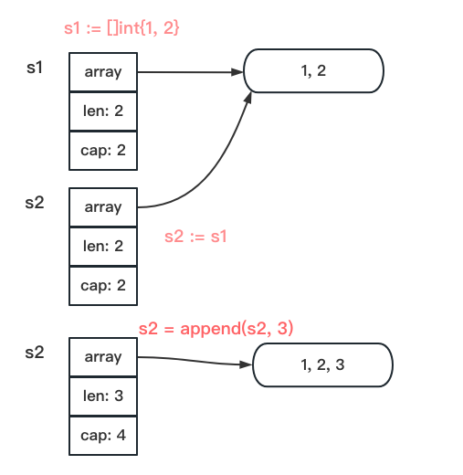
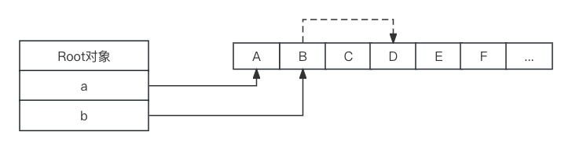
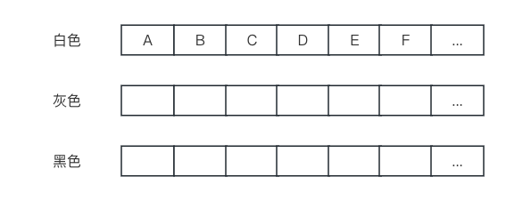
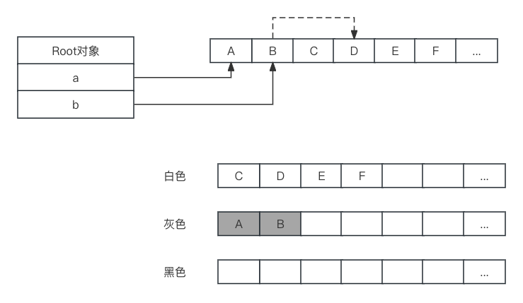

Go专家编程笔记


# 第1章 常见数据结构的实现原理

## 管道

一、读写nil管道均会阻塞。关闭的管道仍然可以读取数据，向关闭的管道写数据会触发panic。总结一下，触发panic的操作有：

- 关闭值为nil的管道；
- 关闭已经关闭的管道；
- 向已经关闭的管道写入数据；


二、x, ok := <-ch，第二个变量(bool类型)用于表示是否成功读取了数据。一个已关闭的管道有两种情况：

* 管道缓冲区中没有数据了，此时ok = false。
* 管道缓冲中区还有数据，此时ok = true。


二、for-range可以持续从管理中读出数据，当管理中没有数据时会阻塞当前协程。


## slice

一、slice是引用类型，赋值时底层指向同一个array。

```go
package main

import (
	"fmt"
)

func SliceRise(s []int) {
	s = append(s, 0)
	for i := range s {
		s[i]++
	}
}
func SlicePrint() {
	s1 := []int{1, 2}
	s2 := s1
	s2 = append(s2, 3)
	SliceRise(s1)
	SliceRise(s2)
  
  // 输出[1,2] [2,3,4]
	fmt.Println(s1, s2)
}

func main() {
	SlicePrint()
}
```



注意len和cap即可。


二、append一个nil时的效果

```go
func SliceExtend() {
	var slice []int
	s1 := append(slice, 1, 2, 3)

	// 3, 3
	fmt.Println(len(s1), cap(s1))

	s2 := append(s1, 4)
	// 4, 6
	fmt.Println(len(s2), cap(s2))

	// false
	fmt.Println(&s1[0] == &s2[0])
}
```


三、扩容规则：

cap(原slice) < 1024，则cap(新slice) = 2 * cap(原)，即两倍大小；

cap(原slice) >= 1024，cap(新slice) = 1.25 * cap(原)，1.25倍。

使用append()向slice添加一个元素时：

* 假如原slice容量够用，则添加新元素，slice.len++，返回原slice。
* 假如原slice容量不够，则将slice扩容，得到新slice，再添加新元素，slice.len++，返回新slice。


四、扩展表达式

常规的截取可能会覆盖原有的：

```go
a := [5]int{1,2,3,4,5}
b := a[1:4]
b = append(b, 0) // 此时a[5]将由5变为0
```

a[low: high: max]，限制截取的cap。

```go
b = a[1:4:4] // 限制了b的len、cap = 3
b = append(b, 0) // 此时会创建一个新的，不会覆盖旧的。
```


五、iota

每行+1，从0开始。

```go
const (
  // 1, 0
  bit0, mask0 = 1 << iota, 1 <<iota -1 // 1<<0, 1<<0 -1
  
  // 2, 1
  bit1, mask1 // 1<<1, 1<<1 -1
  
  _, _ // 空行iota+1
  
  // 8, 7
  bit3, mask3 // 3<<1, 3<<1 -1
)
```


六、string

声明的string可能为空字符串，但不会为nil，也不能修改。

```go
var s1 string; // 空字符串, 但不是nil
```


七、sync.Map

即开即用：

```go
var m sync.Map
m.Store("Jim", 80)

score, _ := m.Load("Jim")
fmt.Println("%d", score.(int))

m.Delete("Jim")
```

原理：用两原生map，一个read、一个dirty。read是原子性，dirty要用Mutex保护。写数据先到dirty，读先从read里读，miss后再去dirty里读。当miss超过dirty里数据量时，会触发数据迁移，从dirty到read。

适用场景：读多写少的并发场景（因为mutx限定在了dirty表，缩小了互斥锁的范围）。


# 第2章 控制结构

## select

一、空的select语句会永远阻塞。

```go
func Select() {
	select {}
}
```


二、case语句中操作了nil的管道，那么该case语句会被忽略。

```go
func Select() {
	var c chan string
	select {
		case c <- "hello":
			fmt.Println("sent")
		default:
			fmt.Println("default")
	}
```


三、select只能用于管道。

四、case读操作返回条件：成功读到数据、或管道已经关闭。

```go
func SelectArgs(c chan string) {
  select {
  case <-c:
    fmt.Println("0")
  case d := <-c:
    ...
  case d, ok := <-c:
    ...
  }
}

c := make(chan string)
close(c)
SelectArgs(c) // 三个case都有机会执行
```

五、select原理的lockorder不太理解。


## for-range

一、for range遍历时，key， value。

```go
// 遍历每次执行一次赋值value, string会拷贝。
// 更好的办法是用key, 不用vaule。
func FindMonkey(s []string) bool {                func Find(s []string) bool {
  for _, v := range s {                             for k := range s {
    if v == "monkey" {                                if s[k] == "monkey" {
			return true                                       return true
    }                                                 }
	}
	return false
}
```


二、for-range作用于值为nil的管道时会永久阻塞。

三、for-range在遍历开始时就已经决定了循环次数，所以迭代过程中向切片追加元素不会有问题。另外，key从0开始取的。

```go
func Range() {
	s := []int{1,2,3}
	for i := range s {
		s = append(s, i)
	}
	// [1,2,3,0,1,2]
	fmt.Println(s)
}
```

四、for-range遍历channel只会返回数据，不会返回成功标志。没有数据会阻塞，直到close。close会直接退出for-range，不会取到零值。


# 第3章 协程

M：Machine，代表操作系统内核实体线程。

G：go语句提交的任务。

P：Processor，为了协调M与G之间的调度，引入了一个角色P用来解耦。P包含一个任务队列。

M必须跟P绑定，才能运行G。

当M运行的G进行系统调用阻塞时，P与M解绑，另外的M跟P结合，继续运行P的任务队列，这样就可以提高系统利用率。


# 第4章 内存管理&垃圾回收

四级管理。

首先是span。Go有67级span，各个级别的span大小不同，比如说第一级span的容量是一个page，8KB，元素大小8个字节。然后各级span都有前后指针连接起来。相当于有67条链。

有了这67条链，还需要个容器来管理它们，那就是cache。

cache线程相关的，Go会为每个线程分配cache。它的结构是一个两倍67大小的数组，用来管理span的。

```go
type mcache struct {
  alloc [67*2] *mspan
}
```

cache在最开始是没有span的，需要在使用过程中动态的去获取，获取的来源就是central。

central是全局共享的，一个central对应一个span级别，有两个span列表，一个有空闲内存的span列表，一个没有空闲内存的。

```go
type mcentral struct {
  lock mutex
  spanClass spanClass // span级别
  noempty mSpanList
  empty   mSpanList
  ..
}
```

线程从central的空闲span列表摘取span，缓存进cache。之后再归还到central。

同样的，像span一样，还需要个容器来把central集中起来，这就是heap。

```go
type mheap struct {
  lock mutex
  central [67*2] struct {
    ...
  }
}
```

heap是最高级别的抽象，管理着全部的内存。

申请内存的步骤大概是这样：

1. 当前线程的cache里有没有span空闲，如果没有，则找一个central里有没有空闲的，如果再没有，再从heap里申请。

<br />

## 垃圾回收

Go用的标记清除算法，三色标记法。

白色：在等待标记的对象；

灰色：正在标记中的对象；

黑色：已经标记完的对象；

首先从根对象出发，引用到的对象置灰，再依次从灰对象出发，将灰对象引用的对象置灰的同时，将本对象置黑。

剩余的白色对象，就是可以被清除的对象。

1、当前内存中有A-F 6个对象，根对象a、b是栈上分配的局部对象，分别引用着A、B，而B又引用着D。



2、开始执行三色标记，初始时所有对象都是白色的：



3、开始扫描根对象a、b，引用的变灰：



4、A没有引用，直接变黑。B引用D，将D变灰的同时，将B变黑，之后再将D变黑。


# 第5章 并发控制

ctx.WithCancel()

ctx.WithDeadline()

ctx.WithTimeout()

ctx.WithValue()


sync.Mutex原理


# 第6章 反射

```go
type Foo struct {
  A int
  B string
  C interface{}
}
使用==可以比较两个结构体变量，但仅限于结构体成员类型为简单类型，不能有slice、map等不可比较类型。
实际项目中用reflect.DeepEqual()函数来比较。
```

```go
func IsEqual(a, b interface{}) bool {
  ...
}
使用==可以比较两个空接口类型变量，但仅限于接口底层类型一致，且不能有slice、map等不可比较类型。
实际项目也是用reflect.DeepEqual()来比较。
```


# 第8章 异常处理(error、defer、panic、recover)

## error

error是一个接口

```go
type error interface {
  Error() string
}
```

Go1.13之前error的使用：

1、创建error的三种方式: errors.New()、fmt.Errorf()、自定义error。都是返回&errorString结构体。

```go
package errors
func New(text string) error {
  return &errorString(text)
}

package fmt
func Errorf(format string, a ...interface{}) error {
  return errors.New(Sprintf(format, a...))
}

// 自定义
type PathError struct {
  Op string
  Path string
  Err error
}
func (e *PathError) Error() string {
  return ...
}
```

2、检查错误的几中方式：

```go
1) 与nil比较
if err != nil {
  ...
}

2) 与预定义的一些error比较
// ErrPermission = errors.New("permission denied")
if err == ErrPermission {
  ...
}

3) 自定义error，用类型断言检查
if e, ok := err.(*os.PathError); ok {
  e.Op, e.Path
}
```

Go1.13之后，新增了wrapError，用来处理链式error。

```go
err := errors.New("not found")
err1 := fmt.Errorf("some context: %v", err) // errorString
err2 := fmt.Errorf("some context: %w", err) // wrapError
```

errors.Is()：检查特定的error链中是否包含指定的error值。

```go
func ExampleIs() {
  err1 := fmt.Errorf("write file error: %w", os.ErrPermission)
  err2 := fmt.Errorf("write file error: %w", err1)
  
  if errors.Is(err2, os.ErrPermission) { // true
  }
```

errors.As()：error链中是否有指定的类型，有就转换成这个类型，返回true；没有就返回false。

```go
err := &os.PathError{
  Op: "write",
  Path: "/root/demo.txt",
  Err: os.ErrPermission,
}

err2 := fmt.Errorf("some context: %w", err)
var target *os.PathError
if errors.As(err2, &target) { // true
  ...
}
```

## defer

注意的点：

1、defer栈

```go
// 输出43210
func Demo1() {
  for i := 0; i < 5; i++ {
    defer fmt.Print(i)
  }
}
```

2、参数确定

```go
func Demo2() {
  var aInt = 1
  defer fmt.Println(aInt) // 1 defer语句出现时确定
  aInt = 2
  return
}
```

3、设置返回值 ---> defer执行 ---> ret

```go
// 具名返回值
func Demo5() (result int) {
  i := 1
  defer func() {
    result++
  }
  return i
}
return是分成两步，设置返回值1，执行defer2，再ret，所以结果是2

// 匿名返回值
func Demo6() {
  var i int
  defer func() {
    i++
  }()
  return i // 0
}
anony = 1
i++
ret // 所有不会修改到返回值
```

使用场景：

1. 释放资源。

   ```go
   m.mutex.Lock()
   defer m.mutex.Unlock()
   
   ```

2. 异常处理。

   ```go
   defer func() {
     recover()
   }()
   ```

   

## recover

* recover()的返回值是什么？

  返回的是panic()函数的参数，如果没有panic，返回的是nil。

* recover必须直接位于defer函数中才有效。

  ```go
  func RecoverDemo() {
    defer func() {
      func() {
        if err := recover(); err != nil {
          fmt.Println("A")
        }
      }()
    }()
    panic("demo") // 此时recover无效。
  }
  ```

  

# 第9章 定时器

两种定时器：

一次性定时器(Timer)：只运行一次，结束就停止。

周期性定时器(Ticker)：周期性运行，除非手动停止，否则永远。

## Timer

```go
type Timer struct {
  C <-chan Time // 由系统守护协程发送当前时间
  r runtimeTimer
}
```

**基本用法：**

* 创建定时器: time.NewTimer(d Duration)。
* 停止定时器：t.Stop() before Timeout：超时前stop，返回true；否则返回false。
* 重置定时器：t.Reset(d Duration)，先停止，再启动。

**time包提供的简单接口：**

* time.After(Duration)

  ```go
  func AfterDemo() {
    <- time.After(1 * time.Second) // 等1s后执行
    ...
  }
  ```

* time.AfterFunc(Duration, f func()) 异步执行。

  ```go
  func AfterFunc() {
    time.AfterFunc(1 * time.Second, func() {
      ...
    })
    
    time.Sleep(2 * time.Second) // 异步执行，等协程退出
  }
  ```

**使用场景：**

1、设定超时时间

```go
func WaitChannel(conn <-chan string) bool {
  timer := time.NewTimer(1 * time.Second)
  
  select {
  case <- conn:
    timer.Stop()
    return true
  case <- timer.C: // 超时
    return false
  }
}
```

2、延迟执行某个方法

```go
func DelayFunction() {
  timer := time.NewTimer(5 * time.Second)
  select {
  case <- timer.C:
    ...
  }
}
```


## Ticker

**基本用法：**

* 创建：time.NewTicker(Duration) *Ticker。
* 停止：t.Stop()，无返回值。

```go
func TickDemo() {
  ticker := time.NewTicker(1 * time.Second)
  defer ticker.Stop()
  for range ticker.C {
    ...
  }
}
```

**time包提供的简单接口：**

* func Tick(Duration) <-chan Time  没有手段来停止该Ticker，慎用。

错误示例：

```go
func WrongTicker() {
  for {
    select {
    case <- time.Tick(1 * time.Second):
      ...
    }
  }
}
每次检测case语句都会创建一个定时器，消耗CPU资源。
```


# 第10章 语法糖

**简短变量声明**

```go
i := 0
j, k := 1, 2

// 声明f1, offset
f1, offset := nextFiled(str, 0);

// 存在新变量一起声明时, 可以重新声明已声明的变量. 是同一个offset, 只是值变了。
f2, offset := nextFiled(str, 1);

// offset := 3 这个就不行, 因为没有新变量一起声明
```


# 第11章 泛型

**声明泛型函数**

```go
func SumIntsOrFloats[K comparable, V int64 | float64] (m map[K]V) V {
  var s V
  for _, v := range m {
    s += V
  }
  return s
}
```

* 通过[K comparable, V int64 | float64] 声明两个类型参数K, V。
* K类型必须是comparable类型，V可以是int64或float64。
* 参数m表示一个泛化的map。

调用泛型函数：

* 显示调用：

  ```go
  SumIntsOrFloats[string, int64)(ints)
  SumIntsOrFloats[string, float64)(floats)
  ```

* 隐式调用：

  ```go
  SumIntsOrFloats(ints)
  ```

  

# 第12章 依赖管理

三个阶段：

* GOPATH
* Vendor（Go 1.6起）
* Go Module（Go1.11起）


GOROOT：go的安装目录，包括标准库、二进制。

GOPATH：工作空间目录。

某个package引用包时，依次从GOROOT/src/和GOPATH/src/中查找。


Vendor搜索路径：

从当前文件目录下找vendor目录，没有则找上层目录的vendor目录，再往一层层往上。

如果还是没有，则退到GOPATH方式。


Go Module

```go
> go mod init github.com/xxx/gomodules

生成的go.mod内容:
module github.com/xxx/gomodules

go 1.13

require github.com/google/uuid v1.1.1
```


go.mod文件的指令

* module：声明module的名称，import时用的。
* require：声明依赖及版本号。
* replace：替换require中声明的依赖，使用另外的依赖及其版本号。
* exclude：排除某个版本，不使用。
* indirect：表示这个包没有被直接依赖，可能是间接依赖。


replace：

替换require中出现过的包，用v1.1.0：

```go
module github.com/xxx/gomodules
go 1.13

require github.com/google/uuid v1.1.1
replace github.com/google/uuid v1.1.1 => github.com/google/uuid v1.1.0
```

替换无法下载的包：

```go
module github.com/xxx/gomodules
go 1.13

require (
  github.com/google/uuid v1.1.1
  golang.org/x/text v0.3.2
)

replace (
  github.com/google/uuid v1.1.1 => github.com/google/uuid v1.1.0
  golang.org/x/text v0.3.2 => github.com/golang/text v0.3.2
)
```

调试依赖包：

```go
replace (
  github.com/google/uuid v1.1.1 => ../uuid
)
```


indirect：

直接依赖的module没有启用go.mod，此时会在当前module下记录indirect。

```go
          ---> B1
A --->  B |(B没有go.mod)
          ---> B2

// 执行go mod tidy会在A的go.mod下记录
require (
  B vx.x.x
  B1 vx.x.x // indirect
  B2 vx.x.x // indirect
)
```

直接依赖的module启用了go.mod，但记录缺失。也会在当前module下记录indirect。


go mod why -m github.com/retry：查看依赖链。


**incompatible：**

Go Module规定，如果major版本号>1，则module名字应该变为：

github.com/RainbowMango/m/v2。

如果某个module没有遵循这个规定，那会有incompatible标志：

```go
require (
  // 这个modul没有遵循命名规定, 所有会有incompatible
  github.com/RainbowMango/m V3.6.0+incompatible
)
```


**伪版本：**

v1.2.3这样的语义化版本，实际是某个commit ID。

如果不使用语义化版本，直接用commit ID的话，就是伪版本。

```go
require (
  go.etcd.io/etcd v0.0.0-20191023171146-3cf2f69b5738
)
```


**go.sum**

记录每个依赖包的Hash值。用来校验包的正确性。由Module名、版本、hash值组成。

一个module由两条组成：

```go
github.com/google/uuid v1.1.1 h1:GkXwew320dfwea= // 所有文件的hash值
github.com/google/uuid v1.1.1/go.mod h1:TIyPZE4Mwe+hk= // go.mod文件的hash值
```

