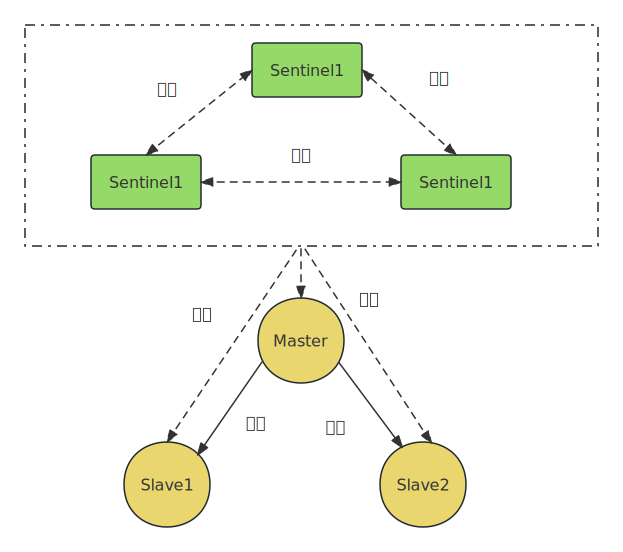
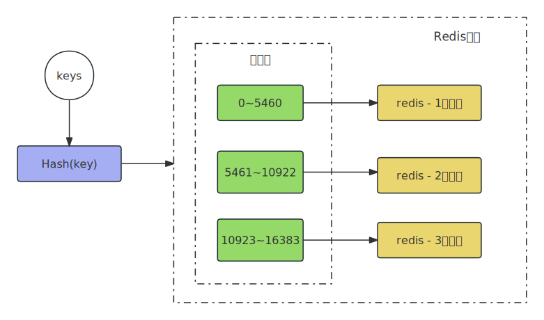

作者：张云河、王硕

2021年8月第一版。实际写成是在2020年8月。


NoSQL（Not Only SQL）：不仅仅是SQL，是非关系型数据库的广义定义。

NoSQL以键值对(key-value)形式存储数据。Redis、Memcached、MongoDB等都属于NoSQL。


# 第2章 Redis常用数据类型及命令

## Hash: HSETNX

```shell
> hsetnx nosql name "redis"
(integer) 1

> hsetnx nosql name "redis"  // 已经存在name了
(integer) 0
```


## RPOPLPUSH

```shell
src:  a、b、c
dest: x、y、z

> rpoplpush src dest 
后 src:  a、b
   dest: c、x、y、z

```


## Sorted Set

zadd： 添加

```shell
zadd key [score member] ...

> zadd myset1 1 "one" 2 "two"
```


zrem: 删除

```shell
zrem key [member]...

> zrem myset1 "one"
```


zcard: 返回元素个数.

```shell
> zcard myset1
```


zcount: 返回score值在[min, max]之间的元素数量.

```shell
> zcount myset1 2 10
```


zscore: 返回member的score值.

```shell
> zscore myset1 two
```


zincrby: member的score加上增量，可以是负数

```
> zincrby myset1 3 two
```


zrange: 返回指定区间（score从小到大排）内的members.

```shell
zrange key start stop [withscores]

> zadd salary 20 wang
> zadd salary 40 lisi
> zadd salary 10 zhan

> zrange salary 0 -1 withscores
得到 [zhan 10]，[wang 20]，[lisi 40]

> zrange salary 1 2 withscores
得到 [wang 20]，[lisi 40]
```


zrevrange：跟zrange一样，只是按score降序排名.

```
zrevrange key start stop [withscores]

> zrevrange salary 0 -1 withscores
得到 [lisi 40]，[wang 20]，[zhan 10]
```


zrevrangebyscore：返回score介于min max之间的members. 按score降序返回.

```shell
zrevrangebyscore key min max
```


zrank：返回member的排名, score值在从小大到排的排名 (从0开始)

```shell
zrank key member

> zrank salary lisi
(integer) 2
```


zrevrank：跟zrank反过来

```shell
zrevrank key member

> zrevrank salary lisi
(integer) 0
```


## HyperLogLog

作来做不精确的计数。如网页的PV值。标准误差是0.81%。

```shell
> pfadd page1 user1 // 用户user1访问了页面page1
> pfadd page1 user2 

> pfcount page1  // 返回估算值
(integer) 3
```


# 第4章 Redis高级主题

## multi

个人认为Redis里的不能算事务，只能命令包。

```shell
> multi // 标记事务块开始

> set age 21
QUEUED

> set age 22
QUEUED

> get age
QUEUED

> sadd tag "java" "python" "c"
QUEUED

> smembers tag
QUEUED

> exec // 发送命令包
1) OK
2) OK
3) "22"
4) (integer) 3
5) 1) "python"
   2) "c"
   3) "java"
```

watch用来实现乐观锁：

```shell
> watch name age  // 监视两个key的变化，如果其他客户端修改了这两个key，那multi的命令包将不起作用。
> multi
> incr age
> set name lishi
> exec
```


## 发布订阅

```shell
// 订阅频道
> subscribe redisCaht
                             // 发布消息
                             > publish redisCaht "message1"
```


# 第5章 Redis持久化

两种方式。

RDB持久化：fork出一个子进程，把内存数据dump到rdb文件。主进程继续接收处理命令。

用save、bgsave命令触发。


AOF持久化：将第一个写操作追加记录到文件中。


# 第6章 Redis集群环境部署

一、主从复制模式。

1主2从，主挂了，从只能读，不能写，从不能变成主。为了让从变成主，于是有了哨兵模式。


二、哨兵模式Sentinel。

监控Master的状态，当Master发生故障的时候，实现Master和Slave的切换。



三、集群模式。

key根据散列函数CRC16(key) % 16384，得到属于哪个Slot，再由Slot找到对应的节点。



