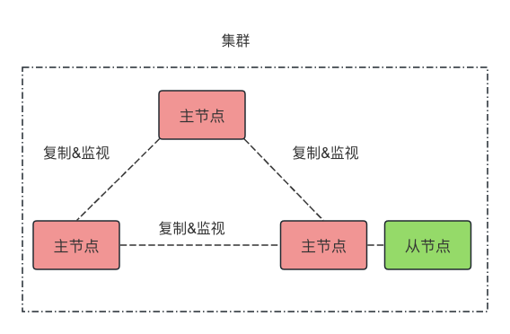

作者：黄健宏

2019年9月第一版


# 第20章 集群

集群提供了主从复制功能，还提供了Sentinel功能，保证了高可用。

简单来说，集群中的各个节点互相监视各自的运行，在某个主节点下线时，提升该节点的从节点为新主节点。



集群会自动维护Slot的分配，包括增删节点时Slot、节点上数据的变更。

有时有这样的需求，本来对于user:10086 这个key在SlotA上，而user:10010在SlotB上，

现在想让这两个key放在同一个Slot，可以通过Redis提供的Hash Tag来做：

```shell
// cluster命令查看key在哪个slot
> CLUSTER SLOT {user}:10086
5474

> CLUSTER SLOT {user}:10010
5474

// Hash Tag 用 {}括起来的
> HMSET {user}:10086 name peter age 28
> HMSET {user}:10010 name julie age 40
```

