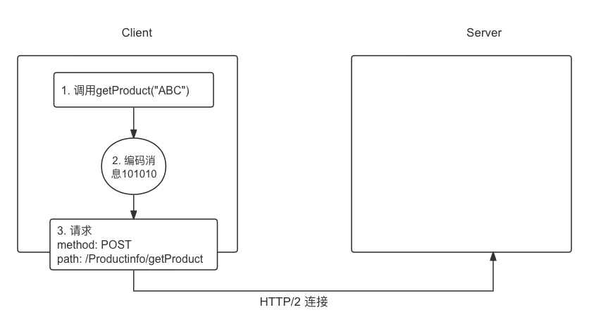
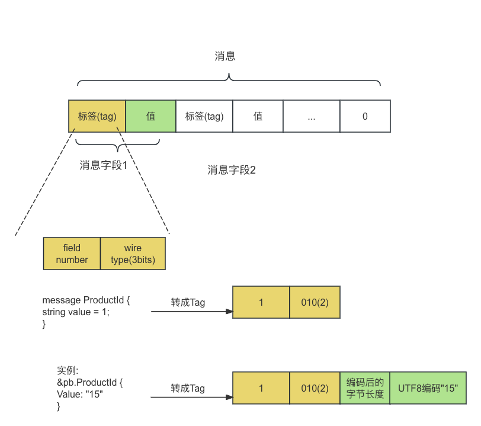
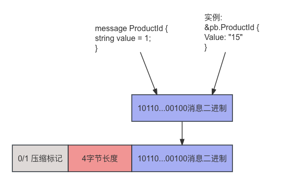

作者：卡山 - 因德拉西里

2021年1月版


# 第2章 开始使用gRPC

**1、下载安装pb编译器**:  https://github.com/protocolbuffers/protobuf/releases/tag/v26.1.

现在最新版本v26(2024/3/25日发布)

```shell
> protoc --version
libprotoc 3.7.1

> which protoc
/usr/local/bin/protoc
```


v3.12.0（2020/5/16日发布)

下载protoc-3.12.0-osx-x86_64.zip，解压，直接覆盖原来的。

```shell
> protoc --version
libprotoc 3.12.0
```


**2、安装gRPC库**

```shell
> go get -u google.golang.org/grpc
```

最新版本是v1.62.1 (2025/5/5日发布) 当前用的这个

v1.28.0 (2020/3/10日发布)


**3、安装go插件**

```shell
> go install google.golang.org/protobuf/cmd/protoc-gen-go@latest

> go get google.golang.org/grpc/cmd/protoc-gen-go-grpc
> go install google.golang.org/grpc/cmd/protoc-gen-go-grpc
```


**4、初始化目录结构**

```shell
> mkdir productinfo/service -p
> cd productinfo/service
> go mod init productinfo/service

# 生成go.mod, 内容为:
module productinfo/service

go 1.20
```


**5、当前目录结构**

ProductInfo.proto文件内容：

```protobuf
syntax = "proto3";
package ecommerce;

option go_package = "/ecommerce";

message Product {
  string id = 1;
  string name = 2;
  string desc = 3;
}

message ProductID {
  string value = 1;
}

service ProductInfo {
  rpc addProduct(Product) returns (ProductID);
  rpc getProduct(ProductID) returns (Product);
}
```

目录结构：

```shell
productinfo/
    service/
        ecommerce/
            ProductInfo.proto
        go.mod
        go.sum
        product_service.go
        main.go
```

进入ecommer目录，编译：

```shell
ecommerce > protoc -I=. --go_out=. --go_opt=paths=source_relative --go-grpc_out=. --go-grpc_opt=paths=source_relative ProductInfo.proto
```

直接就会在当前下生成pb.go、grpc.pb.go文件。


6、**vscode打开时, 总是报找不到grpc库，跳也跳不过去。需要在service目录下打开vscode，即：**

```shell
productinfo> cd service

# 这样打开就正常了, gopls插件的通病 https://github.com/golang/vscode-go/issues/275
service> code . 
```


7、**再建另一个client, 也是一样go mod init productinfo/client。 目录结构：**

```shell
productinfo/
    service/
        ecommerce/
            ProductInfo.proto
            ProductInfo.pb.go
            ProductInfo_grpc.pb.go
        go.mod
        go.sum
        product_service.go
        main.go
        
    client/
        ecommerce/
            #... 从service下直接拷过来
        go.mod
        go.sum
        main.go
```

此时有两个module。在vscode打开时client，要这样打开才可以有代码跳转：

File -> Add Folder to Workspace.


**8、运行service module：**

```shell
# 因为main包分成了两个文件, 所以需要这样运行：
service> go run main.go product_service.go
2024/04/04 08:21:53 Starting gRPC listner on port :5051

# 或者直接这样：
service> go run *.go
2024/04/04 07:59:57 Starting gRPC listner on port :5051
```


# 第3章 gRPC的通信模式

四种模式。Communication Patterns。

## **一、一元RPC模式**

常规的请求、响应。第2章示例就是属于这种。

```
            请求
client   ----------------->  server
        
           响应(数据 + 服务端状态 + trailer元数据)
         <-----------------
```


## **二、服务端的流RPC模式**

 Server-side Streaming RPC

服务端收到客户端请求消息，发送多个响应，多个响应组成的序列叫”流“。在所有响应发送完后，再发服务端状态 + trailer元数据。

```
---------------
|   client    |
|             |        请求
|   gRPC存根   |  ------------------------>   serve/gRPC服务端
|             |  <------------------- 响应1
|             |  <------------------- 响应2
---------------
```

**1) .proto文件中定义服务端流：**

```protobuf
syntax = "proto3";
import "google/protobuf/wrappers.proto";
package ecommerce;

service OrderManagement {
  ...
  // 返回stream
  rpc searchOrders(google.protobuf.StringValue) returns (stream Order);
}

message Order {
    string id = 1;
    repeated string items = 2;
    string description = 3;
    float price = 4;
    string destination = 5;
}
```

**2) server端实现调用stream.Send方法发送响应：**

```go
func (s *server) SearchOrders(searchQuery *wrappers.StringValue, stream pb.OrderManagement_SearchOrdersServer) error {

	for key, order := range orderMap {
		for _, itemStr := range order.Items {
      // 调用Send方法
      err := stream.Send(&order)
      if err != nil {
        return fmt.Errorf("error sending message to stream : %v", err)
      }
		}
	}
  // 返回nil标记流的结束, 发服务端状态 + trailer元数据。
	return nil
}
```

**3) client端用Recv方法接收：**

```go
// Search Order : Server streaming scenario
searchStream, 	_ := client.SearchOrders(ctx, &wrapper.StringValue{Value: "Google"})
for {
  searchOrder, err := searchStream.Recv()
  if err == io.EOF {
    log.Print("EOF")
    break
  }
  if err == nil {
    log.Print("Search Result : ", searchOrder)
  }
}
```


## 三、客户端流RPC模式

Client-side Streaming RPC

客户端发多个消息到服务端，服务端可以在接收到一条、几条、或者全部消息后响应。

**1) .proto定义**:

```protobuf
syntax = "proto3";
import "google/protobuf/wrappers.proto";
package ecommerce;

service OrderManagement {
  rpc updateOrders(stream Order) returns (google.protobuf.StringValue);
}
```

**2) server处理：**

调用Recv接收，调用SendAndClose结束并响应。

```go
func (s *server) UpdateOrders(stream pb.OrderManagement_UpdateOrdersServer) error {
  ordersStr := "Updated Order IDs : "
	for {
		order, err := stream.Recv()
		if err == io.EOF {
			// Finished reading the order stream.
			return stream.SendAndClose(&wrapper.StringValue{Value: "Orders processed " + ordersStr})
		}

		if err != nil {
			return err
		}
		// Update order
		orderMap[order.Id] = *order

		log.Printf("Order ID : %s - %s", order.Id, "Updated")
		ordersStr += order.Id + ", "
	}
}
```

**3) client处理：**

调用Send发请求，调用CloseAndRecv接响应。

```go
updOrder1 := pb.Order{Id: "102", Items:[]string{"Google Pixel 3A", "Google Pixel Book"}}
updOrder2 := pb.Order{Id: "103", ...}
updateStream, err := client.UpdateOrders(ctx)
if err != nil {
  log.Fatalf("%v.UpdateOrders(_) = _, %v", client, err)
}

// Updating order 1
if err := updateStream.Send(&updOrder1); err != nil {
  log.Fatalf("%v.Send(%v) = %v", updateStream, updOrder1, err)
}

// Updating order 2
if err := updateStream.Send(&updOrder2); err != nil {
  log.Fatalf("%v.Send(%v) = %v", updateStream, updOrder2, err)
}

updateRes, err := updateStream.CloseAndRecv()
if err != nil {
  log.Fatalf("%v.CloseAndRecv() got error %v, want %v", updateStream, err, nil)
}
log.Printf("Update Orders Res : %s", updateRes)
```


## 四、双向流RPC模式

Bi-directional Streaming RPC

**1) .proto文件定义：**

```protobuf
service OrderManagement {
  // 参数都是stream
  rpc processOrders(stream google.protobuf.StringValue) returns (stream CombinedShipment);
}
```

**2) server端：**

```go
func (s *server) ProcessOrders(stream pb.OrderManagement_ProcessOrdersServer) error {
	for {
    // 接收
		orderId, err := stream.Recv()
		log.Printf("Reading Proc order : %s", orderId)
		if err == io.EOF {
			// 客户端发完了所有消息
			for _, shipment := range combinedShipmentMap {
        // 回个响应
				if err := stream.Send(&shipment); err != nil {
					return err
				}
			}
      // return 用来标记服务端流的结束
			return nil
		}
    
		if err != nil {
			log.Println(err)
			return err
		}
    
    ...
    // 多次调用Send给客户端响应
    stream.Send(&comb);
	}
}

```

**3) client端：**

```go
// Process Order : Bi-di streaming scenario
streamProcOrder, err := client.ProcessOrders(ctx)
if err != nil {
  log.Fatalf("%v.ProcessOrders(_) = _, %v", client, err)
}

// 发送
if err := streamProcOrder.Send(&wrapper.StringValue{Value:"102"}); err != nil {
  log.Fatalf("%v.Send(%v) = %v", client, "102", err)
}

if err := streamProcOrder.Send(&wrapper.StringValue{Value:"103"}); err != nil {
  log.Fatalf("%v.Send(%v) = %v", client, "103", err)
}

channel := make(chan struct{})
go asncClientBidirectionalRPC(streamProcOrder, channel)

// 结束发送
if err := streamProcOrder.CloseSend(); err != nil {
  log.Fatal(err)
}
channel <- struct{}{}


func asncClientBidirectionalRPC(streamProcOrder pb.OrderManagement_ProcessOrdersClient, c chan struct{}) {
  for {
    // 拿服务端响应
    combinedShipment, errProcOrder := streamProcOrder.Recv()
    if errProcOrder == io.EOF {
      break
    }
    log.Printf("Combined shipment : ", combinedShipment.OrdersList)
  }
  <-c
}
```

总结一下，方法：

| Client                                   | 用法                              |
| ---------------------------------------- | --------------------------------- |
| Send(xxx): 发送xxx消息                   | err := stream.Send(xxx)           |
| Recv(): 接收响应                         | obj, err := stream.Recv()         |
| CloseAndRecv(): 标记结束, 并等待接收响应 | res, err := stream.CloseAndRecv() |
| CloseSend(): 标记结束                    | err := stream.CloseSend();        |

<br />

| Server                                   | 用法                        |
| ---------------------------------------- | --------------------------- |
| Send(xxx): 发送xxx消息                   | err := stream.Send(&order)  |
| Recv(): 接收消息                         | order, err := stream.Recv() |
| SendAndClose(xxx): 发送xxx消息, 并结束流 | stream.SendAndClose(xxx)    |


# 第4章 gRPC的底层原理

gRPC Under the Hood



## 一、protocol buffers编码

以字符串为例：



## 二、消息分帧（message-framing)

编码后的proto消息，前面加上消息长度，4个字节，表明消息长度不超过4GB。

其实就是所谓的粘包。



## 三、HTTP/2发送

有了长度前缀消息，还需要加上HTTP/2的消息头(header)，再加上结束标记(EOS End Of Stream)就可以发送了。


## 四、响应

一样的，响应数据包括两部分：

1、响应头信息、长度前缀消息（可无）；

2、trailer，作为单独的头信息。用来告知客户端响应已发送；

trailer包括：状态码、状态信息

HEADERS (flags = END_STREAM, END_HEADERS)

grpc-status = 0 

grpc-message= xxx


# 第5章 超越基础知识

## 一、拦截器（interceptor)

拦截器可以用在服务端、客户端。

又再分两种拦截器：一元拦截器（unary interceptor）和流拦截器（streaming interceptor）。

**服务端拦截器：**

```
              -----------          ------------        ----------
请求 -------> | 请求拦截器 | ----->  | 请求拦截器 | -----> |        |
             |-----------          |----------|        |   服务  |
             |           |         |          |        |        |
             |   拦截器1  |         |  拦截器2  |        |        |
             |           |         |          |        |        |
响应 <-----   |-----------| <-----  |----------| <----- |        |
             |  响应拦截器 |         | 响应拦截器 |       |        |   
             |-----------|          -----------        ----------
                   
```

**服务端一元拦截器：**

```go
// 定义
func orderUnaryInterceptor(
  ctx context.Context,
  req interface{},
  info *grpc.UnaryServerInfo,
  handler grpc.UnaryHandler,
) (interface{}, error) {
  log.Println("===== [Server Interceptor]", info.FullMethod)
  
  // 调用后续的操作
  m, err := handler(ctx, req)
  
  // 后置处理
  log.Printf(" Post proc Message: %s", m)
  return m, err
}

// 注册
s := grpc.NewServer(grpc.UnaryInterceptor(orderUnaryInterceptor))

```

**服务器端流拦截器：**

没讲清楚。


