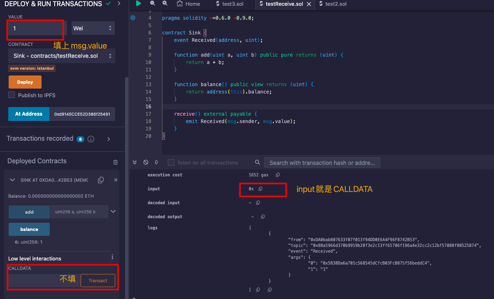

- [简介](#简介)
- [第3章 智能合约安全](#第3章-智能合约安全)
  - [3.1 整数溢出漏洞](#31-整数溢出漏洞)
    - [整数溢出漏洞防护](#整数溢出漏洞防护)
  - [3.2 重入漏洞 Reentrancy](#32-重入漏洞-reentrancy)
    - [前置知识 - transfer、send、call](#前置知识---transfersendcall)
    - [前置知识 - receive函数](#前置知识---receive函数)
    - [前置知识 - fallback函数](#前置知识---fallback函数)
    - [前置知识 - receive和fallback的区别](#前置知识---receive和fallback的区别)
    - [重入示例](#重入示例)
    - [重入预防](#重入预防)
  - [3.3 假充值漏洞](#33-假充值漏洞)
    - [前置知识 - 错误处理](#前置知识---错误处理)
    - [示例](#示例)
    - [预防](#预防)
  - [3.4 短地址漏洞](#34-短地址漏洞)
  - [3.5 tx.origin身份认证漏洞](#35-txorigin身份认证漏洞)
  - [3.6 默认可见性](#36-默认可见性)
    - [前置知识 - external、public、internal、private](#前置知识---externalpublicinternalprivate)
    - [预防](#预防-1)
  - [3.8 代码执行漏洞](#38-代码执行漏洞)
    - [前置知识 - call()、delegatecall()、callcode()](#前置知识---calldelegatecallcallcode)
    - [示例 - bytes注入](#示例---bytes注入)
    - [示例 - 方法选择器注入](#示例---方法选择器注入)
    - [预防](#预防-2)
  - [3.8 条件竞争漏洞](#38-条件竞争漏洞)
    - [预防](#预防-3)
  - [3.9 未验证返回值漏洞](#39-未验证返回值漏洞)
    - [前置知识 - call、delegatecall、callcode、call.value()、send()、transfer()](#前置知识---calldelegatecallcallcodecallvaluesendtransfer)
    - [示例](#示例-1)
    - [预防](#预防-4)
  - [3.10 浮点数及精度安全漏洞](#310-浮点数及精度安全漏洞)
    - [前置知识 - 浮点型、运算](#前置知识---浮点型运算)
    - [示例](#示例-2)
    - [预防](#预防-5)
  - [3.11 拒绝服务漏洞 Dos](#311-拒绝服务漏洞-dos)
    - [前置知识 - transder()、revert()](#前置知识---transderrevert)
    - [示例](#示例-3)
    - [预防](#预防-6)
  - [3.12 不安全的随机数](#312-不安全的随机数)
  - [3.13 错误的构造函数](#313-错误的构造函数)
  - [3.14 时间戳依赖漏洞](#314-时间戳依赖漏洞)
  - [3.15 意外的Ether漏洞](#315-意外的ether漏洞)
  - [3.16 未初始化指针漏洞](#316-未初始化指针漏洞)
    - [示例](#示例-4)
    - [预防](#预防-7)


# 简介

作者：刘林炫 邓永凯 万钧 张继龙

2021年1月第1版。


# 第3章 智能合约安全

## 3.1 整数溢出漏洞

分为上溢和下溢。分别在三种运算中：

* 乘法溢出
* 加法溢出
* 减法溢出

无符号整数uint256，能表示的范围为：$[0, 2^{256} - 1]$，

```javascript
// SPDX-License-Identifier: GPL-3.0
pragma solidity ^0.4.25;
contract POC {
  function add_overflow() public pure returns (uint256 o1, uint256 o2) {
    uint256 max = 2**256 - 1;
    o1 = max + 1; // 回到0
    o2 = max + 2; // 回到1
  }

  function sub_underflow() public pure returns (uint256 u1, uint256 u2) {
    uint256 min = 0;
    u1 = min - 1;  // 回到2**256 - 1
    u2 =  min - 2; // 回到2**256 - 2
  }

  function mul_overflow() public pure returns (uint256 u1, uint256 u2) {
    uint256 mul = 2**255;
    u1 = mul * 2; // 到0
    u2 = mul * 4; // 到0
  }
}
```

官网0.8.20文档上看，发生了变化：

> https://docs.soliditylang.org/zh/latest/control-structures.html#unchecked
>
> 上溢或下溢是指算术运算的结果值，当对一个不受限制的整数执行时，超出了结果类型的范围。
>
> 在Solidity 0.8.0之前，算术运算总是在下溢或上溢的情况下被包起来， 这导致广泛使用引入额外检查的库。
>
> 从Solidity 0.8.0开始，在默认情况下所有的算术运算都会在上溢和下溢时还原， 从而使这些库的使用变得没有必要。
>
> 为了获得以前的行为，可以使用一个 `未检查（unchecked）` 区块。

如果把上面的版本改为：`pragma solidity ^0.8.0;`，三个函数都会抛出这个错误：

```
revert
	The transaction has been reverted to the initial state.
Note: The called function should be payable if you send value and the value you send should be less than your current balance.
Debug the transaction to get more information.
```

加上unchecked就可以变成原来的作用：

```javascript
pragma solidity ^0.8.0;

function add_overflow() public pure returns (uint256 o1, uint256 o2) {
  uint256 max = 2**256 - 1;
  unchecked {
    o1 = max + 1;
    o2 = max + 2;
  }
}
```

有符号N的整数，所能表示的范围为：$[-2^{N-1}, 2^{N-1} - 1]$，

```javascript
int256 max = 2**255 - 1;
u1 = max + 1; // 溢出, 0.8.0之前循环滚动, 之后报错
u2 = max + 2;

int256 min = -2**255;
u1 = min - 1; // 溢出, 0.8.0之前循环滚动, 之后报错
u2 = min - 2;

int256 max = 2**255 - 1;
u1 = max * 2; // 溢出, 0.8.0之前循环滚动, 之后报错
u2 = max * 4;
```

在0.8.0之前，也是一样，加、减、乘溢出的结果循环滚动。

在0.8.0及其之后，抛错。

### 整数溢出漏洞防护

版本<0.8.0，一般会OpenZeppelin的SafeMath库。原理这样：

```javascript
pragma solidity ^0.4.25;

library SafeMath {
  function add(uint256 a, uint256 b) internal pure returns (uint256) {
    uint256 c = a + b;
    assert(c >= a);
    return c;
  }
  ...
}
```

版本>=0.8.0之后，就不用了。Solidity本身就带的溢出恢复。

## 3.2 重入漏洞 Reentrancy

### 前置知识 - transfer、send、call

都可以用来向某一地址转账，区别：

* transfer()：发送失败时抛错回滚，退回以太，只传2300Gas供调用。payable(address(test)) 才可以调用；
* send()：发送失败返回false，退回以太，需要手动判断revert回滚，同样只传2300Gas。payable(address(test)) 才可以调用；
* call()：发送失败返回false，传入剩余的Gas。

这三种方法

### 前置知识 - receive函数

\>=0.6.0版本后才有的函数。

接收以太币后回调的函数。

可以是虚拟的(virtual)，可以重载(override)，可以有修饰器。

```javascript
// SPDX-License-Identifier: GPL-3.0
pragma solidity >=0.6.0 <0.9.0;
contract Sink {
  event Received(address, uint);
  
  function add(uint a, uint b) public pure returns (uint) {
    return a + b;
  }
  function balance() public view returns (uint) {
    return address(this).balance;
  }
  receive() external payable {
    emit Received(msg.sender, msg.value);
  }
}
```

msg.data，即remix里CALLDATA里为空时，会调用receive：



当msg.data不为空时，会报错，不让调用。

所以，总结来说：

转账时，要调用receive，msg.value可以是0，但msg.data必须为空。

### 前置知识 - fallback函数

0.6.0之前的函数，一样可虚拟可重载。用在两个地方：

* 调用合约的不存的函数时，会回落到fallback函数；
* 向合约发送以太时，此时要带上payable；

声明如下：

```c#
fallback () external [payable] { }
或 
fallback (bytes calldata input) external [payable] returns (bytes memory output) { }
```

input就是msg.data，原生的calldata。要解码出input要这样：

```c#
(c, d) = abi.decode(input[4:], (uint256, uint256));
```

ouput返回的数据不会被ABI编码。

示例：

```c#
// SPDX-License-Identifier: GPL-3.0
pragma solidity >=0.6.2 <0.9.0;
contract Test {
  uint public x;
  // msg.value必须为0时，调用不存的函数（msg.data随便填) 都会调用fallback
  // 如果msg.value不为0，会报错，不让调，因为没有加payable。
  fallback() external { x = 1; }
  
  // msg.value不必为0，表示可以接收以太。
  fallback() payable external { x = 1; }
}
```

### 前置知识 - receive和fallback的区别

同：

* 都可虚拟(virtual)，可重载(override)，可修饰。
* 都可以在接收以太后调用。

不同：

* 虽然在功能上都可以接收以太，但语义不同，receive纯粹的接收以太，fallback是调用不存的函数时的回调，也就是msg.data不空。

### 重入示例

```javascript
// SPDX-License-Identifier: GPL-3.0
pragma solidity ^0.4.21;

contract AMoney {
  mapping(address => uint256) balances;
  function deposit() payable public {
    balances[msg.sender] += msg.value;
  }
  function withdraw(address add, uint amount) public {
    require(balances[add] > amount);
    // 重入点
    add.call.value(amount)();
    balances[add] -= amount;
  }
}

contract Battach {
  address public amoney;
  function start() public payable {
    // 在 Amoney中: balances: { 合约Battach地址 -> 100 }
    amoney.call.value(msg.value)(bytes4(keccak256("deposit()")));
    amoney.call(bytes4(keccak256("withdraw(address,uint256)")), this, msg.value / 2);
  }
  function() external payable {
    if(msg.sender == amoney) {
      amoney.call(bytes4(keccak256("withdraw(address,uint256)")), this, msg.value);
    }
  }
}
```

用一句话概括：发送以太币时调用对方合约的Fallback函数，在Fallback函数中又调用原合约函数，形成递归调用。

### 重入预防

* 尽量用transfer()转，因为只给2300Gas，不足以调另一人上合约。

* 确保状态变量改变发生在发送Ether之前，即：检查-生效-交互模式。


## 3.3 假充值漏洞

### 前置知识 - 错误处理

* assert(bool)：条件不满足就抛出异常，消耗剩余Gas。
* require(bool)：条件不满足就抛出异常，返还剩余Gas。
* revert()：中止执行并恢复状态变更，返还Gas，将错误信息返回给调用者。

TxReceipt.status的值有关，交易没有抛出错误就是0x1（success)，抛出错误就是0x0（fali），业务如果依赖这个字段就有问题。。。正常人谁看这个字段。。。。

### 示例

```javascript
function transfer(address to , uint value) returns (bool) {
  if(balances[msg.sender] >= value) {
    balances[msg.sender] -= value;
    balances[to] += value;
    return true;
  } else {
    return false;
  }
}
```

这段代码不管返回什么值都不会抛错，所以交易的status一直是0x1，成功。

如果后续业务需要判断此次交易的status，都会是成功的。

### 预防

* 尽量用require断言抛错，let it crash！

```javascript
function transfer(address to , uint value) returns (bool) {
  require(to != address(0));
  require(value <= balances[msg.sender]);
  ...
  return true;
}
```

一句话概括：业务需要判断调用结果，可是调用结果设置了不正确。

## 3.4 短地址漏洞

跟ABI编码有关。

设有以下合约：

```javascript
function transfer(address to, uint amount) {
  require(balances[msg.sender > amount);
  balances[msg.sender] -= amount;
  balances[to] += amount;
}
```

A转给B，调用transfer的input，即msg.data为：

```javascript
// transfer的函数选择器 = bytes4(keccak256("transfer(address,uint)")
0xa9059cbb

// B地址, 填充到32字节
0x000....7800

// amount值, 填充到32字节
0x00...02
```

这个有很大疑问！

讲和不清不楚，包括网络上文章。

高位填充0，既然地址短了，不是也要高倍填充0到32字节么？怎么前面就填充，后面就不填充了？

## 3.5 tx.origin身份认证漏洞

tx.origin是一个全局变量，代表整个调用链中最初的发起者。

```javascript
A --> B --> C --> D
D内的msg.sender是C，tx.orgin就是A
```

容易受到钓鱼攻击，示例

```javascript
// 有问题的合约
contract A {
  address public owner;
  
  function withdrawAll(address to) public {
    require(tx.origin == owner);
    to.transfer(this.balance);
  }
}

// 攻击合约
contract Attack {
 A ph;
 address to;
  
  function() {
    ph.withdrawAll(to);
  }
}
```

只要诱导A合约拥有者发送以太到Attach，就达成攻击。

防护：

* 小心安全使用tx.oring。


## 3.6 默认可见性

### 前置知识 - external、public、internal、private

函数和状态变量的四种可见性。

状态变量默认是internal，函数默认是public。

* external：只能从合约外部调用。

  ```javascript
  // SPDX-License-Identifier: GPL-3.0
  pragma solidity ^0.4.26;
  contract FuncTest {
    uint a;
    function extFunc() external {
      a = 2;
    }
    function callFunc() public {
      a = 1;
      // 语法报错
      // extFunc();
      
      this.extFunc();
    }
  }
  ```

* internal：只能在合约内部及子合约内调用。

  ```javascript
  // SPDX-License-Identifier: GPL-3.0
  pragma solidity ^0.4.26;
  contract FuncTest {
    uint a;
    function extFunc() external {
      a = 2;
      intFunc();
    }
    function intFunc() internal {
      a = 3;
    }
    function callFunc() public {
      intFunc();
      // 语法报错
      // this.intFunc();
    }
  }
  ```

* public：可以interal、也可以external调用。

* private：只限于本合约，子合约不能访问、调用。

### 预防

没什么好办法，只能靠开发人员和审核人员注意。

## 3.8 代码执行漏洞

### 前置知识 - call()、delegatecall()、callcode()

都可以调合约，不同点：

* call()：以当前合约作为`msg.sender`，执行上下文转移到要被调合约；
* delegatecall()：不改变当前`msg`，以当前合约作为上下文，调用被调合约；相当于把被调用合约的代码偷过来执行。
* callcode()：以当前合约作为`msg.sender`，以当前合约作为上下文，调用被调合约；

```javascript
contract A {
  address public tmp1;
  uint public tmp2;
  
  // 当前账号0xcc, 调用three_call(), 传入B的地址
  function three_call(address addr) public {
    // B.tmp1 = address(A); B.tmp2 = 100;
    addr.call(bytes4(keccak256("test()")));
    
    // A.tmp1 = 0xcc; A.tmp2 = 100;
    addr.delegatecall(bytes4(keccak256("test()")));
    
    // A.tmp1 = address(A); A.tmp2 = 100;
    addr.callcode(bytes4(keccak256("test()")));
  }
}

contract B {
  address public tmp1;
  uint public tmp2;
  function test() public {
    tmp1 = msg.sender;
    tmp2 = 100;
  }
}
```

### 示例 - bytes注入

```javascript
function approveAndCallcode(address _spender, uint _value, bytes _data) {
  ...
  if(!_spender.call(_data)) { revert(); }
}
```

_spender传入合约自身地址，\_data合约自身的权限方法，就能越权。

### 示例 - 方法选择器注入

```javascript
function logAndCall(address _to, uint _value, bytes _data, string _fallback) {
  // 调用_to的fallback，传入三个参数
 assert(_to.call(bytes4(keccak256(_fallback)), msg.sender, _value, _data)); 
}
```

EVM在处理CALLDATA时，不管参数个数，只是按需去取，所以可以传多个参数。比如：

```javascript
contract Sample1 {
  function test(uint a, uint b , uint c) public {}
}

contract Sample2 {
  function run(address addr) public {
    // 可以传多个, EVM只取1,2,3
    addr.call(bytes4(keccak256("test(uint256,uint256,uint256)")), 1,2,3,4,5);
  }
}
```

### 预防

尽量不用call、delegatecall，要用也要注意权限判断，msg.sender的变化，执行环境的变化。

## 3.8 条件竞争漏洞

一句话概括：因为gasPrice不同引起的交易顺序问题。比方方ERC20的授权例子。

ERC20的approve函数会引起条件竞争漏洞：

```javascript
function approve(address _spender, uint _value) public returns(bool) {
  allowance[msg.sender][_spender] = _value;
  return true;
}
```

场景：

1. A用户授权B用户100个以太；
2. 第二天，B用户的100个以太未使用，A用户把授予的100个以太修改为50个；
3. B用户监控交易池，发现了A的这个操作，使用更高的gasPrice发出一笔提取100个以币的交易；
4. B用户的交易优先被打包，B得到100个以太；
5. 随后A的提交被打包，B还有50个以太的使用权，B得到的比预期多；

### 预防

* A用户修改授权时，先设置为0，再改为授权时。

  ```javascript
  function approve(address _spender, uint _value) public returns(bool) {
    // 只能设为0, 或者没有设过时
    require(_value == 0 || allowance[msg.sender][_spender] == 0);
    allowance[msg.sender][_spender] = _value;
    return true;
  }
  ```

* 拆分成两个函数，increaseApprove、decreaseApprove。

  ```javascript
  function increaseApprove(address _spender, uint _addedValue) public returns(bool) {
    allowance[msg.sender][_spender] = allowance[msg.sender][_spender].add(_value);
    return true;
  }
  
  function decreaseApprove(address _spender, uint _subtractedValue) public returns(bool) {
    uint old = allowance[msg.sender][_spender];
    if(_subtractedValue > old) {
      allowance[msg.sender][_spender] = 0;
    }
    else {
      allowance[msg.sender][_spender].sub(_subtractedValue);
    }
    return true;
  }
  
  ```

## 3.9 未验证返回值漏洞

### 前置知识 - call、delegatecall、callcode、call.value()、send()、transfer()

* call()：外部调用call()返回一个bool值表明外部调用是否成功；
* delegatecall()：也是返回一个bool值来表明外部调用是否成功；
* callcode()：一样；
* call.value()：转币函数；
* send()：发送失败，返回false。如果send()目标是合约账户，会调用合约receive/fallback函数，在fallback()函数中执行失败也同样会返回false。send()只提供2300Gas给fallback()；
* transfer：失败会自动回滚，没有返回值，同样只给2300Gas给fallback()；

### 示例

```javascript
function withdraw(uint _amount) public {
  require(balances[msg.sender]) >= _amount;
  balances[msg.sender] -= _amount;
  msg.sender.send(_amount);
}
```

msg.sender.send(_amount)未验证返回值，如果msg.sender是合约账户，在fallback()调用失败后，send()会返回false。balances减少了，以太币没有正常转账。

推测出：send()、transfer()如果调用fallback()失败，则不会发送以太。

### 预防

* 尽量用transfer()

## 3.10 浮点数及精度安全漏洞

### 前置知识 - 浮点型、运算

Solidity只有定长浮点，0.8.20文档也是这么说的：

> Solidity 还没有完全支持定长浮点型。可以声明定长浮点型的变量， 但不能给它们赋值或把它们赋值给其他变量。

除法：结果会四舍五入，舍掉小数；

乘法：支持任意精度；

### 示例

```javascript
uint constant public tokensPerEth = 10;
uint constant public weiPerEth = 1e18;

function buyTokens() public payable {
  uint tokens = msg.value / weiPerEth * tokensPerEth;
}
```

如果msg.value为200wei，除后结果为0，相乘也是0了。

### 预防

* 先乘法，后除法：`msg.value * tokensPerEth / weiPerEth`；
* 增加分母倍数，运算结果后再进行数值调整；

## 3.11 拒绝服务漏洞 Dos

### 前置知识 - transder()、revert()

* transer()：较为安全的转币操作，发送失败会回滚，没有返回值。如果transer()的目标是合约账户，会调用合约的receive()/fallback()。只给2300Gas于receive/fallback。
* revert()：标记错误并回退当前调用，剩余Gas会返回给调用者。

### 示例

有问题的合约：

```javascript
contract PresidentOfCountry {
  address public president;
  uint price;
  
  function becomePresident() payable {
    require(msg.value >= price);
    president.transfer(price);
    president = msg.sender;
    price = price * 2;
  }
}

// 攻击合约
contract Attach {
  function() { revert(); }
  function Attah(address _target) payable {
    _target.call.value(msg.value)(bytes4(keccak256("becomePresident()")));
  }
}
```

攻击流程：

1、正常账户A先调用`becomePresident`()，成为`president`；

2、B调用`Attach`函数，Attach合约成为了`president`；

3、A再调用`becomePresident()`时，transfer错误并回退，无法更新`president`的值了。

这就是拒绝服务。

一句话概括：让其他人无法使用合约。

### 预防

* 对于基于外部调用的Dos：无他，写代码小心；

* 对于owner操作的Dos：设置owner为多重签名合约，防止只有一个owner一家独大。

## 3.12 不安全的随机数

看一个例子就行：

```javascript
function test1() public view returns(uint) {
  // 都是返回0
  return uint(block.blockhash(block.number));
}
```

理解：部署合约，是会生成block。

之后，调用合约，没有写入区块的操作，不会生成block，那就是默认的0。

## 3.13 错误的构造函数

<=0.4.22版本时，构造函数名与合约名同名引起的拼写错误。

不要用低版本就行。

## 3.14 时间戳依赖漏洞

矿工以本地时间作为时间戳，打包的新区块时间戳 > 上一区块时间戳，且误差在900s（15min）以内，就认为是合法的。所以矿工可以操纵`block.timestap`达到目的。

在代码里要小心依赖`block.timestap`的业务。

## 3.15 意外的Ether漏洞

* selfdestruct()：自毁函数。调用`selfdestruct(address)`时，只做一件事：就是合约的`balance`全部转到`address.balance`，不会触发address的`receive/fallback`。

  如果业务有依赖`balance`的，就要小心。

* 预先发送Ether：合约地址可以预先得到，假设地址0x123000在第100次交易中创建一个合约，那这个合约的地址为

  ```javascript
  keccak256(rlp.encode[0x123000, 100])
  ```

## 3.16 未初始化指针漏洞

### 示例

合约的状态为变量，以slot0、slot1、slot2、... 方式存储。

```javascript
contract NameRegister {
  // slot0
  bool public unlocked = false;
  
  struct NameRecord {
    bytes32 name;
    address mappedAddress;
  }
  
  // slot1
  mapping(address => NameRecord) public records;
  
  // slot2
  mapping(bytes32 => address) public resolve;
  
  function register(bytes32 _name, address _addr) public {
    NameRecord r
    r.name = _name;
    r.mappedAddress = _addr;
    ...
  }
}
```

register()中，r没有初始化，因此会覆盖unlocked（slot0)、records（slot1）的值。

### 预防

* 用memory修饰：

  ```javascript
  function register(bytes32 _name, address _addr) public {
    NameRecord memory r
    r.name = _name;
    r.mappedAddress = _addr;
  }
  ```

* 用storage引用状态变量：

  ```javascript
  function register(bytes32 _name, address _addr) public {
    NameRecord storage r = records[_addr];
    r.name = _name;
    r.mappedAddress = _addr;
  }
  ```

新版本貌似不用考虑这个问题了。

